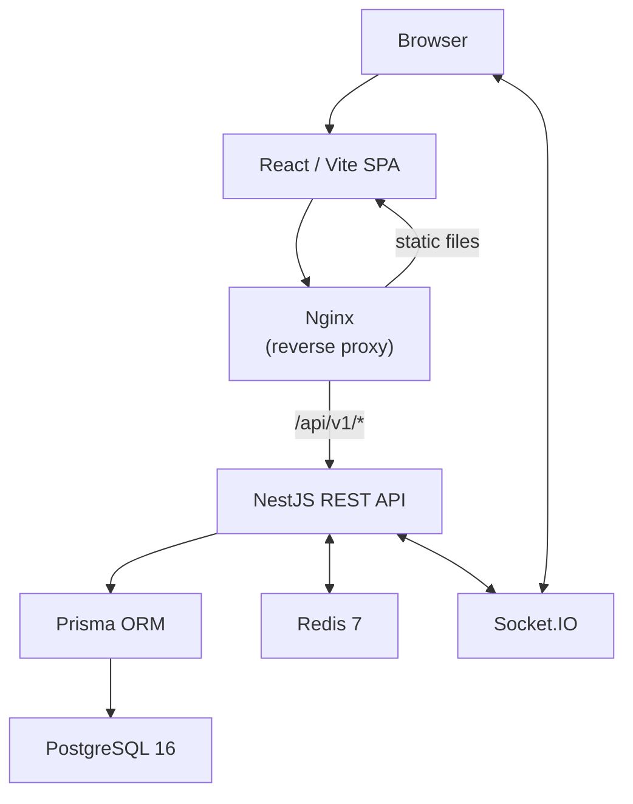

# BeautyBook

Nền tảng đặt lịch và quản lý cơ sở làm đẹp, hỗ trợ khách hàng khám phá dịch vụ và đặt lịch hẹn trực tuyến, đồng thời hỗ trợ doanh nghiệp nhiều chi nhánh quản lý dịch vụ, nhân sự phục vụ booking và vận hành lịch hẹn. Hệ thống phân quyền theo bốn tầng: platform — tenant (business) — branch — self, với tách biệt tài khoản khách hàng và tài khoản vận hành.


---

## Mục lục

- [Điểm nổi bật kỹ thuật](#điểm-nổi-bật-kỹ-thuật)
- [Tổng quan](#tổng-quan)
- [Bài toán và mục tiêu](#bài-toán-và-mục-tiêu)
- [Chức năng chính](#chức-năng-chính)
- [Vai trò và phạm vi truy cập](#vai-trò-và-phạm-vi-truy-cập)
- [Quy tắc nghiệp vụ đáng chú ý](#quy-tắc-nghiệp-vụ-đáng-chú-ý)
- [Một số bài toán kỹ thuật đáng chú ý](#một-số-bài-toán-kỹ-thuật-đáng-chú-ý)
- [Kiến trúc hệ thống](#kiến-trúc-hệ-thống)
- [Công nghệ sử dụng](#công-nghệ-sử-dụng)
- [Cấu trúc repository](#cấu-trúc-repository)
- [Yêu cầu môi trường](#yêu-cầu-môi-trường)
- [Khởi chạy nhanh với Docker](#khởi-chạy-nhanh-với-docker)
- [Chạy local](#chạy-local)
- [Cấu hình môi trường](#cấu-hình-môi-trường)
- [Database, Prisma và Migration](#database-prisma-và-migration)
- [Seed dữ liệu](#seed-dữ-liệu)
- [Kiểm thử](#kiểm-thử)
- [Build](#build)
- [API và OpenAPI](#api-và-openapi)
- [Bảo mật và phân quyền](#bảo-mật-và-phân-quyền)
- [Tính nhất quán dữ liệu và concurrency](#tính-nhất-quán-dữ-liệu-và-concurrency)
- [Dự án thể hiện những gì](#dự-án-thể-hiện-những-gì)
- [Phạm vi hiện tại và giới hạn](#phạm-vi-hiện-tại-và-giới-hạn)
- [Lưu ý triển khai](#lưu-ý-triển-khai)
- [Xử lý lỗi thường gặp](#xử-lý-lỗi-thường-gặp)

---

## Điểm nổi bật kỹ thuật

- **Multi-tenant, multi-branch authorization** — RBAC bốn tầng (platform → tenant → branch → self) kiểm tra scope ở cả guard lẫn service layer, không chỉ dựa vào role name.
- **Tách biệt tài khoản** — tài khoản Customer và tài khoản vận hành (Owner/Receptionist/Staff/Admin) không thể gộp chung; database constraint và runtime guard đều từ chối kết hợp.
- **Booking transaction với Serializable isolation** — mỗi lượt tạo/chuyển trạng thái booking chạy trong transaction Serializable kèm retry logic, đảm bảo không có hai request cùng chiếm một slot.
- **Staff capability và availability** — chỉ staff được gán dịch vụ (`StaffService`) và đang active/bookable mới xuất hiện trong danh sách khả dụng, kết hợp kiểm tra giờ làm việc và conflict thời gian.
- **Booking state machine** — PENDING → CONFIRMED → CHECKED_IN → IN_PROGRESS → COMPLETED, với các trạng thái kết thúc CANCELLED, NO_SHOW, REJECTED, EXPIRED; mỗi chuyển đổi được kiểm tra quyền actor và ràng buộc thời gian.
- **Cancellation policy theo thời gian** — khách ≥ 4 giờ trước hẹn tự hủy trực tiếp; < 4 giờ phải gửi yêu cầu hủy sát giờ (late cancellation request) để cơ sở duyệt.
- **Violation tracking và booking restriction** — late cancellation (+1 điểm) và no-show (+2 điểm) được ghi nhận qua `BookingViolationEvent`; tích lũy ≥ 4 điểm trong 90 ngày kích hoạt hạn chế tự đặt lịch 30 ngày.
- **Idempotency cho POST requests** — Redis-backed `Idempotency-Key` interceptor ngăn xử lý trùng lặp trên các endpoint tạo dữ liệu.
- **JWT access/refresh kèm session revocation** — access token giữ trong bộ nhớ frontend, refresh token dùng HttpOnly cookie; mỗi session gắn thiết bị, có thể revoke theo thiết bị hoặc toàn bộ khi đổi mật khẩu.
- **Realtime qua Socket.IO** — thông báo trạng thái booking, notification và cập nhật scheduler được push real-time tới client.
- **Automated testing đa tầng** — backend unit/integration/E2E (Jest + Supertest), frontend unit (Node test runner), browser E2E (Playwright) với các suite chuyên biệt: smoke, critical, RBAC, concurrency, responsive.
- **Docker Compose reproducible** — một lệnh `docker compose up --build` dựng toàn bộ stack (PostgreSQL, Redis, API, Web + Nginx), tự chạy migration trước khi API khởi động.

---

## Tổng quan

BeautyBook là một nền tảng kết nối khách hàng với các cơ sở làm đẹp (salon, spa, tiệm tóc…). Hệ thống cho phép:

- **Khách hàng** tìm kiếm cơ sở, xem dịch vụ, đặt lịch hẹn và quản lý lịch sử booking của mình.
- **Doanh nghiệp** (Business Owner) đăng ký, quản lý nhiều chi nhánh (Branch), cấu hình dịch vụ, nhân sự, giờ hoạt động, khuyến mãi, voucher.
- **Lễ tân** (Receptionist) vận hành booking hàng ngày tại chi nhánh: xác nhận, check-in, ghi nhận thanh toán.
- **Nhân viên/chuyên viên** (Staff) xem lịch làm việc và cập nhật tiến trình dịch vụ.
- **Quản trị nền tảng** (Platform Admin) quản lý doanh nghiệp, người dùng, duyệt đăng ký, xử lý vi phạm ở cấp platform.

Kiến trúc hỗ trợ **multi-business, multi-branch**: một Owner có thể sở hữu nhiều Business, mỗi Business có nhiều Branch, mỗi Branch có nhân sự và dịch vụ riêng.

---

## Bài toán và mục tiêu

Thị trường dịch vụ làm đẹp tại Việt Nam phần lớn vẫn đặt lịch qua điện thoại hoặc tin nhắn, dẫn tới:

- Khách thiếu kênh khám phá và so sánh dịch vụ.
- Cơ sở khó quản lý lịch hẹn khi có nhiều chi nhánh và nhân viên.
- Xung đột booking (double-booking) khi nhiều kênh cùng nhận lịch.
- Thiếu dữ liệu để theo dõi tỉ lệ hủy, no-show, hiệu suất nhân viên.

BeautyBook giải quyết các vấn đề trên bằng một hệ thống đặt lịch trực tuyến có kiểm soát xung đột, phân quyền rõ ràng và quy trình vận hành chuẩn hóa.

---

## Chức năng chính

### Khách chưa đăng nhập (Guest)

- Duyệt trang chủ marketplace, tìm kiếm cơ sở theo khu vực/dịch vụ.
- Xem chi tiết cơ sở, chi nhánh, dịch vụ, nhân viên, đánh giá.
- Xem trang giới thiệu riêng của doanh nghiệp (Business Landing).
- Đặt lịch trên web yêu cầu đăng nhập tài khoản Customer.

### Khách hàng (Customer)

- Đặt lịch hẹn: chọn chi nhánh → dịch vụ → nhân viên (tùy chế độ) → ngày giờ → xác nhận.
- Áp dụng voucher/mã khuyến mãi khi đặt lịch.
- Xem lịch sử booking, chi tiết từng lịch hẹn.
- Tự hủy lịch hẹn (≥ 4 giờ trước hẹn) hoặc gửi yêu cầu hủy sát giờ (< 4 giờ).
- Đánh giá dịch vụ sau khi hoàn thành (review + rating theo từng dịch vụ/nhân viên).
- Xem voucher, ưu đãi đang có.
- Quản lý thông báo, hồ sơ cá nhân, cài đặt bảo mật, quyền riêng tư.

### Chủ doanh nghiệp (Business Owner)

- Đăng ký doanh nghiệp qua quy trình onboarding nhiều bước.
- Quản lý nhiều chi nhánh: thông tin, giờ hoạt động, ngày nghỉ, ngày làm việc đặc biệt.
- Cấu hình dịch vụ (catalog cấp business → offering cấp branch), danh mục dịch vụ, combo.
- Quản lý nhân sự: thêm/sửa staff, gán dịch vụ cho staff, mời nhân viên qua email.
- Xem và xử lý booking: xác nhận, từ chối, ghi nhận no-show, quản lý yêu cầu thay đổi.
- Ghi nhận thanh toán (tiền mặt / chuyển khoản thủ công).
- Quản lý khuyến mãi (Promotion) và voucher.
- Xem đánh giá khách hàng, thống kê tổng quan.
- Xem và phản hồi yêu cầu hủy sát giờ (late cancellation request).

### Lễ tân (Receptionist)

- Vận hành booking tại chi nhánh được gán: xác nhận, check-in, chuyển trạng thái.
- Tạo booking cho khách walk-in hoặc qua điện thoại (counter booking).
- Ghi nhận thanh toán.
- Xem lịch hẹn, thống kê chi nhánh.

### Nhân viên / chuyên viên (Staff)

- Xem lịch làm việc và booking được gán.
- Cập nhật tiến trình dịch vụ (bắt đầu, hoàn thành từng dịch vụ trong booking).

### Quản trị nền tảng (Platform Admin)

- Quản lý doanh nghiệp: duyệt đăng ký, suspend/restore, trust actions.
- Quản lý người dùng toàn nền tảng.
- Quản lý danh mục dịch vụ chuẩn hóa (Canonical Service Taxonomy).
- Xem booking toàn hệ thống, audit log.
- Xử lý vi phạm, moderation đánh giá.
- Cấu hình platform settings, thông báo hệ thống.
- Xem báo cáo, compliance.

---

## Vai trò và phạm vi truy cập

| Actor / Role | Loại | Phạm vi | Trách nhiệm chính |
|---|---|---|---|
| Guest | Public actor (không phải DB role) | Toàn bộ nội dung công khai | Duyệt, tìm kiếm, xem thông tin. Đặt lịch cần đăng nhập Customer |
| `CUSTOMER` | Account role | Dữ liệu bản thân (self) | Đặt lịch, xem lịch sử, đánh giá, hủy lịch |
| `STAFF` | Account role | Booking/dịch vụ được gán | Xem lịch, cập nhật tiến trình dịch vụ |
| `RECEPTIONIST` | Account role | Chi nhánh được gán (branch) | Vận hành booking, check-in, ghi nhận thanh toán |
| `BUSINESS_OWNER` | Account role | Toàn bộ doanh nghiệp (tenant) | Quản lý dịch vụ, nhân sự, chi nhánh, khuyến mãi |
| `PLATFORM_ADMIN` | Account role | Toàn nền tảng (platform) | Quản trị doanh nghiệp, người dùng, duyệt, moderation |

> **Lưu ý**: `GUEST` tồn tại trong enum `RoleCode` để tương thích, nhưng Guest không phải là account role — Guest là truy cập công khai, chưa xác thực. `MANAGER` (Branch Manager) đã được retire khỏi quy trình cấp quyền hiện tại.

---

## Quy tắc nghiệp vụ đáng chú ý

### Tách biệt tài khoản (Account Separation)

Tài khoản Customer và tài khoản vận hành (Owner, Receptionist, Staff, Admin) phải tách riêng. Hệ thống từ chối cấp role Customer cho user đang có role vận hành và ngược lại, cả ở tầng runtime guard lẫn database constraint.

### Phạm vi quyền hạn theo scope

- Owner thao tác trên toàn bộ Business mình sở hữu, không truy cập được Business khác.
- Receptionist chỉ thao tác trên Branch mình được gán.
- Staff chỉ xem booking/dịch vụ mà mình được gán phục vụ.
- Customer chỉ truy cập booking/dữ liệu của bản thân.
- Platform Admin có quyền nền tảng nhưng không tự làm hành động Customer.

### Booking availability và conflict

- Khung giờ khả dụng dựa trên giờ hoạt động chi nhánh, trừ ngày nghỉ và ngày đặc biệt.
- Chỉ staff active, bookable và có gán dịch vụ tương ứng mới xuất hiện khi đặt lịch.
- Khi tạo booking, backend kiểm tra lại slot availability trong transaction Serializable, không dựa vào kết quả frontend đã kiểm tra trước đó.

### Booking lifecycle

Trạng thái booking: `PENDING` → `CONFIRMED` → `CHECKED_IN` → `IN_PROGRESS` → `COMPLETED`.  
Trạng thái kết thúc: `CANCELLED`, `NO_SHOW`, `REJECTED`, `EXPIRED`.  
Mỗi chuyển đổi trạng thái được ghi vào `BookingStatusHistory` kèm actor và timestamp.

### Chính sách hủy lịch

- **≥ 4 giờ** trước giờ hẹn: Customer tự hủy trực tiếp.
- **< 4 giờ** trước giờ hẹn: Customer phải gửi **yêu cầu hủy sát giờ** (late cancellation request) để cơ sở xem xét và duyệt.

### Vi phạm booking và hạn chế đặt lịch

- **Late cancellation**: +1 điểm vi phạm.
- **No-show** (ghi nhận bởi Owner/Receptionist sau grace period ~15 phút): +2 điểm.
- Cửa sổ tính: **90 ngày** gần nhất (rolling window).
- Tích lũy ≥ 3 điểm: cảnh báo, yêu cầu xác nhận trước khi đặt.
- Tích lũy ≥ 4 điểm: hạn chế tự đặt lịch trong **30 ngày** (Customer vẫn có thể liên hệ cơ sở để được tạo hộ).
- Sự kiện vi phạm không hợp lệ có thể được void bởi admin với bằng chứng, và restriction được tính lại.

### Thanh toán

Hiện tại hệ thống ghi nhận thanh toán thủ công (tiền mặt, chuyển khoản ngân hàng). Chưa tích hợp cổng thanh toán trực tuyến (xem [Phạm vi hiện tại và giới hạn](#phạm-vi-hiện-tại-và-giới-hạn)).

### Đánh giá

Customer chỉ được đánh giá booking đã hoàn thành (`COMPLETED`), mỗi booking tối đa một review. Review có thể bao gồm rating theo từng dịch vụ/nhân viên.

---

## Một số bài toán kỹ thuật đáng chú ý

### 1. Ngăn đặt lịch trùng (Concurrent Booking Protection)

Nhiều request có thể cùng chọn một staff tại cùng một slot. Backend không tin kết quả availability từ frontend mà kiểm tra lại trong transaction Serializable. Nếu phát hiện conflict (P2034 hoặc exclusion constraint), transaction retry với jitter hoặc trả lỗi conflict rõ ràng cho client.

### 2. Phân quyền theo nhiều tầng

Chỉ có role name là chưa đủ: Owner bị giới hạn theo Business, Receptionist theo Branch, Customer theo dữ liệu bản thân. Scope được kiểm tra ở cả guard (JWT + role check) và service layer (query filter theo businessId/branchId/customerId). ID từ request body không được tin cho customer-owned resources.

### 3. Account Separation

Database check + runtime guard đảm bảo một User không thể vừa là Customer vừa có role vận hành. Điều này ngăn privilege mixing — ví dụ một Receptionist không thể tự dùng Customer actions để đặt lịch cho bản thân rồi tự duyệt.

### 4. Booking state machine với audit trail

Mỗi chuyển đổi trạng thái booking được kiểm tra: actor có quyền chuyển từ trạng thái A sang B không, thời gian có hợp lệ không (ví dụ: không check-in khi chưa tới giờ, không no-show khi chưa qua grace period). Mọi chuyển đổi đều được ghi vào bảng `BookingStatusHistory`.

### 5. Violation event replay và restriction

Vi phạm booking được lưu dạng immutable event (`BookingViolationEvent`). Khi có event mới hoặc void, hệ thống replay toàn bộ chuỗi event để tính lại restriction, đảm bảo tính deterministic. Void một event bất hợp lệ tự động tính lại và có thể gỡ restriction nếu score giảm dưới ngưỡng.

---

## Kiến trúc hệ thống



- **Frontend**: React 18 SPA, build bằng Vite, serve qua Nginx (trong Docker container `web`). Nginx proxy `/api/v1/*` về backend.
- **Backend**: NestJS modular monolith, TypeScript. Các module tổ chức theo domain: `auth`, `bookings`, `branches`, `business`, `services`, `staff`, `reviews`, `promotions`, `notifications`, `payments`, `media`, `admin`…
- **Database**: PostgreSQL 16 với Prisma 7 làm ORM và migration tool.
- **Cache / Idempotency / Session**: Redis 7 — dùng cho idempotency key, session revocation, và các cơ chế hỗ trợ trạng thái.
- **Realtime**: Socket.IO — push notification trạng thái booking, thông báo tới client.

---

## Công nghệ sử dụng

### Backend

| Công nghệ | Version | Vai trò |
|---|---|---|
| Node.js | 22 (Docker) | Runtime |
| NestJS | ^11.1 | Application framework |
| TypeScript | ^5.7 | Ngôn ngữ |
| Prisma | ^7.8 | ORM, schema, migration |
| PostgreSQL | 16 (Docker) | Relational database |
| Redis (ioredis) | ^5.11 | Idempotency, session, cache |
| Socket.IO | ^4.8 | Realtime communication |
| Passport + JWT | ^0.7 / ^11.0 | Authentication |
| bcryptjs | ^3.0 | Password hashing |
| Helmet | ^8.3 | Security headers |
| class-validator | ^0.15 | Input validation |
| Nodemailer | ^9.0 | Email |
| Jest | ^30.0 | Unit/integration testing |
| Supertest | ^7.0 | HTTP integration testing |

### Frontend

| Công nghệ | Version | Vai trò |
|---|---|---|
| React | ^18.3 | UI framework |
| Vite | ^5.4 | Build tool, dev server |
| React Router | ^6.30 | Client-side routing |
| Zustand | ^4.5 | State management |
| Tailwind CSS | ^3.4 | Styling |
| Socket.IO Client | ^4.8 | Realtime updates |
| Recharts | ^2.15 | Charts, thống kê |
| Lucide React | ^0.383 | Icon library |
| Playwright | ^1.63-alpha | Browser E2E testing |

### Infrastructure

| Công nghệ | Version | Vai trò |
|---|---|---|
| Docker / Docker Compose | — | Container orchestration |
| Nginx | 1.27 | Reverse proxy, static serving |
| GitHub Actions | — | CI pipeline |

---

## Cấu trúc repository

```
BeautyBook/
├── beauty-booking-api-main/          # Backend (NestJS)
│   ├── prisma/
│   │   ├── schema.prisma             # Database schema
│   │   ├── migrations/               # Prisma migrations
│   │   ├── seed.ts                   # Demo data seeder
│   │   ├── seed-permissions.ts       # Permission + role seeder
│   │   └── demo-data/                # Seed data pools
│   ├── src/
│   │   ├── auth/                     # Authentication, JWT, session
│   │   ├── bookings/                 # Booking CRUD, lifecycle, policies
│   │   ├── branches/                 # Branch management
│   │   ├── business/                 # Business management
│   │   ├── services/                 # Service catalog
│   │   ├── staff/                    # Staff profiles, capabilities
│   │   ├── reviews/                  # Customer reviews
│   │   ├── promotions/               # Promotions, vouchers
│   │   ├── notifications/            # Notification system
│   │   ├── payments/                 # Payment recording
│   │   ├── media/                    # File upload
│   │   ├── admin/                    # Platform administration
│   │   ├── scheduler/               # Internal scheduler
│   │   ├── common/                   # Guards, interceptors, utils
│   │   └── ...
│   ├── test/                         # E2E test config
│   ├── docs/                         # Generated OpenAPI
│   └── Dockerfile
├── beauty-booking-web-main/
│   └── beauty-booking-web-main/      # Frontend (React/Vite)
│       ├── src/
│       │   ├── pages/                # Admin, Customer, Salon, Public, Login
│       │   ├── components/           # Reusable components
│       │   ├── store/                # Zustand stores
│       │   ├── utils/                # Utility functions
│       │   └── styles/               # CSS
│       ├── tests/e2e/                # Playwright E2E tests
│       ├── nginx.conf                # Nginx config for Docker
│       └── Dockerfile
├── docs/                             # Project documentation
├── docker-compose.yml                # Full-stack Docker setup
├── .env.example                      # Environment template
├── .github/workflows/ci.yml          # CI pipeline
└── README.md
```

---

## Yêu cầu môi trường

### Chạy với Docker (khuyến nghị)

- Docker và Docker Compose (v2+)

Docker image sử dụng Node 22 Alpine. Không cần cài thêm gì trên máy host.

### Chạy local (không Docker)

- **Node.js** 22+ (khuyến nghị, theo Dockerfile)
- **PostgreSQL** 16+
- **Redis** 7+
- **npm** (đi kèm Node.js)

---

## Khởi chạy nhanh với Docker

```bash
git clone https://github.com/Tusdz301205/BeautyBook.git
cd BeautyBook
cp .env.example .env
docker compose up --build
```

Sau khi tất cả service healthy:

| URL | Mô tả |
|---|---|
| `http://localhost:8080` | Web application |
| `http://localhost:8080/api/v1/health` | API health check |

Docker Compose sẽ tự chạy `prisma migrate deploy` trước khi API khởi động.

### Services trong Docker Compose

| Service | Image | Vai trò |
|---|---|---|
| `postgres` | `postgres:16-alpine` | Database |
| `redis` | `redis:7-alpine` | Cache, idempotency, session |
| `api` | Build từ `beauty-booking-api-main/` | Backend API |
| `web` | Build từ `beauty-booking-web-main/beauty-booking-web-main/` | Frontend + Nginx |

### Volumes

| Volume | Dữ liệu |
|---|---|
| `postgres_data` | PostgreSQL data |
| `redis_data` | Redis AOF persistence |
| `media_data` | Uploaded media files |

---

## Chạy local

### Backend

```bash
cd beauty-booking-api-main
cp .env.example .env
# Cấu hình DATABASE_URL và REDIS_URL trong .env trỏ đến PostgreSQL/Redis local
npm ci
npx prisma generate
npx prisma migrate deploy
npm run seed:permissions       # Seed roles + permissions (idempotent)
npm run start:dev              # Dev server với hot-reload
```

API chạy tại `http://localhost:3000/api/v1` (mặc định).

### Frontend

```bash
cd beauty-booking-web-main/beauty-booking-web-main
cp .env.example .env
# Cấu hình VITE_API_BASE và VITE_WS_URL trong .env
npm ci
npm run dev
```

Frontend dev server chạy tại `http://localhost:5173` (mặc định Vite).

---

## Cấu hình môi trường

### Root `.env` (Docker Compose)

| Variable | Bắt buộc | Mô tả | Mặc định (local) |
|---|---|---|---|
| `POSTGRES_DB` | Không | Tên database | `glowbook_db` |
| `POSTGRES_USER` | Không | Database user | `glowbook` |
| `POSTGRES_PASSWORD` | Không | Database password | `glowbook_local` |
| `JWT_SECRET` | **Có** (production) | Secret cho access token (≥ 32 ký tự) | Local dev default |
| `JWT_REFRESH_SECRET` | **Có** (production) | Secret cho refresh token (≥ 32 ký tự) | Local dev default |
| `WEB_PORT` | Không | Port expose web container | `8080` |
| `FRONTEND_URL` | Không | URL frontend (email links) | `http://localhost:8080` |
| `CORS_ORIGINS` | Không | Allowed origins | `http://localhost:8080` |

### Backend `.env` (`beauty-booking-api-main/.env`)

| Variable | Bắt buộc | Mô tả |
|---|---|---|
| `DATABASE_URL` | **Có** | PostgreSQL connection string |
| `REDIS_URL` | **Có** | Redis connection string |
| `PORT` | Không | API port (mặc định `3000`) |
| `NODE_ENV` | Không | `development` / `production` |
| `BOOKING_TIME_ZONE` | Không | Timezone cho booking (mặc định `Asia/Ho_Chi_Minh`) |
| `UPLOAD_DIR` | Không | Thư mục lưu file upload |
| `EMAIL_USER` / `EMAIL_PASS` | Không | SMTP credentials |
| `EMAIL_FROM` | Không | Sender email |
| `IDEMPOTENCY_TTL_SECONDS` | Không | TTL cho idempotency key (mặc định `86400`) |
| `SENSITIVE_DATA_ENCRYPTION_KEY` | **Có** (production) | Base64-encoded 32-byte key |
| `SENSITIVE_DATA_KEY_VERSION` | Không | Key version identifier |
| `PRIVACY_EXPORT_TTL_MINUTES` | Không | TTL export dữ liệu cá nhân |

### Frontend `.env` (`beauty-booking-web-main/beauty-booking-web-main/.env`)

| Variable | Mô tả |
|---|---|
| `VITE_API_BASE` | Base URL API (ví dụ: `http://localhost:3000/api/v1`) |
| `VITE_WS_URL` | WebSocket URL (ví dụ: `http://localhost:3000`) |

> **Lưu ý**: Không commit file `.env` chứa credential thật. Các giá trị mặc định trong `.env.example` và `docker-compose.yml` chỉ dành cho local development.

---

## Database, Prisma và Migration

- **Schema**: [`beauty-booking-api-main/prisma/schema.prisma`](beauty-booking-api-main/prisma/schema.prisma)
- **Migrations**: `beauty-booking-api-main/prisma/migrations/`
- **Provider**: PostgreSQL

### Lệnh thường dùng

```bash
cd beauty-booking-api-main

# Generate Prisma Client (sau khi thay đổi schema)
npx prisma generate

# Áp dụng migrations (dùng cho deploy/production)
npx prisma migrate deploy

# Tạo migration mới (khi phát triển)
npx prisma migrate dev --name <tên-migration>

# Kiểm tra schema hợp lệ
npx prisma validate
```

> **Quan trọng**: Dùng `prisma migrate deploy` cho deployment. Không dùng `prisma db push` cho migration deployment vì nó bỏ qua migration history.

---

## Seed dữ liệu

Backend cung cấp các script seed qua `package.json`:

| Lệnh | Mô tả |
|---|---|
| `npm run seed:permissions` | Seed roles và permissions. **Idempotent** — an toàn chạy nhiều lần |
| `npm run db:seed:small` | Seed demo data kích thước nhỏ (3 business, 120 customers, 600 bookings) |
| `npm run db:seed:demo` | Seed demo data trung bình (8 business, 600 customers, 4000 bookings) |
| `npm run db:seed:realistic` | Seed demo data lớn (12 business, 1500 customers, 10000 bookings) |
| `npm run db:validate-seed` | Validate dữ liệu seed |

> **Cảnh báo**: Các script `db:seed:*` sẽ **xóa dữ liệu demo hiện có** trước khi tạo mới. Script từ chối chạy trên database production (`NODE_ENV=production`) và yêu cầu tên database chứa `e2e`, `test`, `demo` hoặc `dev` — hoặc phải set `SEED_ALLOW_DESTRUCTIVE=1` sau khi đã backup.

### Tài khoản demo (sau khi chạy seed)

Mật khẩu chung: `Password123!`

| Vai trò | Email |
|---|---|
| Platform Admin | `admin@glowbook.vn` |
| Business Owner | `lananh.owner@glowbook.vn` |
| Receptionist | `reception@glowbook.vn` |
| Staff | `staff@glowbook.vn` |
| Customer | `khach0001@glowbook.vn` |

> Các tài khoản trên là fixture của seed script, chỉ dành cho môi trường local/demo. Không dùng mật khẩu hoặc JWT secret mặc định ở production.

---

## Kiểm thử

### Backend (Jest + Supertest)

```bash
cd beauty-booking-api-main

# Unit + integration tests
npm test -- --runInBand

# E2E tests
npm run test:e2e -- --runInBand

# Test với coverage
npm run test:cov
```

Backend test bao gồm:
- **Unit tests**: Business logic, validation, policy (cancellation, no-show, violation, account separation, multi-tenancy, serializable transaction…).
- **Integration tests**: Database operations, schema alignment, migration verification.
- **E2E tests**: Full HTTP request → response qua Supertest.

### Frontend (Node test runner + Playwright)

```bash
cd beauty-booking-web-main/beauty-booking-web-main

# Unit tests (Node built-in test runner)
npm test

# Playwright E2E tests (toàn bộ)
npm run test:e2e

# Theo nhóm:
npm run test:e2e:smoke          # Smoke tests — public routes
npm run test:e2e:critical       # Critical user flows
npm run test:e2e:rbac           # Role-based access control
npm run test:e2e:concurrency    # Concurrent booking scenarios
npm run test:e2e:responsive     # Responsive layout verification
```

Playwright E2E tests bao gồm:
- **Smoke**: Kiểm tra các route công khai load thành công.
- **Critical**: Luồng đặt lịch, booking lifecycle end-to-end.
- **RBAC**: Xác minh phân quyền — user chỉ truy cập được tài nguyên trong scope.
- **Concurrency**: Đặt lịch đồng thời, kiểm tra conflict handling.
- **Responsive**: Layout không bị vỡ trên các kích thước màn hình khác nhau.
- **Cancellation policy**: Kiểm tra luồng hủy lịch theo policy thời gian.
- **Restriction policy**: Kiểm tra hạn chế đặt lịch sau vi phạm.

---

## Build

### Backend

```bash
cd beauty-booking-api-main
npm run build                      # NestJS build → dist/
npm run typecheck                  # TypeScript type checking (không emit)
```

### Frontend

```bash
cd beauty-booking-web-main/beauty-booking-web-main
npm run build                      # Vite production build → dist/
```

---

## API và OpenAPI

- **API prefix**: `/api/v1`
- **OpenAPI spec**: [`beauty-booking-api-main/docs/openapi.generated.json`](beauty-booking-api-main/docs/openapi.generated.json)

```bash
cd beauty-booking-api-main
npm run openapi:generate           # Sinh OpenAPI spec từ source
```

OpenAPI spec chứa danh sách route cùng thông tin role/permission contract (`x-roles`, `x-permissions`) cho từng endpoint.

---

## Bảo mật và phân quyền

### Authentication

- JWT access token (thời hạn 15 phút) + refresh token (thời hạn 30 ngày).
- Access token giữ trong bộ nhớ JavaScript (không lưu localStorage); refresh token dùng HttpOnly cookie.
- Mỗi session gắn với thiết bị (`userAgent`, `ipAddress`), workspace (`CUSTOMER` / `SALON` / `PLATFORM`), và có thể revoke riêng.
- Đổi mật khẩu hoặc khóa tài khoản → thu hồi toàn bộ session.
- Production bắt buộc JWT secret ≥ 32 ký tự, không chấp nhận giá trị mặc định.

### Authorization (RBAC + Scope)

- Permission catalog là source of truth; roles được gán tập hợp permissions.
- Scope kiểm tra tại service layer: Owner chỉ truy cập Business mình sở hữu, Receptionist chỉ Branch được gán.
- Response projection whitelist cho User — không bao giờ serialize `passwordHash` qua relation.

### Input Validation

- `class-validator` + `ValidationPipe` với `whitelist: true`, `forbidNonWhitelisted: true` — từ chối field không khai báo.

### Bảo vệ khác

- **Helmet**: Security headers mặc định.
- **CORS**: Chỉ cho phép origins từ `CORS_ORIGINS` environment variable; production từ chối `*`.
- **Rate limiting**: `@nestjs/throttler` cho các endpoint nhạy cảm.
- **Request ID**: Mỗi request được gán `X-Request-Id` (accept từ client hoặc tự sinh UUID).
- **Idempotency**: POST requests yêu cầu `Idempotency-Key` header, backed bởi Redis.
- **Audit log**: Các thao tác quan trọng (tạo, sửa trạng thái, xóa) được ghi vào bảng `AuditLog`.
- **Upload restrictions**: Kiểm tra MIME type, kích thước file.

---

## Tính nhất quán dữ liệu và concurrency

Booking là domain nhạy cảm về tính nhất quán — nhiều request đồng thời có thể cùng cố chiếm một slot. BeautyBook xử lý bằng:

- **Serializable isolation level**: Transaction tạo booking và chuyển trạng thái chạy ở mức Serializable, PostgreSQL sẽ detect và abort transaction conflict.
- **Retry logic**: Khi phát hiện serialization failure (SQLSTATE `40001`/`40P01`), hệ thống retry với bounded jitter (tối đa 2 lần retry).
- **Exclusion constraint**: Overlap kiểm tra ở tầng database cho booking service slot.
- **Idempotency key**: Ngăn xử lý trùng lặp khi client retry request.
- **Voucher conditional update**: Voucher redemption dùng conditional update để tránh oversell.

---

## Dự án thể hiện những gì

### Backend Engineering

- NestJS modular monolith với ~20 domain modules.
- Business rule enforcement ở service layer (cancellation policy, violation tracking, booking restriction).
- Multi-tenant, multi-branch authorization với scope checking.
- Database transaction Serializable cho concurrent booking.
- Relational data modeling với Prisma (quan hệ phức tạp, FK, unique, index, exclusion constraint).
- REST API với global prefix, validation, error handling, audit trail.

### Frontend Engineering

- React 18 SPA với role-aware routing và UI.
- Multi-step booking wizard (chọn chi nhánh → dịch vụ → staff → slot → xác nhận).
- Zustand state management.
- Socket.IO integration cho realtime updates.
- Responsive layout.

### Database Engineering

- PostgreSQL schema ~80+ tables với quan hệ phức tạp.
- Prisma migration history cho schema evolution.
- Transaction isolation levels, exclusion constraints.
- Booking violation event sourcing pattern.

### Software Quality

- Backend: Jest unit + integration + E2E tests.
- Frontend: Node test runner unit tests + Playwright browser E2E.
- Playwright suites chuyên biệt: smoke, critical flows, RBAC, concurrency, responsive.
- OpenAPI spec generation từ source.
- Docker Compose cho reproducible local environment.
- GitHub Actions CI pipeline.

### Security

- JWT + session-based authentication với device binding.
- RBAC + scope authorization.
- Account separation enforcement.
- Input validation, CORS, Helmet, rate limiting.
- Idempotency protection.
- Audit logging.

---

## Phạm vi hiện tại và giới hạn

### Hỗ trợ

- Đặt lịch trực tuyến qua web với đầy đủ lifecycle.
- Multi-business, multi-branch management.
- Customer self-booking và salon-created booking (walk-in, phone, counter).
- Cancellation policy (4 giờ), late cancellation request, no-show tracking.
- Booking violation tracking và restriction policy.
- Khuyến mãi (Promotion) và voucher.
- Customer review sau khi hoàn thành.
- Ghi nhận thanh toán thủ công (tiền mặt, chuyển khoản).
- Notification (in-app + realtime).
- Media upload (ảnh business, branch, service, staff).
- Platform administration.
- OpenAPI documentation.
- Docker Compose deployment.

### Chưa hỗ trợ / đã retire

- **Payment gateway trực tuyến**: Chưa tích hợp MoMo, VNPay, ZaloPay thật — enum `PaymentMethod` có các giá trị này nhưng không có adapter thực tế (chỉ có `MOCK_ONLINE`). Thanh toán hiện tại là ghi nhận thủ công.
- **Phí hủy/no-show bằng tiền**: Cancellation chỉ tính điểm vi phạm, không thu phí tiền.
- **Health/Consultation (hồ sơ sức khỏe)**: Đã retire khỏi active runtime; schema không còn Health models.
- **HR/Attendance/Payroll**: BeautyBook quản lý nhân sự phục vụ booking, không phải hệ thống HR. Attendance module rỗng.
- **Mobile native app**: Chỉ có web application.
- **Branch Manager role**: Đã retire — không còn cấp quyền mới cho role này.

---

## Lưu ý triển khai

Checklist trước khi đưa lên môi trường ngoài local:

- [ ] Thay toàn bộ secret (`JWT_SECRET`, `JWT_REFRESH_SECRET`, `SENSITIVE_DATA_ENCRYPTION_KEY`) bằng giá trị mạnh, không trùng default.
- [ ] Thay database password.
- [ ] Cấu hình TLS/HTTPS ở reverse proxy / load balancer.
- [ ] Cấu hình `CORS_ORIGINS` và `FRONTEND_URL` chính xác cho domain production.
- [ ] Cấu hình `REDIS_URL` trỏ đến Redis instance production.
- [ ] Cấu hình SMTP (`EMAIL_USER`, `EMAIL_PASS`) nếu cần gửi email.
- [ ] Chạy `prisma migrate deploy` (không dùng `db push`).
- [ ] Chạy `npm run seed:permissions` để đảm bảo roles/permissions đồng bộ.
- [ ] Chạy full test suite và build trước deploy.
- [ ] Backup database trước deploy.
- [ ] Xác minh `/api/v1/health` sau deploy.
- [ ] Cấu hình storage persistent cho upload directory.
- [ ] Không chạy seed demo data trên production.

---

## Xử lý lỗi thường gặp

| Vấn đề | Giải pháp |
|---|---|
| Port `8080` đã bị chiếm | Thay `WEB_PORT` trong `.env` hoặc dừng service đang dùng port |
| PostgreSQL container không healthy | Kiểm tra log: `docker compose logs postgres`. Xóa volume nếu data corrupt: `docker compose down -v` |
| Redis container không healthy | Kiểm tra log: `docker compose logs redis` |
| `PrismaClientInitializationError` | Kiểm tra `DATABASE_URL` đúng format và PostgreSQL đang chạy |
| Prisma Client outdated | Chạy `npx prisma generate` sau khi thay đổi schema |
| Migration pending | Chạy `npx prisma migrate deploy` |
| Frontend không gọi được API | Kiểm tra `VITE_API_BASE` trong `.env` frontend trỏ đúng API URL |
| CORS error | Đảm bảo `CORS_ORIGINS` trong backend `.env` chứa URL frontend đang dùng |
| JWT error khi production | Đảm bảo `JWT_SECRET` và `JWT_REFRESH_SECRET` ≥ 32 ký tự, không chứa từ mặc định |
