# Phân Tích & Thiết Kế Phân Quyền Beauty Booking Marketplace

> **Phiên bản**: 1.0 (full blueprint)
> **Phạm vi**: Beauty booking marketplace đa tenant (Booksy / Fresha / StyleSeat style)
> **Đối tượng**: 1 backend (NestJS + Prisma) + 1 Customer App + 1 Business App (chia sẻ API với scope khác nhau)
> **Tuân thủ**: Luật Bảo vệ dữ liệu cá nhân VN 91/2025/QH15 (có hiệu lực 01/01/2026)

## Mục lục
- [Phần 1 — Bối cảnh & Nguyên tắc thiết kế](#phần-1--bối-cảnh--nguyên-tắc-thiết-kế)
- [Phần 2 — Kiến trúc 3 lớp Actor](#phần-2--kiến-trúc-3-lớp-actor)
- [Phần 3 — Mô hình RBAC + Scope](#phần-3--mô-hình-rbac--scope)
- [Phần 4 — Ma trận phân quyền đầy đủ theo từng chức năng](#phần-4--ma-trận-phân-quyền-đầy-đủ-theo-từng-chức-năng)
- [Phần 5 — Vai trò cấp nền tảng (Marketplace only)](#phần-5--vai-trò-cấp-nền-tảng-marketplace-only)
- [Phần 6 — Thiết kế dữ liệu](#phần-6--thiết-kế-dữ-liệu)
- [Phần 7 — Triển khai kỹ thuật](#phần-7--triển-khai-kỹ-thuật)
- [Phần 8 — Bảo mật](#phần-8--bảo-mật)
- [Phần 9 — Kiểm thử (QA)](#phần-9--kiểm-thử-qa)
- [Phần 10 — Vận hành (DevOps)](#phần-10--vận-hành-devops)
- [Phần 11 — Lộ trình triển khai](#phần-11--lộ-trình-triển-khai)
- [Phần 12 — Phụ lục: Permission catalog đầy đủ](#phần-12--phụ-lục-permission-catalog-đầy-đủ)
- [Phần 13 — Platform Split: Customer Mobile / Business + Admin Web](#phần-13--platform-split-customer-mobile--business--admin-web)
- [Phần 14 — Implementation Roadmap & TODOs](#phần-14--implementation-roadmap--todos)
- [Phần 15 — Sequence Diagrams](#phần-15--sequence-diagrams)

---
- [Phần 16 — ERD Data Model](#phần-16--erd-data-model)

---
- [Phần 17 — Pseudo-code Implementation](#phần-17--pseudo-code-implementation)

---
- [Phần 18 — Glossary](#phần-18--glossary)
- [Phần 19 — Decision Log](#phần-19--decision-log)

---

---

## Phần 14.5 — TODO Tracking File

Một bản sao TODO tổng hợp có cấu trúc đã được xuất ra file riêng tại:

```
beauty-booking-api-main/docs/RBAC_TODOS.md
```

File đó dùng cho daily standup, sprint planning, tracking progress từng sprint. Cấu trúc:
- Group theo Phase (0–12).
- Mỗi TODO có ID, title, effort, dependencies, owner column (để trống cho team tự assign), status (TODO/IN_PROGRESS/DONE/BLOCKED).
- Có bảng Velocity ở cuối để theo dõi burndown.


## Phần 1 — Bối cảnh & Nguyên tắc thiết kế

### 1.1 Bối cảnh

Đa số app "beauty booking" hiện nay (Booksy, Fresha, StyleSeat, Treatwell, Hairbook...) đi theo **mô hình marketplace đa tenant**:

- Nhiều salon cùng đăng ký trên một nền tảng.
- Mỗi salon là **1 tenant** độc lập về dữ liệu kinh doanh, nhưng dùng chung hạ tầng.
- Thường tách thành **2 ứng dụng** dùng chung 1 backend:
  - **Customer App** — khách đặt lịch, thanh toán, review.
  - **Business/Partner App** — salon vận hành (lễ tân, thợ, quản lý).

> Nếu hệ thống của bạn chỉ phục vụ **1 chuỗi salon riêng** (single-tenant chain), bạn có thể bỏ nhóm "vai trò cấp nền tảng" ở Phần 5 mà vẫn giữ nguyên phần còn lại. Bản phân tích này dùng **marketplace làm superset**.

### 1.2 Hai nguyên tắc cốt lõi

#### Nguyên tắc #1 — RBAC thuần **không đủ**, cần **RBAC + Scope**

RBAC cổ điển (user → role → permission) **không biểu diễn được phạm vi (scope)**. Ví dụ: "Quản lý chi nhánh" của chi nhánh **A** phải khác "Quản lý chi nhánh" của chi nhánh **B** dù cùng tên role.

Đây là lý do hầu hết SaaS đa tenant (Google Cloud IAM, AWS IAM, Salesforce, Auth0, Casbin, OpenFGA, Cerbos...) đều dùng **RBAC + Scope** (thực chất là biến thể của **ABAC** hoặc **ReBAC** — Relationship-Based Access Control).

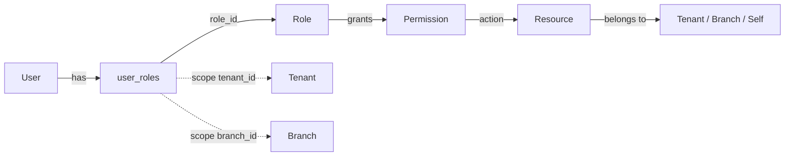
```mermaid
flowchart LR
    User[User] -->|has| UserRole[user_roles]
    UserRole -->|role_id| Role[Role]
    Role -->|grants| Perm[Permission]
    UserRole -.->|scope tenant_id| Tenant[Tenant]
    UserRole -.->|scope branch_id| Branch[Branch]
    Perm -->|action| Resource[Resource]
    Resource -->|belongs to| TenantScope[Tenant / Branch / Self]
```

- **Role** trả lời: user loại gì được làm hành động gì.
- **Scope** trả lời: hành động đó áp dụng trong phạm vi nào — của chính mình / chi nhánh / toàn tenant / toàn platform.

#### Nguyên tắc #2 — Permission code dạng `resource:action:scope`

Đặt permission code theo format chuẩn giúp:
- Dễ map role ↔ permission.
- Thêm role mới **không cần sửa code**, chỉ cần gán permission có sẵn (ví dụ: thêm "Kế toán salon" chỉ cần gán `report:view:tenant` + `payment:read:branch`).
- Phục vụ audit log (action code trùng với permission code).

Ví dụ cấu trúc:

```
booking:create:own      # Khách tạo lịch cho mình
booking:read:own        # Nhân viên xem lịch mình phục vụ
booking:update:branch   # Lễ tân sửa lịch trong chi nhánh
booking:update:tenant   # Owner sửa lịch mọi chi nhánh
payment:refund:tenant   # Owner duyệt hoàn tiền
salon:suspend:platform  # Compliance đình chỉ salon
```

### 1.3 Tiêu chí chất lượng

| # | Tiêu chí | Mục tiêu |
|---|----------|----------|
| Q1 | **Tenant isolation tuyệt đối** | Không bao giờ lộ data của tenant A cho user của tenant B — dùng `tenant_id` ở mọi query + RLS ở DB. |
| Q2 | **IDOR prevention** | Mọi endpoint có `:id` đều phải check ownership ở service layer, test kỹ. |
| Q3 | **Audit compliance** | Mọi hành động nhạy cảm (hủy lịch, đổi giá, hoàn tiền, đổi role, xóa review) phải có audit log append-only. |
| Q4 | **Instant revocation** | Khóa nhân viên nghỉ việc → kill session ngay (blacklist JWT trong Redis), không đợi token hết hạn. |
| Q5 | **2FA** | Bắt buộc cho Owner, Branch Manager và mọi role cấp Platform. |
| Q6 | **PDPA VN 91/2025/QH15** | Tách dữ liệu nhạy cảm (sức khỏe, da) khỏi CRM thường, consent rõ ràng. |

---

## Phần 2 — Kiến trúc 3 lớp Actor

### 2.1 Sơ đồ tổng quan

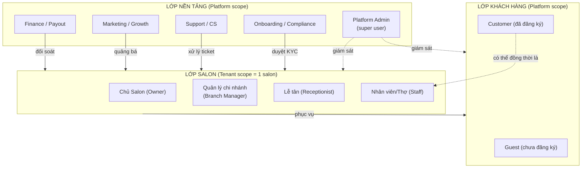
```mermaid
flowchart TB
    subgraph Platform["LỚP NỀN TẢNG (Platform scope)"]
        PA["Platform Admin<br/>(super user)"]
        CO["Onboarding / Compliance"]
        SU["Support / CS"]
        MK["Marketing / Growth"]
        FI["Finance / Payout"]
    end

    subgraph Tenant["LỚP SALON (Tenant scope = 1 salon)"]
        OWN["Chủ Salon (Owner)"]
        BM["Quản lý chi nhánh<br/>(Branch Manager)"]
        RC["Lễ tân (Receptionist)"]
        ST["Nhân viên/Thợ (Staff)"]
    end

    subgraph Customer["LỚP KHÁCH HÀNG (Platform scope)"]
        GU["Guest (chưa đăng ký)"]
        CU["Customer (đã đăng ký)"]
    end

    PA -.giám sát.-> Tenant
    PA -.giám sát.-> Customer
    CO -->|duyệt KYC| Tenant
    SU -->|xử lý ticket| Tenant
    MK -->|quảng bá| Tenant
    FI -->|đối soát| Tenant

    Tenant -->|phục vụ| Customer
    CU -.có thể đồng thời là.-> ST
```

### 2.2 Bảng đặc tả 3 lớp

| Lớp | Actor | Mô tả | Trạng thái dữ liệu | Phạm vi quyền |
|------|-------|--------|---------------------|---------------|
| Khách hàng | **Guest** | Xem salon, dịch vụ, review. Chưa đặt lịch được. | Anonymous / cookie | Public |
| Khách hàng | **Customer** | Đặt / sửa / hủy lịch. Thanh toán. Viết review sau khi dùng. Lưu salon yêu thích. | `users` + role `customer` | `*:*:own` (của mình) |
| Salon | **Staff (Nhân viên/Thợ)** | Xem lịch cá nhân, đổi trạng thái (đã đến / hoàn thành). | `staff_profiles` + role `staff` | `*:own` hoặc `*:branch` (giới hạn chi nhánh) |
| Salon | **Receptionist (Lễ tân)** | Check-in khách, thu tiền, xuất hóa đơn. Thường gộp với Owner ở salon nhỏ. | role `receptionist` scope 1 branch | `*:branch` |
| Salon | **Branch Manager (Quản lý chi nhánh)** | Sửa giờ mở cửa, sửa dịch vụ/bảng giá, duyệt đổi ca, thêm/sửa nhân viên trong chi nhánh. Duyệt hoàn tiền nhỏ. | role `branch_manager` scope 1 branch | `*:branch` |
| Salon | **Owner (Chủ Salon)** | Toàn quyền salon, multi-branch. Tài chính, payout, báo cáo tổng, sửa role nhân viên. | role `owner` scope tenant | `*:tenant` |
| Platform | **Onboarding/Compliance** | Duyệt KYC salon mới, khóa salon vi phạm, xem hồ sơ pháp lý. | role `compliance` scope platform | `salon:*:platform` |
| Platform | **Support/CS** | Xem booking theo ticket hỗ trợ, hoàn tiền trong hạn mức. | role `support` scope platform | `*:platform` (read-mostly) |
| Platform | **Marketing/Growth** | Banner, salon featured, tạo mã KM toàn platform. | role `marketing` scope platform | `promotion:*:platform` |
| Platform | **Finance/Payout** | Đối soát giao dịch, xuất báo cáo tài chính, KHÔNG sửa booking. | role `finance` scope platform | `payment:read:platform` |
| Platform | **Platform Admin** | Toàn quyền hệ thống, sửa role khác, xem log. | role `platform_admin` | `*:*:platform` (super) |

### 2.3 Nguyên tắc phân tách vai trò ở salon nhỏ vs lớn

| Quy mô salon | Mapping gợi ý |
|--------------|----------------|
| **1 cơ sở, < 5 nhân viên** | Gộp Owner + Receptionist + Branch Manager → 1 role duy nhất `owner`. Staff là role riêng. |
| **1 cơ sở, ≥ 5 nhân viên** | Tách `owner` + `receptionist` + `staff`. Branch Manager = Owner (không cần tách). |
| **Đa chi nhánh** | Tách rõ `branch_manager` cho mỗi chi nhánh; `owner` xem tổng. |

> Khi mở rộng từ 1 chi nhánh → 2 chi nhánh: **tách role Branch Manager**, **không cần migration user_roles** (chỉ gán thêm).

---

## Phần 3 — Mô hình RBAC + Scope

### 3.1 Scope là gì?

```
SCOPE         ÁP DỤNG CHO                              VÍ DỤ
─────────────────────────────────────────────────────────────
own           Resource thuộc về chính user đó            Khách xem booking của mình
branch        Resource thuộc chi nhánh mình            Lễ tân xem booking trong chi nhánh mình
tenant        Resource thuộc salon mình                Owner xem booking mọi chi nhánh
platform      Resource ở phạm vi toàn hệ thống         Admin xem log hệ thống, duyệt salon
```

### 3.2 Sơ đồ phân cấp scope

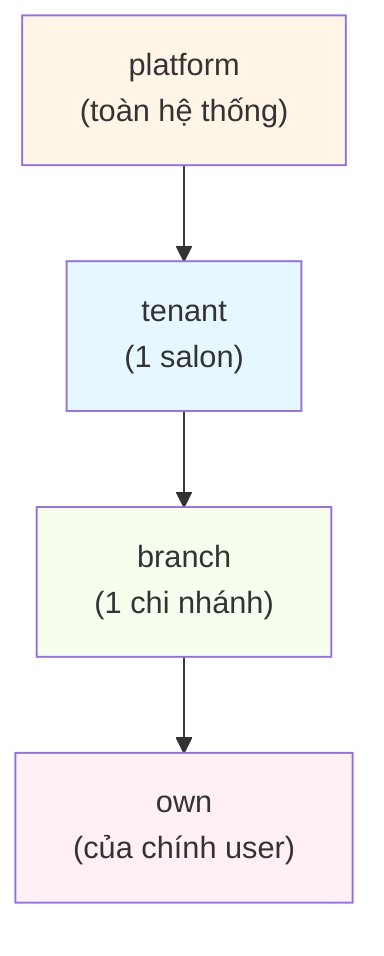
```mermaid
flowchart TB
    P["platform<br/>(toàn hệ thống)"]
    T["tenant<br/>(1 salon)"]
    B["branch<br/>(1 chi nhánh)"]
    O["own<br/>(của chính user)"]

    P --> T
    T --> B
    B --> O

    style P fill:#fff5e6
    style T fill:#e6f7ff
    style B fill:#f6ffed
    style O fill:#fff0f6
```

> Nguyên tắc "khối cha chứa khối con": role có scope `tenant` tự động đọc được mọi `branch` con, nhưng KHÔNG lấn sang tenant khác. Quy tắc này giúp tránh "leak" scope — Branch Manager chi nhánh A không bao giờ thấy chi nhánh B dù cùng tên role.

### 3.3 Quy ước permission code

```
<resource>:<action>:<scope>
```

- **resource** → module nghiệp vụ: `booking`, `service`, `staff`, `customer`, `payment`, `review`, `promotion`, `report`, `salon`, `branch`, `schedule`, `inventory`, `notification`, `audit`, `role`.
- **action** → CRUD + action đặc thù: `create`, `read`, `update`, `delete`, `approve`, `reject`, `refund`, `export`, `assign`, `transfer`.
- **scope** → `own`, `branch`, `tenant`, `platform`.

### 3.4 Ví dụ mapping role → permission

**Role `staff` (nhân viên chi nhánh A):**
```
booking:read:own            # Xem lịch mình phục vụ
booking:update_status:own   # Đổi trạng thái lịch mình phục vụ (đã đến, hoàn thành)
schedule:read:own           # Xem ca làm việc của mình
schedule:request_swap:own   # Gửi yêu cầu đổi ca
customer:read:assigned      # Xem info khách đang/đã được mình phục vụ
service:read:branch         # Xem dịch vụ & giá của chi nhánh mình
review:read:self            # Xem review về mình
report:view_commission:own  # Xem hoa hồng của mình
```

**Role `owner` (chủ salon):**
```
# Toàn bộ permission của staff + receptionist + branch_manager
# CỘNG thêm:
booking:*:tenant
staff:*:tenant
service:*:tenant
report:*:tenant
payment:refund:tenant       # Duyệt hoàn tiền mọi mức
salon:update:tenant         # Sửa thông tin salon
branch:*:tenant             # CRUD chi nhánh
role:assign:tenant          # Gán role cho user trong salon
```

---

## Phần 4 — Ma trận phân quyền đầy đủ theo từng chức năng

> **Cách đọc**: Ô để trống = không có quyền. Ký hiệu viết tắt: `O` = own, `B` = branch, `T` = tenant, `P` = platform, `✓` = toàn quyền bất kể scope, `R` = chỉ đọc, `-` = không có quyền.

### 4.1 Module BOOKINGS (Lịch hẹn)

| Hành động | Customer | Staff | Receptionist | Branch Mgr | Owner | Compliance | Support | Finance | Platform Admin |
|-----------|:--------:|:-----:|:-----------:|:----------:|:-----:|:----------:|:-------:|:-------:|:--------------:|
| Tạo booking cho mình | ✓ (O) | - | ✓ (O) | ✓ (O) | ✓ (O) | - | - | - | ✓ |
| Tạo booking hộ khách (walk-in) | - | - | ✓ (B) | ✓ (B) | ✓ (T) | - | - | - | ✓ |
| Xem danh sách booking của tôi | ✓ (O) | - | ✓ (O - walk-in mình tạo) | ✓ (O) | ✓ (T) | - | - | - | ✓ |
| Xem booking trong chi nhánh | - | ✓ (O - lịch mình phục vụ) | ✓ (B) | ✓ (B) | ✓ (T) | - | ✓ (theo ticket) | R (T) | ✓ |
| Sửa thời gian/giờ của lịch mình | ✓ (O, theo policy) | - | ✓ (B) | ✓ (B) | ✓ (T) | - | - | - | ✓ |
| Đổi nhân viên phục vụ | - | - | ✓ (B) | ✓ (B) | ✓ (T) | - | - | - | ✓ |
| Đổi trạng thái (đã đến/hoàn thành/no-show/hủy) | ✓ (O - chỉ cancel của mình) | ✓ (O - lịch mình) | ✓ (B) | ✓ (B) | ✓ (T) | - | - | - | ✓ |
| Hủy lịch - khách | ✓ (O, theo chính sách hủy) | - | ✓ (B) | ✓ (B) | ✓ (T) | - | - | - | ✓ |
| Hủy lịch - trước giờ hẹn (khoanh nợ) | - | - | ✓ (B) | ✓ (B) | ✓ (T) | - | - | - | ✓ |
| Thêm ghi chú nội bộ salon | - | ✓ (O) | ✓ (B) | ✓ (B) | ✓ (T) | - | - | - | ✓ |
| Thêm ghi chú nhạy cảm (sức khỏe/da) | ✓ (O - với consent) | ✓ (O - lịch mình) | ✓ (B - với consent) | ✓ (B - với consent) | ✓ (T - với consent) | - | - | - | ✓ |
| Yêu cầu đổi lịch (change request) | ✓ (O) | ✓ (O) | ✓ (B) | ✓ (B - duyệt) | ✓ (T - duyệt cuối) | - | - | - | ✓ |
| In/xuất phiếu hẹn | ✓ (O) | ✓ (O) | ✓ (B) | ✓ (B) | ✓ (T) | - | ✓ | R (T) | ✓ |
| Xem lịch sử tương tác (timeline) của 1 booking | ✓ (O) | ✓ (O) | ✓ (B) | ✓ (B) | ✓ (T) | - | ✓ (theo ticket) | R (T) | ✓ |

### 4.2 Module SERVICES (Dịch vụ & Bảng giá)

| Hành động | Customer | Staff | Receptionist | Branch Mgr | Owner | Compliance | Support | Finance | Platform Admin |
|-----------|:--------:|:-----:|:-----------:|:----------:|:-----:|:----------:|:-------:|:-------:|:--------------:|
| Xem danh sách dịch vụ public | ✓ | ✓ | ✓ | ✓ | ✓ | ✓ | ✓ | ✓ | ✓ |
| Xem giá dịch vụ | ✓ | ✓ | ✓ | ✓ | ✓ | R | R | R | ✓ |
| Tạo dịch vụ mới | - | - | - | ✓ (B) | ✓ (T) | - | - | - | ✓ |
| Sửa tên/mô tả/ảnh dịch vụ | - | - | - | ✓ (B) | ✓ (T) | - | - | - | ✓ |
| Sửa giá dịch vụ | - | - | - | ✓ (B, có thể cần duyệt Owner) | ✓ (T) | - | - | - | ✓ |
| Xóa (soft-delete) dịch vụ | - | - | - | ✓ (B) | ✓ (T) | - | - | - | ✓ |
| Sắp xếp thứ tự hiển thị | - | - | ✓ (B) | ✓ (B) | ✓ (T) | - | - | - | ✓ |
| Tạo nhóm dịch vụ (category) | - | - | - | ✓ (B) | ✓ (T) | - | - | - | ✓ |
| Đánh dấu dịch vụ nổi bật (featured) | - | - | - | ✓ (B) | ✓ (T) | ✓ (P - toàn platform) | - | - | ✓ |
| Xem dịch vụ bị ẩn/đã xóa | - | - | ✓ (B) | ✓ (B) | ✓ (T) | - | - | - | ✓ |

### 4.3 Module STAFF (Nhân viên) & SCHEDULE (Lịch làm việc)

| Hành động | Customer | Staff | Receptionist | Branch Mgr | Owner | Compliance | Support | Finance | Platform Admin |
|-----------|:--------:|:-----:|:-----------:|:----------:|:-----:|:----------:|:-------:|:-------:|:--------------:|
| Xem hồ sơ nhân viên (public info) | ✓ (R) | ✓ (O) | ✓ (B) | ✓ (B) | ✓ (T) | R | - | - | ✓ |
| Xem lương/hoa hồng của nhân viên | - | ✓ (O, của mình) | - | ✓ (B) | ✓ (T) | - | - | ✓ (T - readonly) | ✓ |
| Thêm nhân viên mới | - | - | - | ✓ (B) | ✓ (T) | - | - | - | ✓ |
| Khóa / mở khóa tài khoản nhân viên | - | - | - | ✓ (B) | ✓ (T) | ✓ (P - lock salon owner vi phạm) | - | - | ✓ |
| Sửa hồ sơ nhân viên (tên, ảnh, kỹ năng) | - | ✓ (O) | - | ✓ (B) | ✓ (T) | - | - | - | ✓ |
| Sửa commission rate | - | - | - | ✗ (cần Owner duyệt) | ✓ (T) | - | - | - | ✓ |
| Đổi chi nhánh làm việc | - | - | - | ✗ (cần Owner duyệt) | ✓ (T) | - | - | - | ✓ |
| **SCHEDULE** | | | | | | | | | |
| Xem lịch làm việc cá nhân | - | ✓ (O) | ✓ (O) | ✓ (O) | ✓ (T) | - | - | - | ✓ |
| Xem lịch toàn chi nhánh / salon | - | ✓ (B - lịch rảnh để book) | ✓ (B) | ✓ (B) | ✓ (T) | - | - | - | ✓ |
| Tạo ca làm việc cho nhân viên | - | - | - | ✓ (B) | ✓ (T) | - | - | - | ✓ |
| Sửa ca của chính mình | - | ✓ (O, có thể cần duyệt) | - | ✓ (O - nhân viên mình quản lý) | ✓ (T) | - | - | - | ✓ |
| Duyệt yêu cầu đổi ca | - | - | - | ✓ (B) | ✓ (T) | - | - | - | ✓ |
| Xin nghỉ phép | - | ✓ (O) | ✓ (O) | ✓ (O) | ✓ (O) | - | - | - | ✓ |
| Duyệt đơn nghỉ phép | - | - | - | ✓ (B) | ✓ (T) | - | - | - | ✓ |
| Time-off / block-off giờ nghỉ | - | ✓ (O) | - | ✓ (B) | ✓ (T) | - | - | - | ✓ |

### 4.4 Module CUSTOMERS (CRM)

| Hành động | Customer | Staff | Receptionist | Branch Mgr | Owner | Compliance | Support | Finance | Platform Admin |
|-----------|:--------:|:-----:|:-----------:|:----------:|:-----:|:----------:|:-------:|:-------:|:--------------:|
| Xem/sửa hồ sơ của mình | ✓ | - | - | - | - | - | - | - | ✓ |
| Xem khách của booking mình phục vụ | - | ✓ (assigned only) | ✓ (B - toàn bộ khách chi nhánh) | ✓ (B) | ✓ (T) | R (theo ticket) | - | - | ✓ |
| Tìm kiếm khách trong chi nhánh | - | - | ✓ (B) | ✓ (B) | ✓ (T) | - | ✓ (theo ticket) | - | ✓ |
| Tìm kiếm khách toàn platform | - | - | - | - | ✓ (T) | ✓ (P - theo case vi phạm) | ✓ (theo ticket) | - | ✓ |
| Xem lịch sử booking của khách | - | ✓ (của khách mình phục vụ) | ✓ (B) | ✓ (B) | ✓ (T) | R | R | - | ✓ |
| Sửa thông tin khách (SĐT, email, ghi chú) | - | - | ✓ (B) | ✓ (B) | ✓ (T) | - | - | - | ✓ |
| Merge khách trùng (2 tài khoản = 1 người) | - | - | - | ✓ (B) | ✓ (T) | - | ✓ (theo ticket) | - | ✓ |
| Gắn nhãn khách (VIP, allergic, v.v.) | - | - | ✓ (B) | ✓ (B) | ✓ (T) | - | - | - | ✓ |
| Gửi tin nhắn chăm sóc (broadcast theo tag) | - | - | ✓ (B, có template duyệt sẵn) | ✓ (B) | ✓ (T) | - | - | - | ✓ |
| Export CSV khách (theo PDPA) | - | - | - | ✓ (B - chỉ metadata cơ bản) | ✓ (T) | ✓ (P, theo lệnh) | - | - | ✓ |
| Xem dữ liệu nhạy cảm (sức khỏe/da) | ✓ (O - của mình) | ✓ (O - khách đang phục vụ) | ✗ | ✓ (B - khi cần) | ✓ (T) | - | - | - | ✓ |
| Xóa khách (quyền quên - PDPA) | ✓ (O - xóa tài khoản mình) | - | - | - | - | ✓ (P - theo yêu cầu) | ✓ (theo ticket) | - | ✓ |

### 4.5 Module PAYMENTS (Thanh toán) & PAYOUTS

| Hành động | Customer | Staff | Receptionist | Branch Mgr | Owner | Compliance | Support | Finance | Platform Admin |
|-----------|:--------:|:-----:|:-----------:|:----------:|:-----:|:----------:|:-------:|:-------:|:--------------:|
| Thanh toán online (VNPay, MoMo, Stripe) | ✓ (O) | - | ✓ (B - thu hộ walk-in) | ✓ (B) | ✓ (T) | - | - | - | ✓ |
| Thanh toán tại salon (tiền mặt, POS) | - | - | ✓ (B) | ✓ (B) | ✓ (T) | - | - | - | ✓ |
| Xem hóa đơn của mình | ✓ (O) | - | ✓ (B - in lại) | ✓ (B) | ✓ (T) | R | R | R | ✓ |
| Xuất hóa đơn VAT | - | - | ✓ (B) | ✓ (B) | ✓ (T) | - | - | ✓ (T) | ✓ |
| Hoàn tiền online (đến hạn mức nhỏ) | - | - | - | ✓ (B) | ✓ (T) | - | ✓ (P - hạn mức platform) | - | ✓ |
| Hoàn tiền online (hạn mức lớn - cần Owner) | - | - | - | ✗ (gửi yêu cầu Owner duyệt) | ✓ (T) | - | ✓ | - | ✓ |
| Hoàn tiền một phần (partial) | - | - | - | ✓ (B - theo policy) | ✓ (T) | - | ✓ | - | ✓ |
| Áp dụng mã giảm giá/voucher | ✓ (O) | - | ✓ (B) | ✓ (B) | ✓ (T) | - | - | - | ✓ |
| Tạo mã giảm giá/voucher | - | - | - | ✓ (B - trong chi nhánh) | ✓ (T - toàn salon) | ✓ (P - toàn platform) | - | - | ✓ |
| Đối soát giao dịch trong ngày | - | - | ✓ (B) | ✓ (B) | ✓ (T) | - | - | ✓ (T+P) | ✓ |
| Yêu cầu rút tiền (payout) | - | - | - | - | ✓ (T) | - | - | ✓ (P - xử lý) | ✓ |
| Khoanh nợ / đánh dấu nợ xấu | - | - | - | ✓ (B) | ✓ (T) | - | - | ✓ (P) | ✓ |
| Xem số dư & lịch sử payout | - | - | - | ✓ (B - chi nhánh mình) | ✓ (T) | - | - | ✓ (P+T) | ✓ |
| Refund > ngưỡng Owner (cần Platform duyệt) | - | - | - | - | ✗ (gửi yêu cầu) | - | - | - | ✓ |

### 4.6 Module REVIEWS (Đánh giá)

| Hành động | Customer | Staff | Receptionist | Branch Mgr | Owner | Compliance | Support | Finance | Platform Admin |
|-----------|:--------:|:-----:|:-----------:|:----------:|:-----:|:----------:|:-------:|:-------:|:--------------:|
| Viết review sau khi dùng dịch vụ | ✓ (O, trong 30 ngày) | - | - | - | - | - | - | - | ✓ |
| Sửa review của mình | ✓ (O, trong 24h) | - | - | - | - | - | - | - | ✓ |
| Xóa review của mình | ✓ (O) | - | - | - | - | - | - | - | ✓ |
| Xem review công khai | ✓ | ✓ (review về mình) | ✓ | ✓ | ✓ | ✓ | ✓ | ✓ | ✓ |
| Trả lời review | - | - | - | ✓ (B) | ✓ (T) | - | - | - | ✓ |
| Ẩn review vi phạm | - | - | - | ✗ (gửi yêu cầu) | ✓ (T) | ✓ (P) | ✓ | - | ✓ |
| Báo cáo review spam/vi phạm | ✓ | ✓ | ✓ | ✓ | ✓ | - | - | - | ✓ |
| Xem review nội bộ (rating ẩn) | - | - | ✓ (B) | ✓ (B) | ✓ (T) | - | - | - | ✓ |
| Yêu cầu khách viết review (reminder) | ✓ (O - nhận nhắc) | - | ✓ (B - manual) | ✓ (B) | ✓ (T) | - | - | - | ✓ |

### 4.7 Module PROMOTIONS (Khuyến mãi) & MARKETING

| Hành động | Customer | Staff | Receptionist | Branch Mgr | Owner | Compliance | Support | Marketing | Finance | Platform Admin |
|-----------|:--------:|:-----:|:-----------:|:----------:|:-----:|:----------:|:-------:|:---------:|:-------:|:--------------:|
| Xem danh sách KM đang áp dụng | ✓ | ✓ | ✓ | ✓ | ✓ | ✓ | ✓ | ✓ | ✓ | ✓ |
| Áp dụng mã KM khi thanh toán | ✓ (O) | - | ✓ (B) | ✓ (B) | ✓ (T) | - | - | - | - | ✓ |
| Tạo KM cho chi nhánh mình | - | - | - | ✓ (B) | ✓ (T) | - | - | - | - | ✓ |
| Tạo KM toàn salon | - | - | - | - | ✓ (T) | - | - | - | - | ✓ |
| Tạo KM toàn platform | - | - | - | - | - | - | - | ✓ (P) | - | ✓ |
| Cài đặt giới hạn sử dụng KM | - | - | - | ✓ (B) | ✓ (T) | - | - | ✓ (P) | - | ✓ |
| Banner / featured salon | - | - | - | ✓ (B - đề xuất) | ✓ (T - đề xuất) | - | - | ✓ (P - quyết định) | - | ✓ |
| Gửi push notification (broadcast) | ✓ (O - nhận) | - | ✗ (chỉ theo template) | ✓ (B - template duyệt) | ✓ (T) | - | - | ✓ (P) | - | ✓ |
| Email/SMS campaign | - | - | - | ✓ (B - theo template) | ✓ (T) | - | - | ✓ (P) | - | ✓ |

### 4.8 Module REPORTS (Báo cáo) & ANALYTICS

| Hành động | Customer | Staff | Receptionist | Branch Mgr | Owner | Compliance | Support | Finance | Platform Admin |
|-----------|:--------:|:-----:|:-----------:|:----------:|:-----:|:----------:|:-------:|:-------:|:--------------:|
| Báo cáo doanh thu chi nhánh | - | - | - | ✓ (B) | ✓ (T) | - | - | ✓ (T+P) | ✓ |
| Báo cáo doanh thu toàn platform | - | - | - | - | - | - | - | ✓ (P) | ✓ |
| Hoa hồng cá nhân (commission) | - | ✓ (O) | - | ✓ (B - của nhân viên mình) | ✓ (T) | - | - | ✓ (T) | ✓ |
| Tỷ lệ no-show / hủy | - | - | - | ✓ (B) | ✓ (T) | - | - | ✓ (T) | ✓ |
| Top dịch vụ / top khách | - | - | - | ✓ (B) | ✓ (T) | - | - | ✓ (T) | ✓ |
| Utilization rate nhân viên | - | - | - | ✓ (B) | ✓ (T) | - | - | - | ✓ |
| Funnel booking → check-in | - | - | ✓ (B) | ✓ (B) | ✓ (T) | - | - | - | ✓ |
| Xuất CSV/PDF báo cáo | - | - | ✓ (B - báo cáo cơ bản) | ✓ (B) | ✓ (T) | - | - | ✓ (P) | ✓ |
| Báo cáo KYC / tuân thủ | - | - | - | - | ✓ (T - của salon mình) | ✓ (P) | - | - | ✓ |
| Báo cáo gian lận / chargeback | - | - | - | - | ✓ (T) | ✓ (P) | ✓ | ✓ | ✓ |

### 4.9 Module SALON & BRANCH (Thông tin salon / cài đặt)

| Hành động | Customer | Staff | Receptionist | Branch Mgr | Owner | Compliance | Support | Finance | Platform Admin |
|-----------|:--------:|:-----:|:-----------:|:----------:|:-----:|:----------:|:-------:|:-------:|:--------------:|
| Xem thông tin public salon | ✓ | ✓ | ✓ | ✓ | ✓ | ✓ | ✓ | ✓ | ✓ |
| Sửa mô tả / ảnh / giờ mở cửa chi nhánh | - | - | - | ✓ (B) | ✓ (T) | - | - | - | ✓ |
| Sửa thông tin pháp lý (tên DN, MST, địa chỉ KD) | - | - | - | - | ✓ (T, cần duyệt lại KYC) | ✓ (P - duyệt) | - | - | ✓ |
| Sửa thông tin liên hệ (SĐT, email) | - | - | - | ✓ (B) | ✓ (T) | - | - | - | ✓ |
| Thêm chi nhánh mới | - | - | - | ✗ (cần Owner tạo + Platform duyệt) | ✓ (T) | ✓ (P - duyệt) | - | - | ✓ |
| Đóng chi nhánh | - | - | - | - | ✓ (T) | ✓ (P - duyệt) | - | - | ✓ |
| Cấu hình chính sách hủy (cancellation policy) | - | - | - | ✓ (B - đề xuất) | ✓ (T - quyết định) | ✓ (P - duyệt nếu ngoài policy sàn) | - | - | ✓ |
| Cấu hình thông báo (templates) | - | - | - | ✓ (B) | ✓ (T) | - | - | - | ✓ |
| Upload giấy phép KD (giấy tờ pháp lý) | - | - | - | - | ✓ (T) | ✓ (P - duyệt) | - | - | ✓ |
| Cấu hình payout (tài khoản NH) | - | - | - | - | ✓ (T) | ✓ (P - verify) | - | - | ✓ |
| Tạm dừng / đóng cửa salon (khi nghỉ lễ, sửa) | - | - | - | ✓ (B) | ✓ (T) | - | - | - | ✓ |

### 4.10 Module ROLES & USER MANAGEMENT (cấp salon)

| Hành động | Customer | Staff | Receptionist | Branch Mgr | Owner | Compliance | Support | Finance | Platform Admin |
|-----------|:--------:|:-----:|:-----------:|:----------:|:-----:|:----------:|:-------:|:-------:|:--------------:|
| Mời user mới vào salon | - | - | - | ✓ (B - role ≤ receptionist) | ✓ (T - mọi role) | - | - | - | ✓ |
| Gán role cho user trong salon mình | - | - | - | ✓ (B - nhưng KHÔNG gán được owner/branch_manager) | ✓ (T - mọi role) | ✓ (P - role platform) | - | - | ✓ |
| Thu hồi role | - | - | - | ✓ (B - thu hồi role dưới mình) | ✓ (T) | ✓ (P) | - | - | ✓ |
| Xem danh sách thành viên salon | - | ✓ (B - limited view) | ✓ (B) | ✓ (B) | ✓ (T) | - | - | - | ✓ |
| Xem audit log thay đổi role | - | - | - | ✓ (B - log thay đổi role trong chi nhánh mình) | ✓ (T) | ✓ (P) | - | - | ✓ |
| Cho phép impersonate user (debug) | - | - | - | - | - | - | - | - | ✓ (có log riêng) |

### 4.11 Module NOTIFICATIONS (Thông báo)

| Hành động | Customer | Staff | Receptionist | Branch Mgr | Owner | Compliance | Support | Finance | Platform Admin |
|-----------|:--------:|:-----:|:-----------:|:----------:|:-----:|:----------:|:-------:|:-------:|:--------------:|
| Nhận thông báo (push/email/SMS) | ✓ (O) | ✓ (O) | ✓ (B) | ✓ (B) | ✓ (T) | ✓ | ✓ | ✓ | ✓ |
| Xem lịch sử thông báo của mình | ✓ (O) | ✓ (O) | ✓ (O) | ✓ (O) | ✓ (O) | ✓ | ✓ | ✓ | ✓ |
| Cài đặt tùy chọn nhận thông báo | ✓ (O) | ✓ (O) | ✓ (O) | ✓ (O) | ✓ (O) | ✓ | ✓ | ✓ | ✓ |
| Template thông báo (salon tự tạo) | - | - | - | ✓ (B) | ✓ (T) | - | - | - | ✓ |
| Template thông báo toàn platform | - | - | - | - | - | - | - | ✓ (P - duyệt) | ✓ |

### 4.12 Module AUDIT & LOGS

| Hành động | Customer | Staff | Receptionist | Branch Mgr | Owner | Compliance | Support | Finance | Platform Admin |
|-----------|:--------:|:-----:|:-----------:|:----------:|:-----:|:----------:|:-------:|:-------:|:--------------:|
| Xem audit log của tenant mình | - | - | - | ✓ (B - filter chi nhánh) | ✓ (T) | ✓ (P) | - | - | ✓ |
| Xem audit log toàn platform | - | - | - | - | - | ✓ (P) | - | - | ✓ |
| Export audit log (theo yêu cầu pháp lý) | - | - | - | - | ✓ (T - của salon mình) | ✓ (P) | - | - | ✓ |
| Audit log entry — ai cũng bị ghi | ✓ | ✓ | ✓ | ✓ | ✓ | ✓ | ✓ | ✓ | ✓ |
| Audit log — KHÔNG được sửa/xóa | - | - | - | - | - | - | - | - | (chỉ đọc) |

### 4.13 Module INVENTORY (Nguyên liệu / sản phẩm — optional, salon lớn)

| Hành động | Customer | Staff | Receptionist | Branch Mgr | Owner | Compliance | Support | Finance | Platform Admin |
|-----------|:--------:|:-----:|:-----------:|:----------:|:-----:|:----------:|:-------:|:-------:|:--------------:|
| Xem tồn kho | - | ✓ (O - assigned shift) | ✓ (B) | ✓ (B) | ✓ (T) | - | - | - | ✓ |
| Nhập kho | - | - | ✓ (B) | ✓ (B) | ✓ (T) | - | - | - | ✓ |
| Xuất kho (tiêu hao theo booking) | - | ✓ (O) | ✓ (B) | ✓ (B) | ✓ (T) | - | - | - | ✓ |
| Đặt hàng nhà cung cấp | - | - | - | ✓ (B) | ✓ (T) | - | - | - | ✓ |
| Cảnh báo hết hàng | - | - | ✓ (B - nhận) | ✓ (B) | ✓ (T) | - | - | - | ✓ |

### 4.14 Module CHAT / MESSAGING (nếu có in-app chat)

| Hành động | Customer | Staff | Receptionist | Branch Mgr | Owner | Compliance | Support | Finance | Platform Admin |
|-----------|:--------:|:-----:|:-----------:|:----------:|:-----:|:----------:|:-------:|:-------:|:--------------:|
| Nhắn với salon về booking của mình | ✓ (O) | ✓ (O - khách mình phục vụ) | ✓ (B) | ✓ (B) | ✓ (T) | - | ✓ (theo ticket) | - | ✓ |
| Broadcast tin nhắn tới khách | - | - | ✓ (B - theo template) | ✓ (B) | ✓ (T) | - | - | - | ✓ |
| Khóa chat spam | - | - | ✓ (B) | ✓ (B) | ✓ (T) | ✓ (P) | ✓ | - | ✓ |
| Xem lịch sử chat (audit) | - | - | ✓ (B) | ✓ (B) | ✓ (T) | ✓ (theo case) | ✓ | - | ✓ |

---

## Phần 5 — Vai trò cấp nền tảng (Marketplace only)

### 5.1 Bảng trách nhiệm cụ thể

| Role | Trách nhiệm | Quyền tiêu biểu | Hạn chế cốt lõi |
|------|--------------|-----------------|------------------|
| **Platform Admin** | Vận hành toàn hệ thống, fix bug ở cấp data, sửa role bất kỳ user nào, xem log. | `*:*:platform` (super) | Phải qua 2FA; mọi action log riêng với cờ `super_admin_action=true`. |
| **Onboarding/Compliance** | Duyệt KYC salon mới (giấy ĐKKD, MST, CMND chủ), xử lý báo cáo vi phạm (review spam, salon ảo), khóa salon vi phạm. | `salon:approve:platform`, `salon:suspend:platform`, `kyc:read:platform`, `report:handle:platform` | KHÔNG đọc được dữ liệu kinh doanh chi tiết (doanh thu/booking nội dung); chỉ metadata. |
| **Support/CS** | Xử lý ticket khiếu nại: xem booking, payment liên quan ticket, hoàn tiền trong hạn mức (VD: ≤ 500k), escalate lên Finance nếu vượt. | `booking:read:platform` (theo `ticket_id`), `payment:read:platform` (theo ticket), `payment:refund:platform` (small) | KHÔNG được refund > hạn mức mà không có Finance duyệt; KHÔNG thấy data ngoài ticket. |
| **Marketing/Growth** | Tạo banner, salon featured, mã KM toàn platform, push notification broadcast. | `promotion:*:platform`, `banner:*:platform`, `featured_salon:*:platform` | KHÔNG truy cập CRM chi tiết; chỉ metric aggregate (số lượt booking, rating trung bình). |
| **Finance/Payout** | Đối soát giao dịch merchant, xử lý payout cho salon, xuất báo cáo tài chính, khoanh nợ. | `payment:read:platform`, `payout:*:platform`, `report:export_finance:platform` | KHÔNG được sửa booking; chỉ tạo/cập nhật payout record. |

### 5.2 Nguyên tắc separation of duties (tách trách nhiệm)

- **Không ai có quyền vừa "tạo salon" vừa "duyệt payout"** → Compliance tạo, Finance payout.
- **Hoàn tiền > ngưỡng** cần **2 chữ ký** (VD: Support refund ≤ 500k, Finance refund ≤ 5tr, Owner salon đồng ý với số lớn hơn).
- **Đổi role Platform Admin** cần **multi-admin approval** (ít nhất 2 admin khác duyệt).
- **Sửa data master record** (giá dịch vụ đã phát hành hóa đơn) → phải có audit log + flag cho compliance review.

---

## Phần 6 — Thiết kế dữ liệu

### 6.1 Sơ đồ quan hệ tổng quan

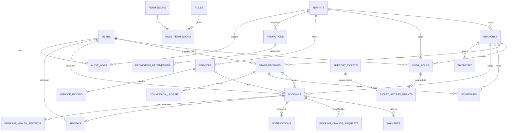
```mermaid
erDiagram
    USERS ||--o{ USER_ROLES : "has many"
    USERS ||--o{ STAFF_PROFILES : "is staff"
    USERS ||--o{ BOOKINGS : "customer"
    USERS ||--o{ REVIEWS : "authored"
    USERS ||--o{ AUDIT_LOGS : "actor"

    TENANTS ||--o{ BRANCHES : "owns"
    TENANTS ||--o{ USER_ROLES : "scope"
    TENANTS ||--o{ SERVICES : "offers"
    TENANTS ||--o{ PROMOTIONS : "campaigns"
    TENANTS ||--o{ AUDIT_LOGS : "subject"

    BRANCHES ||--o{ USER_ROLES : "scope"
    BRANCHES ||--o{ STAFF_PROFILES : "employs"
    BRANCHES ||--o{ SCHEDULES : "hosts"
    BRANCHES ||--o{ BOOKINGS : "hosts"
    BRANCHES ||--o{ INVENTORY : "stores"

    STAFF_PROFILES ||--o{ BOOKINGS : "serves"
    STAFF_PROFILES ||--o{ SCHEDULES : "works"
    STAFF_PROFILES ||--o{ COMMISSION_LEDGER : "earns"

    SERVICES ||--o{ BOOKINGS : "for"
    SERVICES ||--o{ SERVICE_PRICING : "priced at"

    BOOKINGS ||--o{ PAYMENTS : "paid by"
    BOOKINGS ||--o{ BOOKING_CHANGE_REQUESTS : "modified by"
    BOOKINGS ||--o{ NOTIFICATIONS : "triggered"
    BOOKINGS ||--o| REVIEWS : "rated"
    BOOKINGS ||--o{ BOOKING_HEALTH_RECORDS : "has_sensitive"

    PROMOTIONS ||--o{ PROMOTION_REDEMPTIONS : "redeemed"

    ROLES ||--o{ ROLE_PERMISSIONS : "grants"
    PERMISSIONS ||--o{ ROLE_PERMISSIONS : "in"

    SUPPORT_TICKETS ||--o{ TICKET_ACCESS_GRANTS : "scope-limited"
    USER_ROLES ||--o{ TICKET_ACCESS_GRANTS : "granted via"
```

### 6.2 Bảng `users`

```sql
CREATE TABLE users (
  id            UUID PRIMARY KEY,
  email         CITEXT UNIQUE NOT NULL,
  phone         VARCHAR(20) UNIQUE,
  password_hash TEXT NOT NULL,
  full_name     VARCHAR(120),
  avatar_url    TEXT,
  status        ENUM('active', 'pending_verification', 'locked', 'deleted') DEFAULT 'pending_verification',
  two_factor_secret TEXT,                  -- mã hóa, chỉ load khi bật 2FA
  two_factor_enabled BOOLEAN DEFAULT FALSE,
  gdpr_consent_at TIMESTAMP,                -- đồng ý PDPA VN lúc đăng ký
  gdpr_consent_version VARCHAR(20),
  created_at    TIMESTAMP DEFAULT NOW(),
  updated_at    TIMESTAMP DEFAULT NOW(),
  deleted_at    TIMESTAMP
);
CREATE INDEX idx_users_phone ON users(phone);
```

### 6.3 Bảng `tenants` (= salon)

```sql
CREATE TABLE tenants (
  id                  UUID PRIMARY KEY,
  name                VARCHAR(200) NOT NULL,
  slug                VARCHAR(80)  UNIQUE NOT NULL,    -- URL-friendly, vd: "toc-tien-phong"
  legal_name          VARCHAR(200),                    -- tên pháp lý (ĐKKD)
  tax_code            VARCHAR(20),
  owner_user_id       UUID NOT NULL REFERENCES users(id),
  status              ENUM('onboarding', 'active', 'suspended', 'closed') DEFAULT 'onboarding',
  subscription_tier   ENUM('free', 'basic', 'pro', 'enterprise') DEFAULT 'free',
  kyc_status          ENUM('not_started', 'pending', 'approved', 'rejected') DEFAULT 'not_started',
  contract_signed_at  TIMESTAMP,
  created_at          TIMESTAMP DEFAULT NOW()
);
CREATE INDEX idx_tenants_status ON tenants(status);
CREATE INDEX idx_tenants_owner ON tenants(owner_user_id);
```

### 6.4 Bảng `branches`

```sql
CREATE TABLE branches (
  id              UUID PRIMARY KEY,
  tenant_id       UUID NOT NULL REFERENCES tenants(id) ON DELETE CASCADE,
  name            VARCHAR(200) NOT NULL,
  address         TEXT,
  ward            VARCHAR(80),
  district        VARCHAR(80),
  city            VARCHAR(80),
  geo_lat         DECIMAL(9, 6),
  geo_lng         DECIMAL(9, 6),
  phone           VARCHAR(20),
  opening_hours   JSONB,                              -- {"mon": [{"open":"09:00","close":"21:00"}], ...}
  is_active       BOOLEAN DEFAULT TRUE,
  created_at      TIMESTAMP DEFAULT NOW(),
  deleted_at      TIMESTAMP
);
CREATE INDEX idx_branches_tenant ON branches(tenant_id);
CREATE INDEX idx_branches_geo ON branches(geo_lat, geo_lng);
```

### 6.5 Bảng `roles`

```sql
CREATE TABLE roles (
  id    UUID PRIMARY KEY,
  code  VARCHAR(40) UNIQUE NOT NULL,    -- vd: 'customer', 'staff', 'owner', 'branch_manager', 'receptionist'
  name  VARCHAR(120) NOT NULL,
  level ENUM('platform', 'tenant', 'branch') NOT NULL,
  description TEXT
);
```

### 6.6 Bảng `permissions`

```sql
CREATE TABLE permissions (
  id    UUID PRIMARY KEY,
  code  VARCHAR(80) UNIQUE NOT NULL,    -- vd: 'booking:update:branch'
  resource VARCHAR(40) NOT NULL,
  action   VARCHAR(40) NOT NULL,
  scope    VARCHAR(20) NOT NULL,
  description TEXT
);
CREATE INDEX idx_perms_code ON permissions(code);
```

### 6.7 Bảng `role_permissions`

```sql
CREATE TABLE role_permissions (
  role_id       UUID REFERENCES roles(id) ON DELETE CASCADE,
  permission_id UUID REFERENCES permissions(id) ON DELETE CASCADE,
  PRIMARY KEY (role_id, permission_id)
);
```

### 6.8 Bảng `user_roles` — **ĐIỂM MẤU CHỐT**

```sql
CREATE TABLE user_roles (
  id          UUID PRIMARY KEY,
  user_id     UUID NOT NULL REFERENCES users(id) ON DELETE CASCADE,
  role_id     UUID NOT NULL REFERENCES roles(id),
  tenant_id   UUID REFERENCES tenants(id) ON DELETE CASCADE,   -- NULL = role cấp platform
  branch_id   UUID REFERENCES branches(id) ON DELETE CASCADE, -- NULL = role toàn tenant (VD: owner)
  granted_by  UUID REFERENCES users(id),
  granted_at  TIMESTAMP DEFAULT NOW(),
  expires_at  TIMESTAMP,                                     -- NULL = vĩnh viễn; có giá trị = role tạm
  revoked_at  TIMESTAMP,
  revoked_by  UUID REFERENCES users(id),
  revoke_reason TEXT,
  UNIQUE(user_id, role_id, tenant_id, branch_id)             -- tránh trùng lặp
);
CREATE INDEX idx_user_roles_user ON user_roles(user_id);
CREATE INDEX idx_user_roles_tenant_branch ON user_roles(tenant_id, branch_id);

-- Bật RLS (xem mục 7.6)
ALTER TABLE user_roles ENABLE ROW LEVEL SECURITY;
```

**Nguyên tắc**:
- 1 user có thể giữ NHIỀU role ở NHIỀU scope khác nhau. VD:
  - User A vừa là `customer` (platform), vừa là `staff` tại chi nhánh X (tenant T1, branch B1), vừa là `branch_manager` tại chi nhánh Y (tenant T1, branch B2).
- `tenant_id = NULL` → role cấp **platform**.
- `branch_id = NULL` + `tenant_id IS NOT NULL` → role scope **tenant** (VD: owner xem mọi chi nhánh).
- `branch_id IS NOT NULL` → role scope **branch**.
- `expires_at` → dùng cho nhân viên thời vụ, marketing campaign tạm thời.
- `revoked_at` → audit khi thu hồi (không xóa record).

### 6.9 Bảng `staff_profiles`

```sql
CREATE TABLE staff_profiles (
  id                UUID PRIMARY KEY,
  user_id           UUID NOT NULL REFERENCES users(id) ON DELETE CASCADE,
  primary_branch_id UUID NOT NULL REFERENCES branches(id),
  title             VARCHAR(80),                    -- "Senior Stylist", "Therapist"
  specialties       TEXT[],                          -- vd: ['haircut', 'coloring']
  commission_rate   DECIMAL(5,2),                   -- % hoa hồng
  bio               TEXT,
  portfolio_urls    TEXT[],
  is_active         BOOLEAN DEFAULT TRUE,
  hired_at          DATE,
  terminated_at     DATE,
  created_at        TIMESTAMP DEFAULT NOW()
);
CREATE INDEX idx_staff_user ON staff_profiles(user_id);
CREATE INDEX idx_staff_branch ON staff_profiles(primary_branch_id);
```

### 6.10 Bảng `services`

```sql
CREATE TABLE services (
  id              UUID PRIMARY KEY,
  tenant_id       UUID NOT NULL REFERENCES tenants(id) ON DELETE CASCADE,
  category_id     UUID REFERENCES service_categories(id),
  name            VARCHAR(200) NOT NULL,
  description     TEXT,
  duration_min    INT NOT NULL,                     -- phút
  base_price      DECIMAL(12,0) NOT NULL,           -- VND
  image_urls      TEXT[],
  is_featured     BOOLEAN DEFAULT FALSE,
  display_order   INT DEFAULT 0,
  is_active       BOOLEAN DEFAULT TRUE,
  deleted_at      TIMESTAMP,
  created_at      TIMESTAMP DEFAULT NOW()
);
CREATE INDEX idx_services_tenant ON services(tenant_id);
```

### 6.11 Bảng `bookings`

```sql
CREATE TABLE bookings (
  id                       UUID PRIMARY KEY,
  tenant_id                UUID NOT NULL REFERENCES tenants(id),
  branch_id                UUID NOT NULL REFERENCES branches(id),
  customer_id              UUID NOT NULL REFERENCES users(id),
  staff_id                 UUID REFERENCES staff_profiles(id),  -- nullable: khách chưa chọn thợ
  service_id               UUID NOT NULL REFERENCES services(id),
  start_at                 TIMESTAMP NOT NULL,
  end_at                   TIMESTAMP NOT NULL,
  status                   ENUM('pending', 'confirmed', 'checked_in', 'in_progress',
                                'completed', 'cancelled_by_customer', 'cancelled_by_salon',
                                'no_show', 'rescheduled') DEFAULT 'pending',
  price                    DECIMAL(12,0) NOT NULL,
  discount_amount          DECIMAL(12,0) DEFAULT 0,
  final_price              DECIMAL(12,0) NOT NULL,
  customer_note            TEXT,                       -- cơ bản
  internal_note            TEXT,                       -- cơ bản (salon note)
  sensitive_data_consent   BOOLEAN DEFAULT FALSE,      -- true nếu có health record
  source                   ENUM('app', 'walk_in', 'phone', 'partner') DEFAULT 'app',
  created_by               UUID REFERENCES users(id),
  created_at               TIMESTAMP DEFAULT NOW(),
  updated_at               TIMESTAMP DEFAULT NOW()
);
CREATE INDEX idx_bookings_tenant_branch_start ON bookings(tenant_id, branch_id, start_at);
CREATE INDEX idx_bookings_customer ON bookings(customer_id);
CREATE INDEX idx_bookings_staff_start ON bookings(staff_id, start_at);
CREATE INDEX idx_bookings_status ON bookings(status);

ALTER TABLE bookings ENABLE ROW LEVEL SECURITY;
```

### 6.12 Bảng `booking_health_records` — tách dữ liệu nhạy cảm

```sql
CREATE TABLE booking_health_records (
  id              UUID PRIMARY KEY,
  booking_id      UUID NOT NULL UNIQUE REFERENCES bookings(id) ON DELETE CASCADE,
  skin_type       VARCHAR(40),
  allergies       TEXT[],
  medications     TEXT[],                          -- thuốc đang dùng
  conditions      TEXT[],                          -- bệnh nền
  consent_at      TIMESTAMP NOT NULL,              -- thời điểm khách đồng ý cung cấp
  consent_version VARCHAR(20),
  retention_until DATE,                            -- auto-delete sau N ngày theo policy
  created_at      TIMESTAMP DEFAULT NOW()
);

ALTER TABLE booking_health_records ENABLE ROW LEVEL SECURITY;
-- Policy: chỉ staff/manager/owner assigned + customer của booking đó
```

> **Lý do tách bảng**: Theo Luật PDPA VN 91/2025/QH15, dữ liệu sức khỏe/tình trạng da là **dữ liệu nhạy cảm**, cần kiểm soát truy cập chặt hơn CRM thường. Tách bảng giúp:
> - Field-level access (không ai query `SELECT * bookings` lộ ra).
> - Retention policy riêng (VD: xóa sau 2 năm không booking lại).
> - Encryption riêng (key tách).
> - Audit access riêng (mỗi lần đọc là 1 audit row).

### 6.13 Bảng `payments`

```sql
CREATE TABLE payments (
  id                  UUID PRIMARY KEY,
  booking_id          UUID NOT NULL REFERENCES bookings(id),
  amount              DECIMAL(12,0) NOT NULL,
  currency            CHAR(3) DEFAULT 'VND',
  method              ENUM('vnpay', 'momo', 'zalopay', 'stripe', 'cash', 'bank_transfer') NOT NULL,
  status              ENUM('pending', 'paid', 'failed', 'refunded', 'partially_refunded') DEFAULT 'pending',
  gateway_txn_id      VARCHAR(120),                 -- mã giao dịch từ cổng (KHÔNG lưu số thẻ)
  gateway_response    JSONB,
  paid_at             TIMESTAMP,
  refunded_amount     DECIMAL(12,0) DEFAULT 0,
  created_at          TIMESTAMP DEFAULT NOW()
);
CREATE INDEX idx_payments_booking ON payments(booking_id);
CREATE INDEX idx_payments_status ON payments(status);

ALTER TABLE payments ENABLE ROW LEVEL SECURITY;
```

### 6.14 Bảng `reviews`

```sql
CREATE TABLE reviews (
  id          UUID PRIMARY KEY,
  booking_id  UUID NOT NULL UNIQUE REFERENCES bookings(id),
  customer_id UUID NOT NULL REFERENCES users(id),
  branch_id   UUID NOT NULL REFERENCES branches(id),
  staff_id    UUID REFERENCES staff_profiles(id),    -- optional: review riêng thợ
  rating      SMALLINT CHECK (rating BETWEEN 1 AND 5),
  comment     TEXT,
  photos      TEXT[],
  reply       TEXT,                                  -- salon trả lời
  replied_by  UUID REFERENCES users(id),
  replied_at  TIMESTAMP,
  status      ENUM('visible', 'hidden', 'flagged') DEFAULT 'visible',
  flagged_reason TEXT,
  created_at  TIMESTAMP DEFAULT NOW()
);
```

### 6.15 Bảng `promotions`

```sql
CREATE TABLE promotions (
  id              UUID PRIMARY KEY,
  scope           ENUM('platform', 'tenant', 'branch') NOT NULL,
  tenant_id       UUID REFERENCES tenants(id),
  branch_id       UUID REFERENCES branches(id),
  code            VARCHAR(40) UNIQUE,
  name            VARCHAR(200),
  type            ENUM('percent', 'fixed_amount', 'free_service', 'bundle'),
  value           DECIMAL(12,0),
  min_booking_value DECIMAL(12,0),
  max_discount    DECIMAL(12,0),
  usage_limit     INT,
  usage_count     INT DEFAULT 0,
  per_user_limit  INT DEFAULT 1,
  valid_from      TIMESTAMP,
  valid_until     TIMESTAMP,
  is_active       BOOLEAN DEFAULT TRUE,
  created_by      UUID REFERENCES users(id),
  created_at      TIMESTAMP DEFAULT NOW()
);
```

### 6.16 Bảng `audit_logs` — append-only

```sql
CREATE TABLE audit_logs (
  id              UUID PRIMARY KEY,
  actor_user_id   UUID REFERENCES users(id),
  actor_role_codes TEXT[],                          -- snapshot lúc ghi
  action          VARCHAR(80) NOT NULL,             -- vd: 'booking:cancel:branch'
  resource_type   VARCHAR(40) NOT NULL,             -- vd: 'booking'
  resource_id     UUID,
  tenant_id       UUID,                             -- để index theo tenant
  branch_id       UUID,
  before          JSONB,
  after           JSONB,
  diff            JSONB,                            -- computed diff
  ip              INET,
  user_agent      TEXT,
  request_id      UUID,                             -- correlation ID
  super_admin_action BOOLEAN DEFAULT FALSE,         -- flag cho platform admin
  ticket_id       UUID REFERENCES support_tickets(id), -- nếu do support/CS thao tác
  created_at      TIMESTAMP DEFAULT NOW()
);
CREATE INDEX idx_audit_actor ON audit_logs(actor_user_id, created_at DESC);
CREATE INDEX idx_audit_resource ON audit_logs(resource_type, resource_id);
CREATE INDEX idx_audit_tenant ON audit_logs(tenant_id, created_at DESC);

-- Append-only: revoke UPDATE/DELETE ở role DB
REVOKE UPDATE, DELETE ON audit_logs FROM PUBLIC;
```

> Trong Postgres có thể dùng `pg_audit` extension hoặc trigger ngăn UPDATE/DELETE.

### 6.17 Bảng `jwt_revocations` (token blacklist)

```sql
CREATE TABLE jwt_revocations (
  jti         UUID PRIMARY KEY,                      -- JWT ID
  user_id     UUID REFERENCES users(id),
  revoked_at  TIMESTAMP DEFAULT NOW(),
  expires_at  TIMESTAMP NOT NULL,                   -- để dọn dẹp
  reason      VARCHAR(200)
);
CREATE INDEX idx_jwt_revocations_expires ON jwt_revocations(expires_at);
```

### 6.18 Bảng `support_tickets` (CS)

```sql
CREATE TABLE support_tickets (
  id              UUID PRIMARY KEY,
  customer_id     UUID REFERENCES users(id),
  tenant_id       UUID REFERENCES tenants(id),
  category        VARCHAR(40),
  status          ENUM('open', 'in_progress', 'escalated', 'resolved', 'closed'),
  priority        ENUM('low', 'medium', 'high', 'urgent'),
  subject         VARCHAR(200),
  description     TEXT,
  assigned_to     UUID REFERENCES users(id),        -- support agent
  resolved_at     TIMESTAMP,
  created_at      TIMESTAMP DEFAULT NOW()
);

CREATE TABLE ticket_access_grants (
  ticket_id       UUID REFERENCES support_tickets(id) ON DELETE CASCADE,
  user_role_id    UUID REFERENCES user_roles(id) ON DELETE CASCADE,  -- user + scope cụ thể
  granted_at      TIMESTAMP DEFAULT NOW(),
  granted_by      UUID REFERENCES users(id),
  expires_at      TIMESTAMP,
  PRIMARY KEY (ticket_id, user_role_id)
);
```

> Đây là cơ chế **scope-limited access**: Support chỉ xem được booking/payment liên quan ticket khi có grant — không xem được mọi thứ.

### 6.19 Bảng `commission_ledger`

```sql
CREATE TABLE commission_ledger (
  id              UUID PRIMARY KEY,
  staff_id        UUID NOT NULL REFERENCES staff_profiles(id),
  booking_id      UUID NOT NULL REFERENCES bookings(id),
  base_amount     DECIMAL(12,0) NOT NULL,
  commission_rate DECIMAL(5,2) NOT NULL,
  commission_amount DECIMAL(12,0) NOT NULL,
  period          DATE NOT NULL,                    -- tháng tính commission
  status          ENUM('pending', 'paid', 'reversed'),
  created_at      TIMESTAMP DEFAULT NOW()
);
CREATE INDEX idx_commission_staff_period ON commission_ledger(staff_id, period);
```

### 6.20 Quan hệ tổng kết

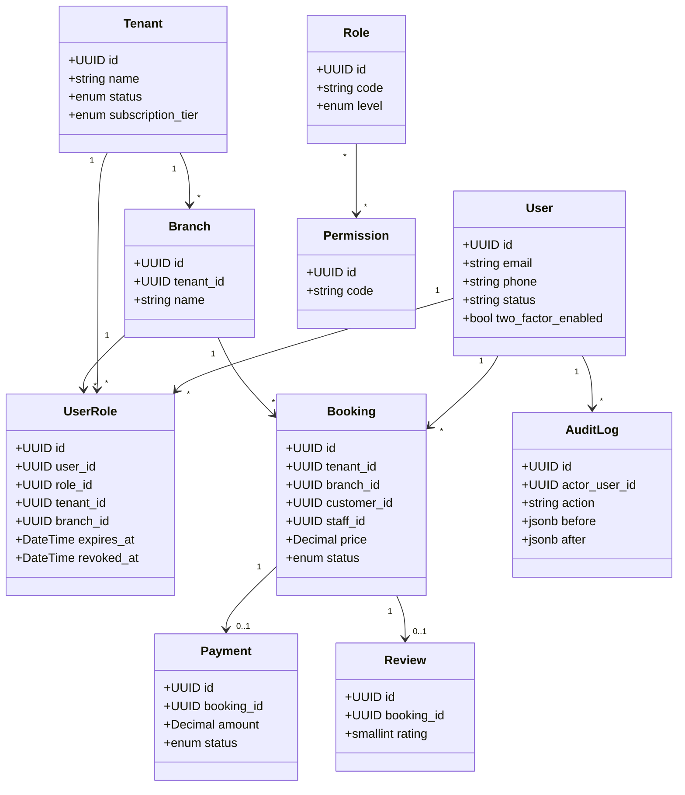
```mermaid
classDiagram
    class User {
        +UUID id
        +string email
        +string phone
        +string status
        +bool two_factor_enabled
    }
    class Tenant {
        +UUID id
        +string name
        +enum status
        +enum subscription_tier
    }
    class Branch {
        +UUID id
        +UUID tenant_id
        +string name
    }
    class UserRole {
        +UUID id
        +UUID user_id
        +UUID role_id
        +UUID tenant_id
        +UUID branch_id
        +DateTime expires_at
        +DateTime revoked_at
    }
    class Role {
        +UUID id
        +string code
        +enum level
    }
    class Permission {
        +UUID id
        +string code
    }
    class Booking {
        +UUID id
        +UUID tenant_id
        +UUID branch_id
        +UUID customer_id
        +UUID staff_id
        +Decimal price
        +enum status
    }
    class Payment {
        +UUID id
        +UUID booking_id
        +Decimal amount
        +enum status
    }
    class Review {
        +UUID id
        +UUID booking_id
        +smallint rating
    }
    class AuditLog {
        +UUID id
        +UUID actor_user_id
        +string action
        +jsonb before
        +jsonb after
    }

    User "1" --> "*" UserRole
    Tenant "1" --> "*" Branch
    Tenant "1" --> "*" UserRole
    Branch "1" --> "*" UserRole
    Role "*" --> "*" Permission
    User "1" --> "*" Booking
    Branch "1" --> "*" Booking
    Booking "1" --> "0..1" Payment
    Booking "1" --> "0..1" Review
    User "1" --> "*" AuditLog
```

---

## Phần 7 — Triển khai kỹ thuật

### 7.1 JWT & Session strategy

| Thuộc tính | Quyết định | Lý do |
|------------|-----------|--------|
| Access token TTL | **10–15 phút** | Giảm blast radius khi lộ token. |
| Refresh token TTL | **7–30 ngày**, lưu DB + rotate mỗi lần dùng. | Cho mobile/web persistent session. |
| Token storage (web) | **httpOnly + Secure + SameSite=Strict cookie** | Tránh XSS đánh cắp token. LocalStorage không an toàn. |
| Token storage (mobile) | Keychain/Keystore | OS-level bảo vệ. |
| Token payload | chỉ `{user_id, role_codes[], tenant_ids[], branch_ids[], token_version}` | Token nhỏ, không nhúng toàn bộ permissions. |
| Permission resolution | query bảng `role_permissions` + cache Redis | Token không chứa permission chi tiết (dễ revoke, không phình). |
| Token version | `users.token_version` tăng mỗi lần đổi role / khóa account | Cho phép kill-all-session không cần blacklist. |
| Blacklist | Redis `SET jwt:revoked:<jti> 1 EX <remaining_ttl>` | Khi cần revoke 1 token cụ thể (do leaked). |

**Code skeleton NestJS** (minh họa):

```typescript
// auth.service.ts
@Injectable()
export class AuthService {
  async login(user: User): Promise<TokenPair> {
    const roles = await this.getActiveUserRoles(user.id);   // active, not expired, not revoked
    const payload = {
      sub: user.id,
      role_codes: roles.map(r => r.role.code),
      tenant_ids: [...new Set(roles.filter(r => r.tenant_id).map(r => r.tenant_id))],
      branch_ids: [...new Set(roles.filter(r => r.branch_id).map(r => r.branch_id))],
      token_version: user.token_version,
    };
    const accessJwt = this.jwt.sign(payload, { expiresIn: '15m', jwtid: randomUUID() });
    const refreshToken = this.jwt.sign({ sub: user.id, tv: user.token_version }, { expiresIn: '7d', jwtid: randomUUID() });
    await this.storeRefreshToken(user.id, refreshToken);
    return { accessToken: accessJwt, refreshToken };
  }

  async invalidateAllSessions(userId: string): Promise<void> {
    await this.prisma.user.update({
      where: { id: userId },
      data: { token_version: { increment: 1 } },
    });
    // Optionally: blacklist all active JTIs in Redis scan.
  }

  async revokeToken(jti: string, userId: string, expiresAt: Date): Promise<void> {
    await this.redis.set(`jwt:revoked:${jti}`, '1', 'EXAT', expiresAt.getTime() / 1000);
  }
}
```

### 7.2 Kiểm tra 2 lớp (Gateway + Service)

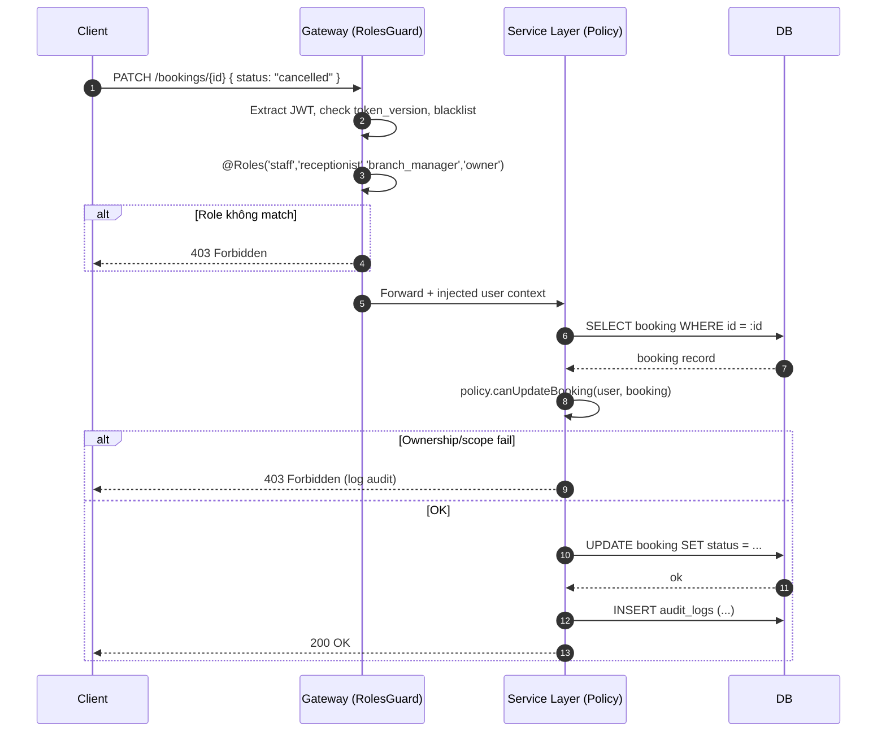
```mermaid
sequenceDiagram
    autonumber
    participant Client
    participant Gateway as Gateway (RolesGuard)
    participant Service as Service Layer (Policy)
    participant DB

    Client->>Gateway: PATCH /bookings/{id} { status: "cancelled" }
    Gateway->>Gateway: Extract JWT, check token_version, blacklist
    Gateway->>Gateway: @Roles('staff','receptionist','branch_manager','owner')
    alt Role không match
        Gateway-->>Client: 403 Forbidden
    end
    Gateway->>Service: Forward + injected user context
    Service->>DB: SELECT booking WHERE id = :id
    DB-->>Service: booking record
    Service->>Service: policy.canUpdateBooking(user, booking)
    alt Ownership/scope fail
        Service-->>Client: 403 Forbidden (log audit)
    else OK
        Service->>DB: UPDATE booking SET status = ...
        DB-->>Service: ok
        Service->>DB: INSERT audit_logs (...)
        Service-->>Client: 200 OK
    end
```

#### Lớp 1 — Gateway (Coarse)

- Controller chỉ kiểm tra "user có role được gọi route này không".
- Không quan tâm resource_id cụ thể.
- Ví dụ:
  ```typescript
  @Controller('bookings')
  @UseGuards(JwtAuthGuard, RolesGuard)
  export class BookingsController {

    @Patch(':id')
    @Roles('receptionist', 'branch_manager', 'owner', 'staff', 'customer')
    async update(@Param('id') id: string, @Body() dto: UpdateBookingDto, @CurrentUser() user) {
      return this.bookingsService.update(id, dto, user);
    }
  }
  ```

#### Lớp 2 — Service (Fine-grained / Ownership)

- Service kiểm tra user có quyền trên **chính resource_id đó không**.
- Đây là lớp chống IDOR.

```typescript
@Injectable()
export class BookingsService {
  async update(bookingId: string, dto: UpdateBookingDto, user: AuthUser) {
    const booking = await this.prisma.booking.findUniqueOrThrow({ where: { id: bookingId } });

    const decision = this.policy.can(user, 'booking:update', booking);
    if (!decision.allow) {
      await this.audit.log({
        actor: user,
        action: 'booking:update',
        resourceType: 'booking',
        resourceId: bookingId,
        outcome: 'denied',
        reason: decision.reason,
      });
      throw new ForbiddenException(decision.reason);
    }

    const before = booking;
    const after = await this.prisma.booking.update({ where: { id: bookingId }, data: dto });
    await this.audit.log({ actor: user, action: 'booking:update', before, after });
    return after;
  }
}
```

### 7.3 Cache permission (Redis)

```typescript
@Injectable()
export class PermissionCacheService {
  private readonly TTL_SEC = 600;             // 10 phút
  constructor(@InjectRedis() private redis: Redis, private prisma: PrismaService) {}

  async getPermissions(userId: string): Promise<string[]> {
    const key = `perms:${userId}`;
    const cached = await this.redis.get(key);
    if (cached) return JSON.parse(cached);

    const perms = await this.computePermissions(userId);
    await this.redis.set(key, JSON.stringify(perms), 'EX', this.TTL_SEC);
    return perms;
  }

  async invalidate(userId: string): Promise<void> {
    await this.redis.del(`perms:${userId}`);
  }

  private async computePermissions(userId: string): Promise<string[]> {
    // Lấy active roles → join role_permissions → join permissions
    const rows = await this.prisma.$queryRaw<{ code: string }[]>`
      SELECT DISTINCT p.code
      FROM user_roles ur
      JOIN role_permissions rp ON rp.role_id = ur.role_id
      JOIN permissions p ON p.id = rp.permission_id
      WHERE ur.user_id = ${userId}::uuid
        AND ur.revoked_at IS NULL
        AND (ur.expires_at IS NULL OR ur.expires_at > NOW());
    `;
    return rows.map(r => r.code);
  }
}
```

**Invalidation triggers** (gọi `invalidate(userId)` khi):
- Gán role mới / thu hồi role.
- Sửa role ↔ permission mapping (admin đổi).
- Khóa user / tăng token_version.
- Đổi tenant status / branch is_active.

### 7.4 Policy Engine — chọn stack nào?

| Quy mô | Đề xuất | Lý do |
|--------|---------|--------|
| MVP, 1 backend, < 5 service | **CASL** (NestJS gốc) hoặc **class-based Guards** | Đơn giản, integrate nhanh. |
| 3–10 service, đa ngôn ngữ | **Casbin** (file policy, multi-lang) | Có model RBAC + ABAC, load từ DB. |
| 10+ service, cần ReBAC mạnh (kiểu Airbnb, Google Drive) | **OpenFGA** (Zanzibar-style) | Relationship-based, hiệu năng cao với multi-tenant. |
| SaaS enterprise cần UI quản lý policy | **Cerbos** (managed) / **OPA** | Có dashboard, audit, dry-run. |

Với stack NestJS hiện tại, **CASL** là lựa chọn pragmatic cho MVP:

```typescript
// policy.ts
import { AbilityBuilder, PureAbility, AbilityClass } from '@casl/ability';

export type AppAction =
  | 'manage' | 'create' | 'read' | 'update' | 'delete' | 'update_status'
  | 'refund' | 'approve' | 'reject' | 'assign';

export type AppSubject =
  | 'Booking' | 'Payment' | 'Service' | 'Staff' | 'Customer'
  | 'Promotion' | 'Review' | 'Report' | 'Salon' | 'Branch'
  | 'AuditLog' | 'Role' | 'all';

export type AppAbility = PureAbility<[AppAction, AppSubject]>;
const AppAbility = PureAbility as AbilityClass<AppAbility>;

export function buildAbilityFor(user: AuthUser, perms: string[]): AppAbility {
  const { can, build } = new AbilityBuilder(AppAbility);

  for (const code of perms) {
    const [subject, action, scope] = code.split(':');
    if (scope === 'own')      can(action, normalizeSubject(subject), { ownerId: user.id });
    if (scope === 'branch')   can(action, normalizeSubject(subject), { branchId: { $in: user.branchIds } });
    if (scope === 'tenant')   can(action, normalizeSubject(subject), { tenantId: { $in: user.tenantIds } });
    if (scope === 'platform') can(action, normalizeSubject(subject));
  }
  return build();
}

function normalizeSubject(s: string): AppSubject {
  // 'booking' -> 'Booking'
  return (s.charAt(0).toUpperCase() + s.slice(1)) as AppSubject;
}

// Hook vào request
export const PolicyHook = createParamDecorator((data: unknown, ctx: ExecutionContext) => {
  const req = ctx.switchToHttp().getRequest();
  return req.policy as AppAbility;
});
```

Service sử dụng:

```typescript
@Injectable()
export class BookingsService {
  async updateStatus(bookingId: string, status: BookingStatus, user: AuthUser) {
    const booking = await this.prisma.booking.findUniqueOrThrow({ where: { id: bookingId } });
    ForbiddenError.from(this.policy(user)).throwUnlessCan('update_status', subject('Booking', booking));
    // ... update
  }
}
```

### 7.5 Field-level filtering (response mask)

Một số field nhạy cảm **phải ẩn/lọc theo role**:

```typescript
@Injectable()
export class BookingResponseMapper {
  toDto(booking: Booking, user: AuthUser): BookingDto {
    const dto: BookingDto = {
      id: booking.id,
      customerId: booking.customerId,
      startAt: booking.startAt,
      status: booking.status,
      // ...
    };
    if (user.roleCodes.includes('branch_manager') || user.roleCodes.includes('owner')) {
      dto.internalNote = booking.internalNote;
      dto.finalPrice = booking.finalPrice;
    }
    if (user.roleCodes.includes('staff')) {
      // Staff chỉ thấy note của khách mình phục vụ; service layer đã filter
    }
    return dto;
  }
}
```

Các field cần filter:
- `commission_rate`, `salary` → chỉ chủ salon/manager thấy của nhân viên trong scope; staff chỉ thấy của mình.
- `internal_note` → chỉ staff/receptionist/manager/owner (trong scope).
- `gateway_response` (raw payment response) → chỉ platform finance.
- `password_hash`, `two_factor_secret` → internal only, không bao giờ trả API.
- `health_info` → chỉ staff/manager/owner được assigned trên booking đó.

### 7.6 Row-Level Security (Postgres)

Lớp phòng thủ thứ 2, phòng khi application bug:

```sql
-- Bật RLS
ALTER TABLE bookings ENABLE ROW LEVEL SECURITY;

-- Policy: branch_manager thấy booking thuộc branch mình quản lý
CREATE POLICY booking_branch_manager ON bookings
  USING (
    current_setting('app.current_tenant_id', true)::uuid = tenant_id
    AND (
      current_setting('app.role_code', true) = 'owner'
      OR (
        current_setting('app.role_code', true) = 'branch_manager'
        AND branch_id = ANY(string_to_array(current_setting('app.branch_ids', true), ',')::uuid[])
      )
      OR (
        current_setting('app.role_code', true) = 'receptionist'
        AND branch_id = ANY(string_to_array(current_setting('app.branch_ids', true), ',')::uuid[])
      )
      OR (
        current_setting('app.role_code', true) = 'staff'
        AND staff_id IN (SELECT id FROM staff_profiles WHERE user_id = current_setting('app.user_id', true)::uuid)
      )
      OR customer_id = current_setting('app.user_id', true)::uuid
      OR current_setting('app.role_code', true) IN ('platform_admin','support','finance')
    )
  );

-- Mỗi query phải SET các biến session này trước khi query
```

Trong Prisma:

```typescript
await prisma.$transaction(async (tx) => {
  await tx.$executeRawUnsafe(`
    SET LOCAL app.user_id = '${user.id}';
    SET LOCAL app.role_code = '${user.roleCodes[0]}';
    SET LOCAL app.tenant_id = '${user.tenantIds.join(',')}';
    SET LOCAL app.branch_ids = '${user.branchIds.join(',')}';
  `);
  return tx.booking.findMany();
});
```

### 7.7 Library theo stack

| Stack | Đề xuất |
|-------|---------|
| NestJS | **CASL** + custom Guards/Interceptors; **nest-access-control**; OpenFGA client nếu cần ReBAC. |
| Spring Boot | Spring Security + `@PreAuthorize("@authz.can(#bookingId, 'update')")`. |
| Laravel | Gates & Policies (`php artisan make:policy`). |
| Rails | Pundit / CanCanCan. |
| Go | Casbin (`github.com/casbin/casbin`), OPA. |
| Multi-lang platform | Open Policy Agent (OPA, Rego). |

### 7.8 WebSocket / Realtime authorization

Một số endpoint realtime (VD: Socket.IO cho dashboard thợ):

```typescript
@WebSocketGateway()
export class BookingsGateway implements OnGatewayConnection {
  async handleConnection(client: Socket) {
    const user = await this.authenticate(client.handshake.headers.cookie);
    if (!user) return client.disconnect();

    // Tự động join rooms theo scope
    for (const tenantId of user.tenantIds) {
      client.join(`tenant:${tenantId}`);
    }
    for (const branchId of user.branchIds) {
      client.join(`branch:${branchId}`);
    }
    client.join(`user:${user.id}`);

    // Platform roles join platform room
    if (user.roleCodes.some(r => r.endsWith('platform') || r === 'platform_admin')) {
      client.join('platform');
    }
  }

  @SubscribeMessage('booking.subscribe')
  async onSubscribe(@MessageBody() data: { bookingId: string }, @ConnectedSocket() client: Socket) {
    const user = client.data.user as AuthUser;
    const booking = await this.prisma.booking.findUniqueOrThrow({ where: { id: data.bookingId } });
    ForbiddenError.from(this.policy(user)).throwUnlessCan('read', subject('Booking', booking));
    client.join(`booking:${data.bookingId}`);
  }
}
```

---

## Phần 8 — Bảo mật

### 8.1 IDOR — lỗi phổ biến nhất

**Tấn công**: User A đăng nhập, đổi `booking_id` trên URL/param để xem/sửa booking của user B.

**Phòng chống**:
1. **Ownership check bắt buộc** ở service layer cho mọi endpoint có `:id`.
2. **Test kỹ** mọi endpoint có pattern `:id` với 2 kịch bản:
   - Resource thuộc về user → `200 OK`.
   - Resource thuộc user khác → `403 Forbidden` (không 404, không 500).
3. **Rate-limit** endpoint nhạy cảm (VD: 1 user gọi 100 endpoint có `:id>` khác nhau / phút → block + alert).
4. **UUID không tuần tự** (random UUID v4) → tránh brute-force enumerate ID.

### 8.2 Audit log bắt buộc cho hành động nhạy cảm

| Hành động | Audit? | Field bắt buộc |
|-----------|:------:|----------------|
| Hủy lịch | ✓ | before, after, reason |
| Đổi giá dịch vụ | ✓ | before, after, actor |
| Hoàn tiền (mọi mức) | ✓ | amount, reason, ticket_id (nếu có) |
| Sửa review (ẩn, sửa nội dung) | ✓ | before, after |
| Đổi role user | ✓ | granted/revoked, role_code, scope |
| Sửa commission_rate | ✓ | before, after |
| Sửa giờ mở cửa + sửa lịch làm việc | ✓ | diff |
| Đăng nhập / logout / fail login | ✓ | ip, user_agent, outcome |
| Refund vượt hạn mức | ✓ | escalation_reason, approver |

### 8.3 Thu hồi quyền tức thì

Quy trình khi khóa tài khoản nhân viên nghỉ việc:

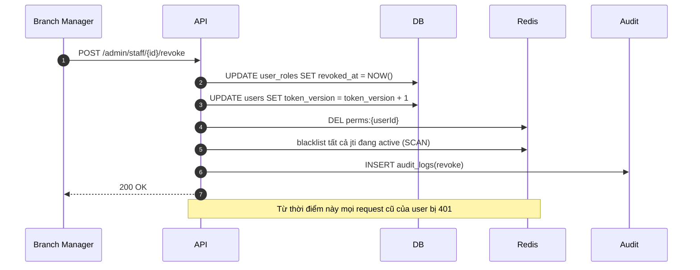
```mermaid
sequenceDiagram
    autonumber
    participant Mgr as Branch Manager
    participant API
    participant DB
    participant Redis
    participant Audit

    Mgr->>API: POST /admin/staff/{id}/revoke
    API->>DB: UPDATE user_roles SET revoked_at = NOW()
    API->>DB: UPDATE users SET token_version = token_version + 1
    API->>Redis: DEL perms:{userId}
    API->>Redis: blacklist tất cả jti đang active (SCAN)
    API->>Audit: INSERT audit_logs(revoke)
    API-->>Mgr: 200 OK
    Note over API, Redis: Từ thời điểm này mọi request cũ của user bị 401
```

### 8.4 2FA (Xác thực 2 yếu tố)

| Role | Bắt buộc? | Method |
|------|:---------:|--------|
| Customer | Khuyến nghị | TOTP (Google Authenticator) hoặc SMS OTP |
| Staff | Khuyến nghị | TOTP |
| Receptionist | Bắt buộc nếu xử lý payment | TOTP |
| Branch Manager | **Bắt buộc** | TOTP |
| Owner | **Bắt buộc** | TOTP + bắt buộc backup codes |
| Platform roles | **Bắt buộc** | TOTP + hardware key (FIDO2) |

Luồng 2FA:

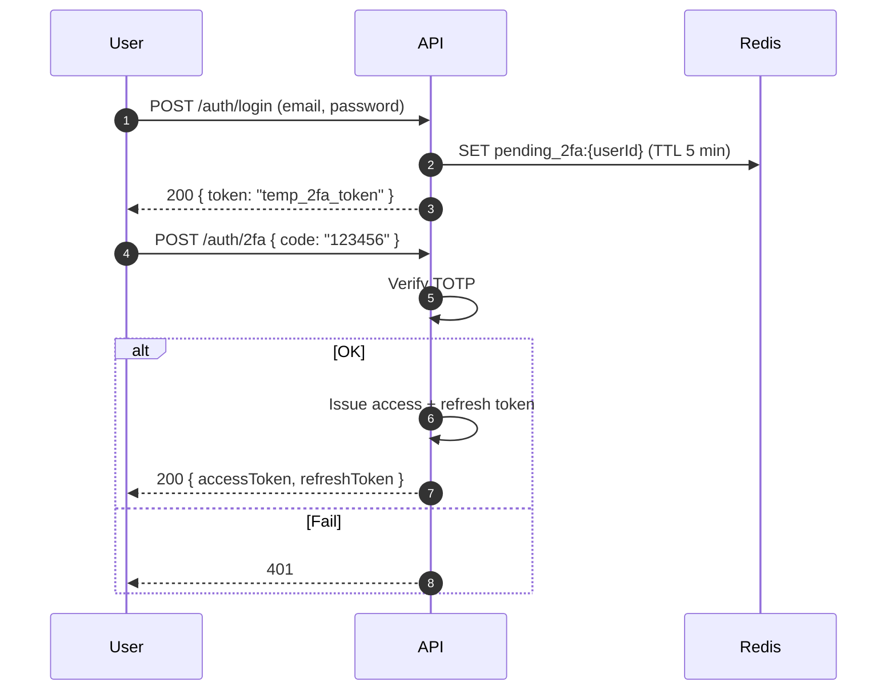
```mermaid
sequenceDiagram
    autonumber
    participant U as User
    participant API
    participant Cache as Redis

    U->>API: POST /auth/login (email, password)
    API->>Cache: SET pending_2fa:{userId} (TTL 5 min)
    API-->>U: 200 { token: "temp_2fa_token" }
    U->>API: POST /auth/2fa { code: "123456" }
    API->>API: Verify TOTP
    alt OK
        API->>API: Issue access + refresh token
        API-->>U: 200 { accessToken, refreshToken }
    else Fail
        API-->>U: 401
    end
```

### 8.5 Bảo mật thanh toán

| Quy tắc | Áp dụng |
|---------|---------|
| **Không lưu số thẻ/raw PAN** | Bắt buộc tokenization qua VNPay/MoMo/ZaloPay/Stripe. |
| **PCI-DSS scope minimize** | Form nhập thẻ iframe của gateway (không touch dữ liệu thẻ). |
| **Webhook signature verify** | Mỗi gateway cung cấp HMAC key; verify trước khi xử lý. |
| **Idempotency key** | Tránh double-charge khi retry. |
| **Hoàn tiền nhiều cấp** | Receptionist ≤ 200k; Branch Manager ≤ 1tr; Owner ≤ 10tr; trên 10tr cần Platform Admin. |
| **2 người duyệt** | Hoàn tiền > 5tr phải có 1 Owner + 1 Finance platform confirm. |
| **Log mọi refund** | audit_logs entry + payment update + notification cho customer. |

### 8.6 Bảo vệ dữ liệu cá nhân (PDPA VN 91/2025/QH15)

Phân loại dữ liệu:

| Loại | Ví dụ trong app | Mức bảo vệ |
|------|----------------|--------------|
| **Cơ bản** | SĐT, email, tên, lịch sử booking, địa chỉ | Cần consent, có cơ chế sửa/xóa |
| **Nhạy cảm** | Tình trạng da, dị ứng, thuốc đang dùng, bệnh nền | Cần consent riêng + retention policy + ACL riêng |

Quy tắc triển khai:
- Tách **bảng `booking_health_records`** riêng khỏi `bookings`.
- Trường `sensitive_data_consent` bắt buộc = true nếu bản ghi health record tồn tại.
- **Không** gửi health record trong payload JWT, email thông báo, push notification — chỉ staff/manager/owner được assigned mới xem được qua UI có mask.
- **Quyền quên (right to be forgotten)**:
  - User yêu cầu xóa → soft-delete user (anonymize PII) nhưng giữ `bookings` aggregate cho báo cáo doanh thu salon.
  - Health records: xóa cứng sau khi hết retention (VD: 2 năm không booking lại).
- **Audit access** cho mọi lần đọc/sửa health record (ghi vào `audit_logs` cùng cờ `sensitive_access=true`).
- **Data residency**: lưu data user VN ở server VN (Singapore Replica cho disaster recovery vẫn OK).

### 8.7 Ngăn chặn leo thang đặc quyền (Privilege Escalation)

| Vector tấn công | Phòng chống |
|-----------------|-------------|
| User sửa `role_id`/`tenant_id` trong request body | Whitelist field mỗi DTO; bỏ qua field không trong whitelist; service check lại. |
| Gửi kèm `Authorization: Bearer <token của Owner>` | Bind token ↔ user_id; mọi thao tác trên resource kiểm tra ownership so với user_id từ JWT. |
| Đổi role qua API không bảo vệ | Route gán role phải check `actor.scope ⊇ target.scope` (VD: Branch Mgr chỉ gán được role < mình). |
| Mass assignment | DTO class-validator + whitelist + `@Exclude()` cho field nhạy cảm. |
| Path traversal / parameter pollution | Strict parsing + validation schema. |

### 8.8 Các biện pháp chung khác

- **HTTPS only**, HSTS, CSP headers (NestJS `helmet`).
- **Rate limit** theo IP + user (login: 5 lần / 15 phút; API sensitive: 60 req / phút).
- **CAPTCHA** cho form công khai (đăng ký, quên mật khẩu).
- **Input validation** bằng `class-validator` (NestJS) hoặc tương đương.
- **SQL injection**: Prisma tự escape, nhưng raw query phải dùng parameter binding.
- **File upload**: scan malware (ClamAV), validate MIME, giới hạn size.

---

## Phần 9 — Kiểm thử (QA)

### 9.1 Ma trận test data-driven (map 1-1 với ma trận phân quyền)

Mỗi ô trong ma trận là ít nhất 2 test:
- **Positive**: user được phép → expect 200/201.
- **Negative**: user không được phép → expect **403** (không phải 500, không phải 200).

Ví dụ cho module BOOKINGS:

| Role | Endpoint | Resource | Expected |
|------|----------|----------|----------|
| Customer (A) | `GET /bookings/{id}` | Booking của A | 200 |
| Customer (B) | `GET /bookings/{id}` | Booking của A | **403** |
| Customer (A) | `PATCH /bookings/{id}/cancel` | Booking của A, trước deadline | 200 |
| Customer (A) | `PATCH /bookings/{id}/cancel` | Booking của A, sau deadline (theo policy) | **403** hoặc **200 với phí** (verify policy) |
| Staff (branch A) | `GET /bookings/{id}` | Booking thuộc branch A, KHÁCH của staff đó | 200 |
| Staff (branch A) | `GET /bookings/{id}` | Booking thuộc branch A, khách của staff khác | **403** |
| Staff (branch A) | `GET /bookings/{id}` | Booking thuộc branch B | **403** |
| Staff (branch A) | `GET /bookings/{id}` | Booking thuộc branch A, KHÔNG assigned | **403** (hoặc chỉ thấy metadata) |
| Receptionist (branch A) | `PATCH /bookings/{id}` | Booking thuộc branch A | 200 |
| Receptionist (branch A) | `PATCH /bookings/{id}` | Booking thuộc branch B | **403** |
| Branch Mgr (branch A) | `PATCH /bookings/{id}` | Booking thuộc branch A | 200 |
| Branch Mgr (branch A) | `PATCH /bookings/{id}` | Booking thuộc branch B | **403** |
| Owner (tenant T) | `PATCH /bookings/{id}` | Booking thuộc tenant T | 200 |
| Owner (tenant T) | `PATCH /bookings/{id}` | Booking thuộc tenant khác | **403** |
| Owner (tenant T) | `PATCH /bookings/{id}` | Booking thuộc tenant T, **đã completed** | **403** (rule business: không sửa booking đã completed) |
| Support (ticket T1) | `GET /bookings/{id}` | Booking liên quan ticket T1 | 200 |
| Support | `GET /bookings/{id}` | Booking KHÔNG liên quan ticket nào | **403** |
| Finance | `GET /bookings/{id}` | Mọi booking | **403** (Finance không đọc nội dung booking) |
| Platform Admin | `*` | Mọi | 200 (với log) |

### 9.2 Test cách ly tenant (Tenant Isolation)

Bắt buộc chạy song song **2 bộ dữ liệu** cho mọi tenant-scoped endpoint:

```typescript
// e2e/tenant-isolation.e2e-spec.ts
describe('Tenant Isolation', () => {
  it('Branch Manager of Tenant A cannot read Tenant B booking via any tenant-scoped endpoint', async () => {
    // Seed: tenant A, branch A1, manager MA
    // Seed: tenant B, branch B1, booking X (in B)
    const login = await loginAs(MA);
    const endpoints = [
      ['GET', `/bookings/${bookingX.id}`],
      ['GET', `/bookings?branchId=${branchB1.id}`],
      ['GET', `/reports/revenue?tenantId=${tenantB.id}`],
      ['GET', `/customers/${customerInB.id}`],
      ['GET', `/services?tenantId=${tenantB.id}`],
      ['GET', `/staff/${staffInB.id}`],
    ];
    for (const [method, url] of endpoints) {
      const res = await request(app.getHttpServer())
        [method.toLowerCase()](url)
        .set('Authorization', `Bearer ${login.token}`);
      expect(res.status).toBe(403);
    }
  });
});
```

### 9.3 Test chống leo thang đặc quyền (Privilege Escalation)

```typescript
describe('Privilege Escalation Prevention', () => {
  it('Customer cannot self-promote to owner via PATCH /me', async () => {
    const login = await loginAsCustomer();
    const res = await request(app.getHttpServer())
      .patch('/users/me')
      .set('Authorization', `Bearer ${login.token}`)
      .send({
        fullName: 'Hacked',
        role_id: owner_role_id,           // attempt privilege escalation
        tenant_id: tenant_id,             // scope injection
        token_version: 999,               // attempt lockout
      });
    // Service phải ignore các field không trong whitelist + log suspicious
    expect(res.status).toBe(200);
    expect(res.body.role_id).toBeUndefined();
    const me = await getUser(login.userId);
    expect(me.roleCodes).not.toContain('owner');
    await expect(auditLog.findFirst({
      where: { actor: login.userId, action: 'user:privilege_escalation_attempt' }
    })).resolves.toBeTruthy();
  });

  it('Branch Manager cannot grant owner role to another user', async () => {
    const mgr = await loginAsBranchManager();
    const res = await request(app.getHttpServer())
      .post(`/users/${someUserId}/roles`)
      .set('Authorization', `Bearer ${mgr.token}`)
      .send({ roleId: owner_role_id, tenantId: mgr.tenantId });
    expect(res.status).toBe(403);
    const userRoles = await getUserRoles(someUserId);
    expect(userRoles.some(ur => ur.role.code === 'owner')).toBe(false);
  });
});
```

### 9.4 Test JWT hết hạn / thu hồi

```typescript
describe('JWT Expiry & Revocation', () => {
  it('Expired token is rejected', async () => {
    const expired = jwt.sign({ sub: userId }, SECRET, { expiresIn: '-1s' });
    const res = await request(app.getHttpServer())
      .get('/bookings').set('Authorization', `Bearer ${expired}`);
    expect(res.status).toBe(401);
  });

  it('Token after token_version bump is rejected', async () => {
    const token = await login();
    await prisma.user.update({ where: { id: userId }, data: { token_version: { increment: 1 } } });
    const res = await request(app.getHttpServer())
      .get('/bookings').set('Authorization', `Bearer ${token.accessToken}`);
    expect(res.status).toBe(401);
  });

  it('Blacklisted jti is rejected', async () => {
    const token = await login();
    await redis.set(`jwt:revoked:${token.jti}`, '1');
    const res = await request(app.getHttpServer())
      .get('/bookings').set('Authorization', `Bearer ${token.accessToken}`);
    expect(res.status).toBe(401);
  });
});
```

### 9.5 Audit log test

```typescript
describe('Audit Log', () => {
  it('Cancel booking writes audit log with before/after', async () => {
    const owner = await loginAsOwner();
    const before = await getBooking(bookingId);
    await request(app.getHttpServer())
      .patch(`/bookings/${bookingId}/cancel`)
      .set('Authorization', `Bearer ${owner.token}`)
      .send({ reason: 'customer_request' })
      .expect(200);
    const log = await prisma.auditLog.findFirst({
      where: { actor: owner.userId, action: 'booking:cancel', resourceId: bookingId },
      orderBy: { createdAt: 'desc' },
    });
    expect(log).toBeTruthy();
    expect(log.before.status).toBe(before.status);
    expect(log.after.status).toBe('cancelled_by_customer');
    expect(log.ip).toBeTruthy();
  });

  it('Audit log cannot be UPDATEd', async () => {
    const admin = await loginAsPlatformAdmin();
    await expect(
      prisma.auditLog.update({ where: { id: someLogId }, data: { action: 'tampered' } })
    ).rejects.toThrow();
  });
});
```

### 9.6 Field-level masking test

```typescript
it('Staff does not see internalNote of other staff bookings', async () => {
  const staff = await loginAsStaff({ branchId: branchA });
  const booking = await seedBooking({ branchId: branchA, staffId: otherStaffId, internalNote: 'secret' });
  const res = await request(app.getHttpServer())
    .get(`/bookings/${booking.id}`).set('Authorization', `Bearer ${staff.token}`);
  expect(res.status).toBe(403);  // cannot even read
});

it('Receptionist does not see commission_rate of staff', async () => {
  const rec = await loginAsReceptionist();
  const res = await request(app.getHttpServer())
    .get(`/staff/${someStaffId}`).set('Authorization', `Bearer ${rec.token}`);
  expect(res.body.commissionRate).toBeUndefined();
  expect(res.body.salary).toBeUndefined();
});

it('Customer sees only own health records, not others', async () => {
  const customer = await loginAsCustomer();
  const res = await request(app.getHttpServer())
    .get(`/customers/${anotherCustomer.id}/health`).set('Authorization', `Bearer ${customer.token}`);
  expect(res.status).toBe(403);
});
```

### 9.7 CI Gate

Pipeline bắt buộc:

```yaml
# .github/workflows/authz-ci.yml (minh họa)
name: Authorization Tests
on: [push, pull_request]
jobs:
  authz:
    runs-on: ubuntu-latest
    services:
      postgres:
        image: postgres:16
        env:
          POSTGRES_DB: booking_test
        ports: ['5432:5432']
      redis:
        image: redis:7
        ports: ['6379:6379']
    steps:
      - uses: actions/checkout@v4
      - uses: actions/setup-node@v4
        with: { node-version: 20 }
      - run: npm ci
      - run: npx prisma migrate deploy
      - run: npm run db:seed:authz-matrix   # seed matrix scenarios
      - run: npm run test:e2e -- --testPathPattern=authz
      - run: npm run test:e2e -- --testPathPattern=tenant-isolation
      - run: npm run test:e2e -- --testPathPattern=privilege-escalation
      - run: npm run test:e2e -- --testPathPattern=jwt
      - run: npm run test:e2e -- --testPathPattern=audit
```

**Block merge** nếu:
- Bất kỳ test nào trong ma trận fail.
- Coverage của controller endpoints < 100% (Mỗi route phải có ≥ 1 positive + 1 negative test).
- New endpoint xuất hiện mà chưa có test trong matrix → fail.

---

## Phần 10 — Vận hành (DevOps)

### 10.1 Cache Redis cho permission

| Aspect | Quyết định |
|--------|-----------|
| Key | `perms:{userId}` |
| Value | JSON array permission codes |
| TTL | **5–10 phút** (đổi quyền có hiệu lực trong vài phút) |
| Invalidation triggers | (1) gán/thu hồi role; (2) admin sửa role_permissions; (3) khóa user; (4) tăng token_version; (5) đổi tenant/branch is_active. |
| Invalidation method | Lazy (check `token_version` + cache) + Eager (clear khi admin đổi role). |
| Fallback | Nếu Redis down → fallback query DB (chậm hơn nhưng vẫn đúng). |

### 10.2 Identity Provider (IdP) — chọn sao?

| Quy mô team | Đề xuất |
|-------------|---------|
| Team nhỏ, MVP | **Tự build** trong NestJS (đã làm) + passport-jwt. |
| Team vừa (5–20 dev), cần SSO/social login nhanh | **Keycloak** (self-hosted) hoặc **Auth0** (managed). |
| Team lớn, nhiều app | **Auth0**, **AWS Cognito**, **Clerk**, hoặc **WorkOS** (doanh nghiệp). |

> Bất kể IdP nào, vẫn tự quản lý **permissions table** và scope checks — IdP chỉ lo authentication.

### 10.3 Monitoring & Alerting

| Alert | Điều kiện | Severity |
|-------|-----------|:--------:|
| 1 user bị 403 liên tục > N lần / phút | Dấu hiệu dò quét IDOR | HIGH |
| Đổi role của Admin/Owner ngoài giờ HC | Suspicious | HIGH |
| Login fail > 10 lần / IP / 5 phút | Brute-force | HIGH |
| Token blacklist > ngưỡng | Có thể compromise | MEDIUM |
| Audit log ERROR > 0 | Action nhạy cảm không log được | CRITICAL |
| Permission cache miss rate > 30% | Redis issue | MEDIUM |
| Login từ IP lạ (geo) | Có thể compromised | MEDIUM |
| Refund > ngưỡng xảy ra liên tục | Có thể gian lận nội bộ | HIGH |
| Tạo salon mới > N/ngày | Mass onboarding bot | LOW |

Công cụ: **Prometheus + Grafana** (metrics), **Sentry** (error tracking), **ELK / Loki** (logs), **PagerDuty** (alert on-call).

### 10.4 Permission vs Entitlement (tách bạch)

Rất dễ bị gộp nhầm:

| Khái niệm | Định nghĩa | Ví dụ |
|-----------|-----------|-------|
| **Permission** | Được làm gì theo role | `booking:refund:branch` |
| **Entitlement** (Feature flag / Plan) | Được dùng tính năng nào theo gói cước | Gói Basic KHÔNG có multi-branch; KHÔNG có advanced report. |
| **Quota** | Số lượng tối đa | Plan Free: tối đa 50 booking/tháng/salon; tối đa 3 nhân viên. |
| **Trial / Coupon** | Tạm thời bật tính năng | 14 ngày dùng thử Advanced Report. |

Lưu trữ:

```sql
CREATE TABLE plans (
  id            UUID PRIMARY KEY,
  code          VARCHAR(40) UNIQUE,    -- 'free', 'basic', 'pro', 'enterprise'
  name          VARCHAR(200),
  features      JSONB,                  -- { "multi_branch": true, "advanced_report": false, ... }
  quotas        JSONB,                  -- { "max_bookings_per_month": 100, "max_staff": 5 }
  price_vnd     DECIMAL(12,0)
);

CREATE TABLE tenant_entitlements (
  tenant_id         UUID REFERENCES tenants(id),
  plan_id           UUID REFERENCES plans(id),
  trial_until       DATE,
  custom_overrides  JSONB,              -- ghi đè feature cho tenant cụ thể
  effective_from    DATE,
  effective_until   DATE,
  PRIMARY KEY (tenant_id)
);
```

Check trong middleware:

```typescript
@Injectable()
export class EntitlementsGuard implements CanActivate {
  async canActivate(ctx: ExecutionContext): Promise<boolean> {
    const req = ctx.switchToHttp().getRequest();
    const tenantId = req.user.tenantIds[0];
    const requiredFeature = this.reflector.get('requiredFeature', ctx.getHandler());

    if (!requiredFeature) return true;

    const entitlement = await this.entitlementsService.get(tenantId);
    if (!entitlement.features[requiredFeature]) {
      throw new ForbiddenException(`Plan ${entitlement.plan.code} không bao gồm ${requiredFeature}`);
    }
    return true;
  }
}

@UseGuards(JwtAuthGuard, RolesGuard, EntitlementsGuard)
@RequiredFeature('multi_branch')
@Get('branches')
async listBranches() { ... }
```

### 10.5 Rate Limiting

| Endpoint | Limit |
|----------|-------|
| `/auth/login` | 5 / 15 phút / IP |
| `/auth/register` | 5 / giờ / IP |
| `/auth/forgot-password` | 3 / giờ / IP |
| `/bookings/*` (customer) | 60 / phút / user |
| `/admin/*` | 120 / phút / user |
| WebSocket messages | 30 msg / phút / user |

Dùng `@nestjs/throttler` cho NestJS, hoặc Redis-based token bucket.

### 10.6 Logging tiêu chuẩn

Mỗi request log:

```json
{
  "timestamp": "2026-07-11T10:30:15.123Z",
  "request_id": "uuid-xxx",
  "actor_user_id": "uuid-yyy",
  "actor_roles": ["branch_manager"],
  "tenant_id": "uuid-zzz",
  "branch_id": "uuid-aaa",
  "method": "PATCH",
  "path": "/bookings/uuid-bbb",
  "params": { "id": "uuid-bbb" },
  "body": { "status": "cancelled" },
  "status_code": 200,
  "duration_ms": 145,
  "ip": "1.2.3.4",
  "user_agent": "..."
}
```

Mọi audit log gắn `request_id` để trace xuyên suốt.

### 10.7 Multi-region / Failover

- Active-passive giữa 2 region (SG primary, JP backup).
- RPO ≤ 5 phút, RTO ≤ 30 phút.
- Permission cache (Redis) replicate async.
- JWT stateless nên failover không cần re-login.

---

## Phần 11 — Lộ trình triển khai

### 11.1 MVP (Tuần 1–8)

Phạm vi:

| Hạng mục | Nội dung |
|----------|---------|
| Roles | 5 role cốt lõi: `customer`, `staff`, `receptionist`, `branch_manager`, `owner`. |
| Scope support | `own`, `branch`, `tenant`. (Platform scope giả lập `tenant=1` cho admin nội bộ.) |
| Library | CASL + custom Guards (đơn giản, đủ dùng). |
| Permission cache | In-memory cache (Map, TTL 5 phút) — chưa cần Redis. |
| Audit log | Bảng `audit_logs`, middleware NestJS tự log cho mọi write controller. |
| Authentication | Email + password + JWT 15 phút. **2FA chưa bắt buộc** nhưng có sẵn schema. |
| Multi-tenancy | Tenant ID trong JWT, mọi query filter theo `tenant_id`. |
| Test | Ma trận permission cơ bản (Booking, User cơ bản). |

### 11.2 Giai đoạn 2 (Tuần 9–16)

Khi mở rộng:

| Hạng mục | Nội dung |
|----------|---------|
| Roles bổ sung | `support`, `finance`, `marketing`, `compliance`. |
| Multi-branch | Tách `branch_manager` rõ ràng; `owner` xem tổng; schema đã support sẵn. |
| Permission cache chuyển sang Redis | TTL 5 phút. |
| IdP | Tích hợp Keycloak (hoặc Auth0) cho SSO/social login. |
| 2FA | Bắt buộc cho `owner`, `branch_manager`, platform roles. |
| Audit log | Bổ sung support ticket scope, before/after JSONB. |
| RLS | Bật Row-Level Security ở Postgres. |
| Test | Thêm tenant-isolation, privilege-escalation, JWT expiry tests. |
| Monitoring | Prometheus + Grafana + Sentry. |

### 11.3 Giai đoạn 3 (Tuần 17–24)

| Hạng mục | Nội dung |
|----------|---------|
| Policy Engine nâng cấp | OpenFGA / Cerbos cho multi-service (nếu microservices). |
| Entitlement (plan) | Tách `entitlements` khỏi `permissions`; gói cước multi-tier. |
| Audit compliance dashboard | UI cho compliance review log; export CSV theo khoảng thời gian. |
| Data retention automation | Cron job xóa health record quá hạn; anonymize user inactive > 2 năm. |
| Advanced reporting | Cohort analysis, LTV, churn rate; phân quyền read-only riêng. |
| Marketplace features | Salon onboarding wizard, KYC với giấy tờ scan, payout dashboard. |

### 11.4 Ngân sách & effort ước tính

| Hạng mục | MVP | GĐ2 | GĐ3 |
|----------|:---:|:---:|:---:|
| Backend (RBAC + Scope) | 4 dev-week | 6 dev-week | 8 dev-week |
| Frontend (3 roles UI) | 6 dev-week | 4 dev-week | 4 dev-week |
| Test (matrix e2e) | 2 dev-week | 4 dev-week | 4 dev-week |
| DevOps (cache, monitoring) | 1 dev-week | 2 dev-week | 4 dev-week |
| **Tổng** | **~13 dev-week** | **~16 dev-week** | **~20 dev-week** |

---

## Phần 12 — Phụ lục: Permission catalog đầy đủ

> Format: `<resource>:<action>:<scope>`. Scope áp dụng: `O` = own, `B` = branch, `T` = tenant, `P` = platform.

### 12.1 BOOKINGS (`booking:*`)

```
booking:create:own
booking:create:branch
booking:read:own
booking:read:assigned
booking:read:branch
booking:read:tenant
booking:read:platform         # theo ticket
booking:update:own            # sửa giờ của chính mình
booking:update:branch
booking:update:tenant
booking:update_status:own     # chỉ status của mình (no-show, hoàn thành)
booking:update_status:assigned
booking:update_status:branch
booking:update_status:tenant
booking:cancel:own
booking:cancel:branch
booking:cancel:tenant
booking:cancel:platform       # hủy theo lệnh platform (vi phạm)
booking:reschedule:own
booking:reschedule:branch
booking:reschedule:tenant
booking:assign_staff:branch
booking:assign_staff:tenant
booking:print:assigned
booking:print:branch
booking:print:tenant
booking:view_timeline:own
booking:view_timeline:branch
booking:view_timeline:tenant
booking:add_internal_note:assigned
booking:add_internal_note:branch
booking:add_internal_note:tenant
booking:add_sensitive_health:own       # với consent
booking:add_sensitive_health:assigned  # với consent
```

### 12.2 SERVICES (`service:*`)

```
service:read:public
service:read:branch
service:read:tenant
service:read:platform
service:create:branch
service:create:tenant
service:update:branch
service:update:tenant
service:update_pricing:branch    # có thể cần approval
service:update_pricing:tenant
service:delete:branch
service:delete:tenant
service:reorder:branch
service:reorder:tenant
service:feature:tenant
service:feature:platform
```

### 12.3 STAFF / SCHEDULE (`staff:*`, `schedule:*`)

```
staff:read:public
staff:read:branch
staff:read:tenant
staff:read_self:own
staff:update_self:own
staff:create:branch
staff:create:tenant
staff:update:branch
staff:update:tenant
staff:update_commission:tenant
staff:lock:branch
staff:lock:tenant
staff:lock:platform              # compliance lock
staff:transfer:tenant
staff:view_salary_self:own
staff:view_salary:branch
staff:view_salary:tenant
staff:view_commission_self:own
staff:view_commission:branch
staff:view_commission:tenant

schedule:read_self:own
schedule:read:branch
schedule:read:tenant
schedule:create:branch
schedule:create:tenant
schedule:update_self:own         # xin đổi ca
schedule:update:branch           # manager sửa ca của nhân viên mình quản lý
schedule:update:tenant
schedule:approve_swap:branch     # duyệt đổi ca
schedule:approve_swap:tenant
schedule:request_off:own
schedule:approve_off:branch
schedule:approve_off:tenant
schedule:block_off:own           # thợ tự block giờ không nhận khách
schedule:block_off:branch
schedule:block_off:tenant
```

### 12.4 CUSTOMERS / CRM (`customer:*`)

```
customer:read_self:own
customer:update_self:own
customer:delete_self:own          # quyền quên - PDPA
customer:read:assigned            # staff xem khách của booking mình
customer:read:branch
customer:read:tenant
customer:read:platform            # theo ticket
customer:search:branch
customer:search:tenant
customer:search:platform
customer:view_history:assigned
customer:view_history:branch
customer:view_history:tenant
customer:update:branch
customer:update:tenant
customer:merge:branch
customer:merge:tenant
customer:tag:branch
customer:tag:tenant
customer:broadcast:branch         # theo template
customer:broadcast:tenant
customer:export:branch            # theo PDPA
customer:export:tenant
customer:export:platform          # theo lệnh
customer:view_health_self:own
customer:view_health:assigned
customer:view_health:branch       # khi cần
customer:view_health:tenant
customer:delete:platform          # theo yêu cầu PDPA
```

### 12.5 PAYMENTS / PAYOUTS (`payment:*`, `payout:*`)

```
payment:create:own                # khách tự thanh toán online
payment:create:branch              # lễ tân thu hộ
payment:create:tenant
payment:read:own
payment:read:branch
payment:read:tenant
payment:read:platform              # finance
payment:invoice:own
payment:invoice:branch
payment:invoice:tenant
payment:invoice:tenant_vat        # VAT
payment:refund:branch              # hạn mức thấp
payment:refund:tenant              # hạn mức cao
payment:refund:platform            # support/CS hạn mức thấp
payment:refund_large:platform      # finance duyệt > ngưỡng
payment:partial_refund:branch
payment:partial_refund:tenant
payment:apply_voucher:own
payment:apply_voucher:branch
payment:apply_voucher:tenant
payment:reconcile:branch
payment:reconcile:tenant
payment:reconcile:platform         # finance đối soát
payment:mark_debt:branch
payment:mark_debt:tenant
payment:mark_debt:platform

payout:request:tenant
payout:read:tenant
payout:read:platform
payout:approve:platform           # finance duyệt
payout:reject:platform
payout:execute:platform
payout:export:platform
```

### 12.6 REVIEWS (`review:*`)

```
review:create:own                  # trong 30 ngày sau khi dùng
review:update:own                  # trong 24h
review:delete:own
review:read:public
review:read:self                   # staff xem review về mình
review:read:branch
review:read:tenant
review:reply:branch
review:reply:tenant
review:hide:tenant
review:hide:platform               # compliance
review:report:own
review:report:branch
review:report:tenant
review:read_internal:branch        # rating ẩn
review:read_internal:tenant
review:remind:branch               # nhắc khách viết review
review:remind:tenant
```

### 12.7 PROMOTIONS / MARKETING (`promotion:*`, `banner:*`, `notification:*`)

```
promotion:read:public
promotion:read:branch
promotion:read:tenant
promotion:read:platform
promotion:apply:own
promotion:apply:branch
promotion:apply:tenant
promotion:create:branch
promotion:create:tenant
promotion:create:platform
promotion:update:branch
promotion:update:tenant
promotion:update:platform
promotion:delete:tenant
promotion:delete:platform
promotion:deactivate:branch
promotion:deactivate:tenant
promotion:deactivate:platform

banner:create:platform
banner:update:platform
banner:delete:platform
banner:read:public
featured_salon:create:platform
featured_salon:read:public

notification:receive:own
notification:read_self:own
notification:settings_self:own
notification:template_create:branch
notification:template_create:tenant
notification:template_create:platform
notification:broadcast:branch         # theo template
notification:broadcast:tenant
notification:broadcast:platform
notification:email_campaign:branch
notification:email_campaign:tenant
notification:email_campaign:platform
notification:sms_campaign:branch
notification:sms_campaign:tenant
notification:sms_campaign:platform
```

### 12.8 REPORTS (`report:*`)

```
report:view_revenue_branch:branch
report:view_revenue:tenant
report:view_revenue:platform
report:view_commission_self:own
report:view_commission:branch
report:view_commission:tenant
report:view_commission:platform     # finance
report:view_no_show_rate:branch
report:view_no_show_rate:tenant
report:view_top_services:branch
report:view_top_services:tenant
report:view_top_customers:branch
report:view_top_customers:tenant
report:view_utilization:branch
report:view_utilization:tenant
report:view_funnel:branch
report:view_funnel:tenant
report:export:branch
report:export:tenant
report:export:platform
report:export_finance:platform
report:kyc_status:tenant
report:kyc_status:platform
report:fraud:tenant
report:fraud:platform
```

### 12.9 SALON / BRANCH / SETTINGS (`salon:*`, `branch:*`)

```
salon:read:public
salon:read:own:tenant              # cấu hình nội bộ
salon:update:tenant                 # owner sửa info salon
salon:update_legal:tenant           # cần re-KYC
salon:approve_kyc:platform          # compliance
salon:suspend:platform              # compliance khoá
salon:close:tenant
salon:close:platform                # platform đóng
salon:upload_legal_doc:tenant
salon:verify_legal_doc:platform
salon:configure_payout:tenant
salon:verify_payout:platform        # finance
salon:configure_cancellation_policy:branch   # đề xuất
salon:configure_cancellation_policy:tenant   # quyết định
salon:approve_cancellation_policy:platform  # nếu ngoài sàn policy
salon:configure_notification_template:branch
salon:configure_notification_template:tenant
salon:pause:branch                  # tạm dừng (nghỉ lễ, sửa chữa)
salon:pause:tenant

branch:create:tenant                # owner tạo chi nhánh
branch:read:public
branch:read:branch
branch:read:tenant
branch:update:branch                # bm sửa info (ảnh, SĐT, giờ)
branch:update:tenant
branch:close:tenant
branch:approve_new:platform         # compliance
branch:assign_manager:tenant
```

### 12.10 ROLES & USER MGMT (`role:*`, `user:*`)

```
role:read:tenant
role:read:platform
role:assign:branch                  # gán role ≤ receptionist cho user trong branch
role:assign:tenant                   # owner gán mọi role trong salon
role:assign:platform                 # compliance gán platform role
role:revoke:branch
role:revoke:tenant
role:revoke:platform
role:view_audit:branch              # log thay đổi role trong chi nhánh mình
role:view_audit:tenant
role:view_audit:platform

user:invite:branch
user:invite:tenant
user:lock:branch                    # khoá nhân viên trong chi nhánh
user:lock:tenant
user:lock:platform                  # compliance khoá cả salon owner
user:impersonate:platform           # super admin debug, có log riêng
```

### 12.11 AUDIT LOGS (`audit:*`)

```
audit:read:branch                   # log của chi nhánh mình
audit:read:tenant
audit:read:platform
audit:export:tenant                 # theo yêu cầu pháp lý
audit:export:platform
audit:sensitive_access_log:platform # compliance monitor health record access
```

### 12.12 INVENTORY (`inventory:*`)

```
inventory:read:own                  # thợ assigned shift thấy tồn
inventory:read:branch
inventory:read:tenant
inventory:create:branch             # nhập kho
inventory:create:tenant
inventory:consume:own               # tiêu hao theo booking
inventory:consume:branch
inventory:order:branch
inventory:order:tenant
inventory:low_stock_alert:branch
inventory:low_stock_alert:tenant
```

### 12.13 CHAT (`chat:*`) — nếu có in-app chat

```
chat:send_to_salon:own
chat:receive:assigned               # staff nhận từ khách mình phục vụ
chat:receive:branch
chat:receive:tenant
chat:broadcast:branch
chat:broadcast:tenant
chat:block_spam:branch
chat:block_spam:tenant
chat:block_spam:platform
chat:read_history:branch
chat:read_history:tenant
chat:read_history:platform
```

### 12.14 SUPPORT TICKETS (`ticket:*`)

```
ticket:create:own                   # khách mở ticket
ticket:create:branch
ticket:create:tenant
ticket:read:own
ticket:read:branch                  # bm xem ticket liên quan chi nhánh
ticket:read:tenant
ticket:read:assigned                # support agent được assign
ticket:assign:platform              # support lead phân công
ticket:escalate:platform
ticket:resolve:assigned
ticket:close:assigned
ticket:grant_access:platform        # cấp quyền tạm thời cho resource (booking/payment) liên quan ticket
```

### 12.15 AUTH (`auth:*`)

```
auth:login
auth:logout
auth:refresh
auth:verify_2fa
auth:change_password
auth:request_password_reset
auth:setup_2fa
auth:disable_2fa:platform          # chỉ platform admin mới tắt được 2FA của user khác
```

### 12.16 PLATFORM ADMIN SUPER (`*`)

```
*:*:platform                       # chỉ role platform_admin
```

---

## Phần 13 — Platform Split: Customer Mobile / Business + Admin Web

### 13.1 Bối cảnh & lý do

Ràng buộc kiến trúc:

- **Customer App** — khách đặt lịch: **mobile (iOS + Android, React Native / Flutter / native)**.
- **Business App** — salon vận hành (Owner, Branch Manager, Receptionist, Staff): **web (React SPA, PWA)**.
- **Platform Console** — Platform Admin / Compliance / Support / Marketing / Finance: **web (React SPA)**.

Đây là pattern của Fresha (mobile-first cho khách, web cho salon), StyleSeat (mobile cho khách), Booksy (mobile cho khách, web/iPad cho salon). Lý do:

| Lớp người dùng | Hành vi chính | Thiết bị phù hợp | UI phù hợp |
|----------------|---------------|------------------|-------------|
| Khách | Tìm salon, đặt lịch lúc rảnh, nhận push, check-in QR | Mobile (98%+) | Mobile-first, thumb-friendly, dark mode |
| Salon (lễ tân, BM, Owner) | Làm việc cả ngày tại quầy, nhập data nhiều, in hóa đơn, báo cáo lớn | Desktop / tablet / iPad Pro | Web responsive, nhiều cột, bàn phím shortcut |
| Platform Staff | Làm việc văn phòng, ticket queue, báo cáo tài chính | Desktop | Web, multi-panel, dashboard nặng |

### 13.2 Sơ đồ tách client

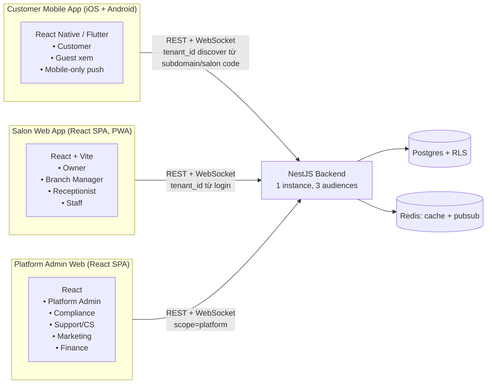
```mermaid
flowchart LR
    subgraph Mobile["Customer Mobile App (iOS + Android)"]
        CustomerApp["React Native / Flutter<br/>• Customer<br/>• Guest xem<br/>• Mobile-only push"]
    end

    subgraph WebSalon["Salon Web App (React SPA, PWA)"]
        SalonWeb["React + Vite<br/>• Owner<br/>• Branch Manager<br/>• Receptionist<br/>• Staff"]
    end

    subgraph WebAdmin["Platform Admin Web (React SPA)"]
        AdminWeb["React<br/>• Platform Admin<br/>• Compliance<br/>• Support/CS<br/>• Marketing<br/>• Finance"]
    end

    Mobile -->|REST + WebSocket<br/>tenant_id discover từ subdomain/salon code| API
    WebSalon -->|REST + WebSocket<br/>tenant_id từ login| API
    WebAdmin -->|REST + WebSocket<br/>scope=platform| API

    API["NestJS Backend<br/>1 instance, 3 audiences"] --> PG[(Postgres + RLS)]
    API --> Redis[(Redis: cache + pubsub)]
```

### 13.3 Tách auth theo client (mobile vs web)

Vì 2 loại client có surface tấn công khác nhau, nên tách endpoint `/auth/*` cho mobile và web nhưng **vẫn cùng 1 bảng `users` / `user_roles`** để đảm bảo một user một identity.

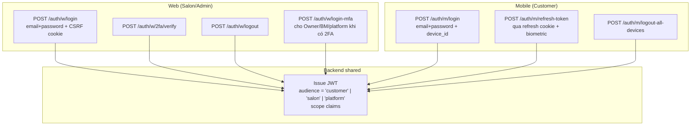
```mermaid
flowchart TB
    subgraph MobileFlow["Mobile (Customer)"]
        MR["POST /auth/m/login<br/>email+password + device_id"]
        MO["POST /auth/m/refresh-token<br/>qua refresh cookie + biometric"]
        ML["POST /auth/m/logout-all-devices"]
    end

    subgraph WebFlow["Web (Salon/Admin)"]
        WR["POST /auth/w/login<br/>email+password + CSRF cookie"]
        WO["POST /auth/w/2fa/verify"]
        WL["POST /auth/w/logout"]
        W2["POST /auth/w/login-mfa<br/>cho Owner/BM/platform khi có 2FA"]
    end

    subgraph Shared["Backend shared"]
        SH["Issue JWT<br/>audience = 'customer' | 'salon' | 'platform'<br/>scope claims"]
    end

    MR --> SH
    WR --> SH
    W2 --> SH
    MO --> SH
    WO --> SH
    WL --> SH
    ML --> SH
```

Lý do tách:
- Mobile có **biometric** (FaceID/TouchID) → có thêm step `biometric_unlock` trên top JWT ngắn hạn.
- Web có **CSRF + SameSite=Strict cookie** riêng.
- Mobile push notification dùng **device_token** lưu ở `user_devices`.

### 13.4 JWT `audience` claim — ngăn chặn cross-app dùng nhầm token

JWT có thêm claim `aud` để backend từ chối token của app sai dùng cho API khác:

```typescript
const payload = {
  sub: user.id,
  aud: 'customer' | 'salon' | 'platform',   // QUAN TRỌNG
  role_codes: [...],
  tenant_ids: [...],
  branch_ids: [...],
  token_version: user.token_version,
};
```

Rule ở backend:

| Audience | Dùng cho API | API mặc định cho role |
|----------|--------------|------------------------|
| `customer` | `/api/customer/*` (booking của mình, đánh giá, hồ sơ mình) | Customer, Guest đã đăng ký |
| `salon`    | `/api/salon/*` (tenant-scoped: bookings/services/staff của salon) | Owner, Branch Manager, Receptionist, Staff |
| `platform` | `/api/admin/*` (platform-scoped: salon management, compliance, payout) | Platform Admin, Compliance, Support, Marketing, Finance |

Có 2 chế độ cho user nhiều role (VD: customer vừa là staff):
- **Single-tenant user**: 1 JWT có 1 audience + role tương ứng. Mobile và web login riêng.
- **Multi-role user** (cùng user vừa là customer vừa là staff): cần **device-aware audience** — mobile luôn dùng `aud=customer`, web nếu user có `staff` role ở tenant nào thì chọn audience khi login.

### 13.5 Phân tách routing theo backend

```
/api/customer/*    — chỉ customer roles + guest read
/api/salon/*       — chỉ staff/rec/bm/owner (tenant-scoped)
/api/admin/*       — chỉ platform roles
/internal/*        — service-to-service, có service token riêng
```

Mỗi nhóm có guard riêng với role allowlist:

```typescript
// customer.guard.ts
@Injectable()
export class CustomerOnlyGuard implements CanActivate {
  canActivate(ctx: ExecutionContext): boolean {
    const req = ctx.switchToHttp().getRequest();
    const user = req.user as AuthUser;
    if (req.token.aud !== 'customer') throw new ForbiddenException('Token audience must be customer');
    if (!user.roleCodes.some(r => ['customer'].includes(r))) throw new ForbiddenException();
    return true;
  }
}

// salon.guard.ts — chỉ cho staff-side, scope tenant
// admin.guard.ts — chỉ cho platform
```

Service layer vẫn như cũ (CASL policy), chỉ audience check ở guard để ngăn **token sai loại app gọi API sai loại**.

### 13.6 UI / UX implications per platform

#### Mobile (Customer App)

| Hành vi | Mobile pattern |
|---------|----------------|
| Auth | Login + biometric (FaceID/TouchID) cho các lần sau |
| Tìm salon | GPS + filter + list card dọc; tab "Gần tôi" |
| Đặt lịch | Stepper 4 bước, swipe giữa service / staff / time / confirm |
| Thanh toán | Native payment sheet (Apple Pay / Google Pay) hoặc redirect VNPay SDK |
| Push | FCM (Android) + APNs (iOS) — token lưu `user_devices(device_token, platform)` |
| Realtime | Socket.IO tự reconnect khi mất mạng |
| Offline | Lưu booking draft local, sync khi online |
| QR check-in | Camera native scan QR salon |
| Dark mode | Bắt buộc hỗ trợ |
| Local notification | Nhắc trước 24h, 1h, 10 phút |

Token storage trên mobile:
- **iOS**: Keychain (access + refresh pair).
- **Android**: Keystore + EncryptedSharedPreferences.
- JWT TTL ngắn hơn web (5 phút), refresh qua silent call; biometric unlock để dùng refresh token.

#### Web (Salon Business App)

| Hành vi | Web pattern |
|---------|-------------|
| Auth | Login form, 2FA TOTP, "remember this device" cookie |
| Dashboard | Multi-column, KPI cards, drag-drop calendar (scheduler) |
| Nhập booking | Modal nhanh (Ctrl+B), autocomplete khách |
| In hóa đơn | Mở popup in ấn, ESC thoát |
| Realtime | Socket.IO + toast khi có booking mới |
| Camera scan | Dùng webcam qua `navigator.mediaDevices.getUserMedia` cho QR |
| Tablet/iPad | Responsive; dark mode optional; pin URL đến 1 chi nhánh |
| Keyboard shortcut | Phím tắt cho action thường xuyên |
| Multi-tab safe | Web Locks API khi cần tránh 2 tab cùng sửa 1 booking |

Chuyển đổi role trên web:
- Salon Owner có thể "switch view" giữa các role (Owner / Manager / Receptionist) trong cùng session — chuyển audience ảo nhưng vẫn `aud=salon`.

#### Web (Platform Admin Console)

| Hành vi | Pattern |
|---------|---------|
| Auth | SSO qua Keycloak + 2FA bắt buộc (TOTP + FIDO2) |
| Workspace | Multi-panel UI, mỗi ticket/case là 1 panel; sub-IDE feel |
| Data grid | Bảng phân trang lớn, filter nâng cao, CSV export chậm nhưng phải có |
| Queue | Support CS xử lý ticket kiểu inbox |
| Audit search | Full-text search trên `audit_logs` |
| Sensitive | Mọi thao tác có confirm modal + ghi log super_admin_action=true |

### 13.7 Data model bổ sung cho platform split

Cần bổ sung một số bảng để vận hành tách client:

```sql
-- Thiết bị của user (cho push + biometric)
CREATE TABLE user_devices (
  id              UUID PRIMARY KEY,
  user_id         UUID NOT NULL REFERENCES users(id) ON DELETE CASCADE,
  device_id       VARCHAR(120) NOT NULL,           -- id do client sinh (UUID v4 lưu local)
  platform        ENUM('ios', 'android', 'web', 'tablet') NOT NULL,
  push_token      TEXT,                            -- FCM/APNs token
  biometric_enabled BOOLEAN DEFAULT FALSE,
  last_seen_at    TIMESTAMP,
  trusted         BOOLEAN DEFAULT FALSE,           -- user trust thiết bị này
  created_at      TIMESTAMP DEFAULT NOW(),
  UNIQUE(user_id, device_id)
);

-- Audit session đăng nhập
CREATE TABLE auth_sessions (
  id              UUID PRIMARY KEY,
  user_id         UUID REFERENCES users(id),
  audience        ENUM('customer', 'salon', 'platform') NOT NULL,
  device_id       UUID REFERENCES user_devices(id),
  ip              INET,
  user_agent      TEXT,
  login_at        TIMESTAMP DEFAULT NOW(),
  last_active_at  TIMESTAMP,
  logout_at       TIMESTAMP,
  logout_reason   VARCHAR(40)                       -- 'user', 'revoked', 'expired', 'forced'
);

-- Bảng theo dõi platform version (mobile)
CREATE TABLE app_versions (
  platform        ENUM('ios', 'android', 'web') PRIMARY KEY,
  min_version     VARCHAR(20),                     -- bắt buộc update
  latest_version  VARCHAR(20),
  force_update    BOOLEAN DEFAULT FALSE
);
```

### 13.8 Endpoint catalog theo audience

#### `/api/customer/*` — Mobile-only

```
POST   /api/customer/auth/m/login
POST   /api/customer/auth/m/refresh
POST   /api/customer/auth/m/biometric-unlock
POST   /api/customer/auth/m/logout

GET    /api/customer/salons                Discover / search
GET    /api/customer/salons/{slug}
GET    /api/customer/salons/nearby         lat,lng
GET    /api/customer/salons/{slug}/services
GET    /api/customer/salons/{slug}/reviews
GET    /api/customer/salons/{slug}/staff

POST   /api/customer/bookings              Create draft
GET    /api/customer/bookings              List of mine
GET    /api/customer/bookings/{id}
PATCH  /api/customer/bookings/{id}/cancel  (own)
PATCH  /api/customer/bookings/{id}/reschedule
GET    /api/customer/bookings/{id}/timeline

POST   /api/customer/payments/intent       MoMo / VNPay SDK init
POST   /api/customer/payments/webhook      (gateway → backend, có signature)
GET    /api/customer/payments/{id}

POST   /api/customer/reviews               (own, within window)
PATCH  /api/customer/reviews/{id}
DELETE /api/customer/reviews/{id}
GET    /api/customer/reviews/by-me

GET    /api/customer/profile/me
PATCH  /api/customer/profile/me
DELETE /api/customer/profile/me            (right to be forgotten)
POST   /api/customer/profile/2fa/setup
POST   /api/customer/profile/biometric

GET    /api/customer/favorites
POST   /api/customer/favorites/{salonId}
DELETE /api/customer/favorites/{salonId}

GET    /api/customer/notifications
PATCH  /api/customer/notifications/{id}/read
PATCH  /api/customer/notifications/settings

POST   /api/customer/devices               Register push token
DELETE /api/customer/devices/{deviceId}

WebSocket: /ws/customer
  subscribe: bookings.own, notifications.self
```

#### `/api/salon/*` — Web only (Owner, BM, Receptionist, Staff)

```
POST   /api/salon/auth/w/login
POST   /api/salon/auth/w/2fa
POST   /api/salon/auth/w/refresh
POST   /api/salon/auth/w/logout

GET    /api/salon/me                        Current user profile + active role
POST   /api/salon/switch-role               Switch active role khi user nhiều role

GET    /api/salon/dashboard                 KPI cards
GET    /api/salon/scheduler                 Calendar view (date range)
GET    /api/salon/scheduler/staff/{id}
POST   /api/salon/scheduler/swap-requests
PATCH  /api/salon/scheduler/swap-requests/{id}/approve

GET    /api/salon/bookings                  Filter theo branch/date/staff/status
GET    /api/salon/bookings/{id}
POST   /api/salon/bookings                  Create (walk-in)
PATCH  /api/salon/bookings/{id}
PATCH  /api/salon/bookings/{id}/status
PATCH  /api/salon/bookings/{id}/assign-staff
POST   /api/salon/bookings/{id}/change-request/approve

GET    /api/salon/customers                 Search
GET    /api/salon/customers/{id}
PATCH  /api/salon/customers/{id}
POST   /api/salon/customers/{id}/merge
GET    /api/salon/customers/{id}/history
GET    /api/salon/customers/{id}/health     ACL: chỉ assigned/branch_scope

GET    /api/salon/services
POST   /api/salon/services
PATCH  /api/salon/services/{id}
PATCH  /api/salon/services/{id}/pricing
DELETE /api/salon/services/{id}

GET    /api/salon/staff
POST   /api/salon/staff
PATCH  /api/salon/staff/{id}
PATCH  /api/salon/staff/{id}/commission
POST   /api/salon/staff/{id}/transfer
POST   /api/salon/staff/{id}/lock

GET    /api/salon/payments
POST   /api/salon/payments                  Thu tiền walk-in
POST   /api/salon/payments/{id}/refund      (within limit)
POST   /api/salon/payments/{id}/partial-refund

GET    /api/salon/reviews
POST   /api/salon/reviews/{id}/reply
PATCH  /api/salon/reviews/{id}/hide

GET    /api/salon/promotions
POST   /api/salon/promotions
PATCH  /api/salon/promotions/{id}
DELETE /api/salon/promotions/{id}

GET    /api/salon/reports/revenue
GET    /api/salon/reports/commission
GET    /api/salon/reports/no-show
GET    /api/salon/reports/top-services
GET    /api/salon/reports/utilization
POST   /api/salon/reports/export

GET    /api/salon/salon/info
PATCH  /api/salon/salon/info
PATCH  /api/salon/salon/opening-hours
PATCH  /api/salon/salon/cancellation-policy

GET    /api/salon/branches
POST   /api/salon/branches                  Owner only
PATCH  /api/salon/branches/{id}
DELETE /api/salon/branches/{id}

GET    /api/salon/members
POST   /api/salon/members/invite
POST   /api/salon/members/{userId}/roles
DELETE /api/salon/members/{userId}/roles/{roleId}

GET    /api/salon/notifications/templates
PATCH  /api/salon/notifications/templates
GET    /api/salon/audit-log                 (branch | tenant)

GET    /api/salon/inventory
POST   /api/salon/inventory
POST   /api/salon/inventory/{id}/consume
POST   /api/salon/inventory/order

WebSocket: /ws/salon
  subscribe: branch.{branchId}, tenant.{tenantId}, booking.{bookingId}
  events: booking.created, booking.updated, payment.captured, staff.swap.requested
```

#### `/api/admin/*` — Web only (Platform roles)

```
POST   /api/admin/auth/w/login             2FA bắt buộc

GET    /api/admin/dashboard                 Marketplace-wide metrics
GET    /api/admin/salons                    Search/filter
GET    /api/admin/salons/{id}
PATCH  /api/admin/salons/{id}/approve-kyc
PATCH  /api/admin/salons/{id}/suspend
PATCH  /api/admin/salons/{id}/verify-payout

GET    /api/admin/compliance/tickets
POST   /api/admin/compliance/tickets/{id}/resolve

GET    /api/admin/support/tickets
POST   /api/admin/support/tickets/{id}/assign
POST   /api/admin/support/tickets/{id}/grant-access
POST   /api/admin/support/tickets/{id}/refund          small
GET    /api/admin/support/tickets/{id}/audit-scope

GET    /api/admin/marketing/banners
POST   /api/admin/marketing/banners
GET    /api/admin/marketing/featured-salons
POST   /api/admin/marketing/featured-salons

GET    /api/admin/marketing/promotions
POST   /api/admin/marketing/promotions

GET    /api/admin/finance/payouts
POST   /api/admin/finance/payouts/{id}/approve
POST   /api/admin/finance/payouts/{id}/reject
POST   /api/admin/finance/payouts/{id}/execute
GET    /api/admin/finance/reports
POST   /api/admin/finance/reports/export

GET    /api/admin/users                     Search
GET    /api/admin/users/{id}
POST   /api/admin/users/{id}/lock
POST   /api/admin/users/{id}/impersonate    Có log riêng super_admin_action

GET    /api/admin/audit-log                 Full-text search
GET    /api/admin/audit-log/export          CSV/NDJSON
GET    /api/admin/audit-log/sensitive-access

GET    /api/admin/roles                     Quản lý role-permission mapping
PATCH  /api/admin/roles/{id}/permissions

WebSocket: /ws/admin
  subscribe: platform, ticket.{ticketId}
```

### 13.9 Multi-role trong 1 user — chuyển audience

User vừa là customer vừa là staff cùng tenant (vd: chủ salon book dịch vụ cho nhân viên khác, hoặc nhân viên salon A book ở salon B khác):

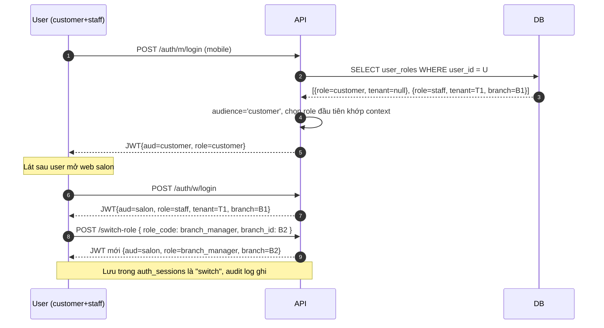
```mermaid
sequenceDiagram
    autonumber
    participant U as User (customer+staff)
    participant API
    participant DB

    U->>API: POST /auth/m/login (mobile)
    API->>DB: SELECT user_roles WHERE user_id = U
    DB-->>API: [{role=customer, tenant=null}, {role=staff, tenant=T1, branch=B1}]
    API->>API: audience='customer', chọn role đầu tiên khớp context
    API-->>U: JWT{aud=customer, role=customer}

    Note over U: Lát sau user mở web salon

    U->>API: POST /auth/w/login
    API-->>U: JWT{aud=salon, role=staff, tenant=T1, branch=B1}

    U->>API: POST /switch-role { role_code: branch_manager, branch_id: B2 }
    API-->>U: JWT mới {aud=salon, role=branch_manager, branch=B2}
    Note over U, API: Lưu trong auth_sessions là "switch", audit log ghi
```

Rule:
- User chỉ được `switch-role` sang role **đã được cấp trong `user_roles`**.
- Mỗi lần switch là 1 audit row.
- Web UI có dropdown "Switch role" nếu user có > 1 role.

### 13.10 Test matrix bổ sung theo audience

| Test | Endpoint | Audience token | Expected |
|------|----------|----------------|----------|
| Customer JWT không gọi được salon endpoint | `GET /api/salon/bookings` | `aud=customer` | **403 audience mismatch** |
| Staff web JWT không gọi được admin endpoint | `GET /api/admin/salons` | `aud=salon` | **403 audience mismatch** |
| Customer mobile JWT hết hạn | `GET /api/customer/bookings` | TTL -1s | **401** |
| Biometric device không trust | `POST /auth/m/biometric-unlock` | device trusted=false | **403** |
| Push token invalid | `POST /api/customer/devices` | token revoked | clear device, không error UI |
| Old mobile version | `GET /api/customer/salons` | app version < min_version | **426 Upgrade Required** |
| Customer cố login vào web salon | `POST /auth/w/login` | user chỉ có role=customer | **403** (chưa cấu hình nhân viên) |
| User đổi audience bằng cách sửa JWT | `GET /api/admin/salons` | tự ký JWT `aud=platform` | **401 signature invalid** |
| Cross-device session revoke | Login từ device A → revoke từ device B | device A tiếp tục gọi API | **401 revoked** |

### 13.11 Build & release khác nhau

| Aspect | Mobile (Customer) | Salon Web | Admin Web |
|--------|-------------------|-----------|-----------|
| Build tool | Xcode/Android Studio + RN bundler | Vite + React | Vite + React |
| Release cadence | 2–4 tuần (App Store review) | Hàng ngày / CI | Hàng ngày / CI |
| Hotfix | Force update qua `app_versions.force_update=true` | Deploy lại | Deploy lại |
| Crash reporting | Crashlytics (Firebase) / Sentry | Sentry | Sentry |
| Analytics | Firebase / Amplitude / Mixpanel | PostHog / GA4 | PostHog / GA4 |
| API base URL | Production domain với `audience=customer` | Production domain với `audience=salon` | Domain phụ `admin.*` (IP allowlist) |

### 13.12 Mermaid: kiến trúc tổng thể có tách client

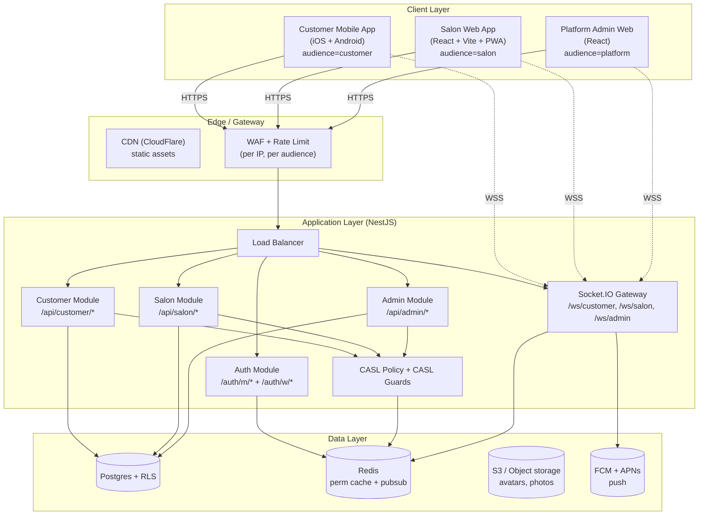
```mermaid
flowchart TB
    subgraph ClientLayer["Client Layer"]
        MOB["Customer Mobile App<br/>(iOS + Android)<br/>audience=customer"]
        SWEB["Salon Web App<br/>(React + Vite + PWA)<br/>audience=salon"]
        AWEB["Platform Admin Web<br/>(React)<br/>audience=platform"]
    end

    subgraph EdgeLayer["Edge / Gateway"]
        CDN["CDN (CloudFlare)<br/>static assets"]
        WAF["WAF + Rate Limit<br/>(per IP, per audience)"]
    end

    subgraph AppLayer["Application Layer (NestJS)"]
        LB["Load Balancer"]
        AUTH["Auth Module<br/>/auth/m/* + /auth/w/*"]
        CUST["Customer Module<br/>/api/customer/*"]
        SALON["Salon Module<br/>/api/salon/*"]
        ADMIN["Admin Module<br/>/api/admin/*"]
        POLICY["CASL Policy + CASL Guards"]
        WS["Socket.IO Gateway<br/>/ws/customer, /ws/salon, /ws/admin"]
    end

    subgraph DataLayer["Data Layer"]
        PG[("Postgres + RLS")]
        RD[("Redis<br/>perm cache + pubsub")]
        S3[("S3 / Object storage<br/>avatars, photos")]
        FCM[("FCM + APNs<br/>push")]
    end

    MOB -->|HTTPS| WAF
    SWEB -->|HTTPS| WAF
    AWEB -->|HTTPS| WAF
    WAF --> LB
    LB --> AUTH
    LB --> CUST
    LB --> SALON
    LB --> ADMIN
    LB --> WS
    MOB -. WSS .-> WS
    SWEB -. WSS .-> WS
    AWEB -. WSS .-> WS
    CUST --> POLICY
    SALON --> POLICY
    ADMIN --> POLICY
    CUST --> PG
    SALON --> PG
    ADMIN --> PG
    AUTH --> RD
    POLICY --> RD
    WS --> RD
    WS --> FCM
```

### 13.13 Ma trận phân quyền đặc thù cho từng audience (BỔ SUNG cho Phần 4)

Một số permission chỉ tồn tại trong 1 audience:

| Audience | Permission chỉ có ở đây |
|----------|-------------------------|
| `customer` | `device:register:own`, `biometric:setup:own`, `favorite:write:own`, `booking:cancel_within_window:own`, `review:create_within_window:own`, `push:opt_in:own` |
| `salon`    | `branch:update_hours:branch`, `staff:lock_in_branch:branch`, `payment:collect_walk_in:branch`, `refund:within_branch_limit:branch`, `report:export_basic:branch`, `audit_log:view_branch:branch` |
| `platform` | `salon:approve_kyc:platform`, `salon:suspend:platform`, `user:impersonate:platform`, `audit_log:view_all:platform`, `audit_log:export:platform`, `payout:approve:platform`, `banner:*:platform` |

Việc tách audience là **lớp 1 (coarse)** trong 2-layer check: token `aud` phải khớp với prefix `/api/customer|slon|admin`. Sau đó mới đến role + scope check ở service layer.

---

## Phần 14 — Implementation Roadmap & TODOs

Phần này chuyển toàn bộ phân tích thành **các task có thể thực thi tuần tự**, kèm ước lượng effort, phụ thuộc, và tiêu chí hoàn thành (Definition of Done). Thứ tự đã được tối ưu để mỗi phase đều có **demo được** cho stakeholder.

### 14.1 Phase 0 — Khởi tạo & thiết lập nền tảng (Tuần 1)

| # | TODO | Effort | Phụ thuộc | Definition of Done |
|---|------|:------:|-----------|---------------------|
| T0.1 | Khảo sát codebase NestJS hiện tại: `guards/`, `utils/policy.ts`, `utils/multi-tenancy.ts`, `utils/audit.ts`. Vẽ dependency map. | 0.5d | — | File `docs/01-codebase-survey.md` + diagram |
| T0.2 | Tạo branch `feat/rbac-scope` từ main; tạo ADR (`docs/adr/0001-rbac-scope-design.md`) chốt stack cuối (CASL vs custom). | 0.5d | T0.1 | ADR merged |
| T0.3 | Setup ENV: thêm package `casl`, `@nestjs/throttler`, `argon2`, `otplib` (cho TOTP). | 0.5d | T0.2 | `package.json` updated, lockfile committed |
| T0.4 | Setup Redis dev (Docker compose hoặc local). Thêm `.env.redis.example`. | 0.5d | — | `docker compose up redis` chạy thành công |

### 14.2 Phase 1 — Data model (Tuần 2)

| # | TODO | Effort | Phụ thuộc | DoD |
|---|------|:------:|-----------|-----|
| T1.1 | Viết Prisma migration `001_init_tenants_users.sql`: `users`, `tenants`, `branches`. Bật `pgcrypto` extension (UUID v4). | 1d | T0.3 | `prisma migrate deploy` chạy |
| T1.2 | Viết migration `002_roles_permissions.sql`: `roles`, `permissions`, `role_permissions`, `user_roles` (theo Phần 6.5–6.8). | 1d | T1.1 | Migration apply, indexes tạo |
| T1.3 | Viết migration `003_bookings_payments_reviews.sql`: `bookings`, `booking_health_records` (tách riêng), `payments`, `reviews`, `services`, `staff_profiles`, `schedules`. | 2d | T1.2 | Migration apply |
| T1.4 | Viết migration `004_promotions_payouts.sql`: `promotions`, `commission_ledger`, `audit_logs` (REVOKE UPDATE/DELETE), `jwt_revocations`. | 1d | T1.3 | Migration apply |
| T1.5 | Viết migration `005_support_tickets.sql`: `support_tickets`, `ticket_access_grants`, `user_devices`, `auth_sessions`, `app_versions`. | 1d | T1.4 | Migration apply |
| T1.6 | Bật RLS cho `bookings`, `payments`, `booking_health_records`, `audit_logs` (Phần 7.6). Test bằng cách bypass app, query trực tiếp, verify isolation. | 1.5d | T1.5 | RLS policies active + e2e tenant-isolation pass |
| T1.7 | Seed database với `permission_catalog.md` (Phần 12): insert roles + permissions + role_permissions. | 1d | T1.2 | `pnpm seed` chạy, có 5 platform roles + 4 salon roles + 1 customer |
| T1.8 | Viết seed script tạo 5 tenants demo, mỗi tenant có 1 owner + 2 branch + 3 staff + 5 customer. | 1d | T1.7 | `pnpm seed:demo` chạy, có ~50 users |

### 14.3 Phase 2 — Authentication & Audience (Tuần 3)

| # | TODO | Effort | Phụ thuộc | DoD |
|---|------|:------:|-----------|-----|
| T2.1 | Implement `AuthModule` base: register, login, password hashing (argon2), JWT issue (15 min) + refresh (7 ngày, single-use rotation). | 2d | T1.1 | `POST /auth/login` working |
| T2.2 | Tách endpoint: `/auth/m/*` (mobile), `/auth/w/*` (web). Mỗi cái riêng DTO + flow (web có thêm CSRF, mobile có `device_id`). | 1.5d | T2.1 | 2 flow tested |
| T2.3 | Thêm JWT `audience` claim (`customer | salon | platform`). Implement audience guard đứng trước RolesGuard. | 1d | T2.2 | Audience mismatch → 403 |
| T2.4 | Implement `token_version` trên `users`. Mỗi lần đổi role/lock → bump version. JWT verify check version. | 0.5d | T2.1 | Bump version → all old tokens invalid |
| T2.5 | Implement blacklist `jwt:revoked:{jti}` trong Redis với TTL = remaining lifetime. | 0.5d | T2.4 | Blacklist works |
| T2.6 | Implement password reset flow: email token (single-use, 1h TTL). | 1d | T2.1 | Reset email gửi được, link works |
| T2.7 | Implement 2FA TOTP (`otplib`). Setup, verify, disable flows. Backup codes (10 codes one-time). | 2d | T2.1 | TOTP verify works |
| T2.8 | Implement mobile biometric flow: register device, store biometric key hash, verify subsequent unlock. | 1.5d | T2.2 | Biometric unlock flow tested on RN |
| T2.9 | Implement `UserDevices` CRUD (mobile): register device push token, mark trusted, list devices, revoke device. | 1d | T1.5 | Devices persisted, push registered |
| T2.10 | Implement `auth_sessions` tracking: ghi log mỗi login/logout, expose `GET /api/customer/auth/sessions` cho user xem. | 1d | T1.5 | Sessions viewable in app |

### 14.4 Phase 3 — Permission catalog & CASL (Tuần 4)

| # | TODO | Effort | Phụ thuộc | DoD |
|---|------|:------:|-----------|-----|
| T3.1 | Implement `PermissionCacheService` (Phần 7.3): `getPermissions(userId)` cache Redis TTL 10 phút, `invalidate(userId)`. | 1d | T0.4, T1.2 | Cache hit/miss metrics export được |
| T3.2 | Implement CASL ability builder (Phần 7.4) — `buildAbilityFor(user, perms[])` mapping scope → condition. | 1.5d | T3.1 | Ability build successfully |
| T3.3 | Implement `PolicyHook` decorator + `ForbiddenError.from(ability).throwUnlessCan()`. | 0.5d | T3.2 | Service throw error đúng |
| T3.4 | Implement `AudienceGuard` + `RolesGuard` + `JwtAuthGuard` chain. Test audience + role combo. | 1d | T2.3, T3.3 | Guards ordered correctly |
| T3.5 | Implement `EntitlementsGuard` (Phần 10.4) — check plan feature (nếu dùng subscription tier). | 1d | T1.3 | Plan-based block works |
| T3.6 | Implement role transition audit: khi admin đổi `user_roles`, ghi `audit_logs` row + clear cache. | 0.5d | T3.1, T4.5 | Admin revoke → staff logout ngay |

### 14.5 Phase 4 — Authorization logic cho Customers API (Tuần 5)

| # | TODO | Effort | Phụ thuộc | DoD |
|---|------|:------:|-----------|-----|
| T4.1 | Implement `CustomerModule` controller + service skeleton: `/api/customer/bookings`, `/salons`, `/profile`, `/reviews`, `/payments`, `/devices`. | 2d | T2, T3 | All endpoints reachable |
| T4.2 | Apply policy cho booking: customer chỉ `*:*:own`. Negative tests cho IDOR. | 1.5d | T4.1, T3.3 | IDOR tests pass |
| T4.3 | Implement `bookings` write path: create draft → confirm → cancel. Validate ownership + time-window. | 2d | T4.2 | Booking flows e2e |
| T4.4 | Implement customer review flow: tạo trong 30 ngày, sửa trong 24h, xóa anytime. | 1d | T4.1 | Reviews created/edited |
| T4.5 | Implement customer `right-to-be-forgotten`: soft-delete user, anonymize PII, hard-delete health records. | 1d | T1.3 | PDPA flow works |
| T4.6 | Implement customer `health_info` write qua `booking_health_records` riêng; consent check bắt buộc. | 1d | T1.3 | Sensitive data tách đúng |

### 14.6 Phase 5 — Salon API (Tuần 6–7)

| # | TODO | Effort | Phụ thuộc | DoD |
|---|------|:------:|-----------|-----|
| T5.1 | Implement `SalonModule` skeleton: dashboard, scheduler, bookings (CRUD + status + assign). | 3d | T4 | All endpoints reachable |
| T5.2 | Apply role-based policy: staff `:own | :assigned`, receptionist `:branch`, BM `:branch`, owner `:tenant`. | 2d | T5.1, T3.3 | Matrix test pass |
| T5.3 | Implement staff scope permissions (Phần 12.3): chỉ thấy assigned bookings, xin đổi ca, xin nghỉ. | 1.5d | T5.2 | Staff flows e2e |
| T5.4 | Implement receptionist: check-in, collect cash, partial refund (≤ ngưỡng). | 1.5d | T5.2 | Refund within limit works |
| T5.5 | Implement BM: CRUD dịch vụ, sửa giờ, duyệt swap, refund (≤ ngưỡng BM). | 2d | T5.2 | BM flows |
| T5.6 | Implement Owner: multi-branch, payout request, role assign, audit export. | 2d | T5.2 | Owner flows |
| T5.7 | Implement cross-role guard: BM chỉ được gán role ≤ receptionist (Phần 8.7). | 1d | T5.6, T3.6 | Privilege escalation test pass |
| T5.8 | Implement multi-branch Owner view: tổng hợp dashboard + drill-down từng branch. | 1.5d | T5.6 | Dashboard hiển thị |
| T5.9 | Implement `switch-role` cho user có nhiều role (Phần 13.9): chỉ được switch sang role đã được gán. | 1d | T3.6 | Switch flow works |

### 14.7 Phase 6 — Payments & Gateways (Tuần 8)

| # | TODO | Effort | Phụ thuộc | DoD |
|---|------|:------:|-----------|-----|
| T6.1 | Implement `PaymentModule` core: intent creation, capture, refund, partial refund. Idempotency key. | 2d | T5 | Payment intents |
| T6.2 | Tích hợp VNPay SDK: tạo payment URL, verify IPN webhook (HMAC). | 2d | T6.1 | VNPay flow works |
| T6.3 | Tích hợp MoMo: tương tự VNPay. | 1.5d | T6.1 | MoMo flow works |
| T6.4 | (Optional) Stripe nếu có KH quốc tế. | 1d | T6.1 | Stripe works |
| T6.5 | Implement refund authority: Receptionist ≤ 200k, BM ≤ 1tr, Owner ≤ 10tr, trên 10tr cần Platform Admin. | 1d | T6.1, T8.x | Refund tiers enforced |
| T6.6 | Implement double-sign refund > 5tr: 1 Owner salon + 1 Platform Finance confirm. | 1.5d | T6.5 | 2FA-refund flow |
| T6.7 | Cash payment (walk-in): generate invoice, store signature hash, audit. | 1d | T6.1 | Cash flow |
| T6.8 | Payment webhook security: verify HMAC, replay-attack protection với `event_id` unique. | 1d | T6.2 | Webhook verify |

### 14.8 Phase 7 — Admin/Platform API (Tuần 9–10)

| # | TODO | Effort | Phụ thuộc | DoD |
|---|------|:------:|-----------|-----|
| T7.1 | Implement `AdminModule` skeleton: dashboard, salons list/search/detail. | 2d | T5 | All admin endpoints reachable |
| T7.2 | Compliance flow: approve KYC (upload + verify docs), suspend salon, handle report. | 2d | T7.1 | KYC flows |
| T7.3 | Support/CS: ticket queue, scope-limited access (Phần 6.18 + 12.14), refund ≤ ngưỡng. | 2d | T7.1 | Ticket flows + access grant |
| T7.4 | Marketing: banner CRUD, featured salon, platform-wide promotions. | 1.5d | T7.1 | Marketing flows |
| T7.5 | Finance: payout request review, approve/reject, execute (mock), report export. | 2d | T7.1, T6.5 | Payout flows |
| T7.6 | Platform Admin override: super_admin_action flag + extra audit logging. | 1d | T7.1 | All admin writes logged với cờ |
| T7.7 | Implement impersonate user (debug): có time-bound (≤ 30 phút), full audit log. | 1d | T7.1 | Impersonate flow works |
| T7.8 | Audit log full-text search (PostgreSQL `tsvector` + GIN index). | 1d | T1.4 | Audit search works |
| T7.9 | Audit log export CSV / NDJSON (yêu cầu pháp lý). | 0.5d | T7.8 | Export works |

### 14.9 Phase 8 — Bảo mật & Compliance (Tuần 11)

| # | TODO | Effort | Phụ thuộc | DoD |
|---|------|:------:|-----------|-----|
| T8.1 | Enable field-level masking cho sensitive fields (commission_rate, salary, health_info). | 1d | T5, T4.6 | Mask tests pass |
| T8.2 | Implement `JwtAuthGuard` blacklist check (Redis) + token_version check. | 0.5d | T2.5 | Blacklist works |
| T8.3 | Implement helmet, CORS strict (per audience origin), CSP headers. | 0.5d | T2 | Headers audited |
| T8.4 | Rate limit: `/auth/login` (5/15min/IP), `/auth/m/login` mobile version. Throttler config. | 1d | T2 | Throttled |
| T8.5 | Lock user sau 5 lần login fail → bump token_version + email alert. | 0.5d | T2.4 | Lock works |
| T8.6 | CSRF token middleware cho web (cookie-based). Mobile không cần. | 1d | T2 | CSRF tested |
| T8.7 | Input validation: `class-validator` trên mọi DTO, ngăn mass-assignment. | 1d | T4-T7 | DTO whitelist enforced |
| T8.8 | Sensitive data consent banner (mobile + web) + lưu consent vào `gdpr_consent_at`. | 1d | T1.1 | Consent captured |
| T8.9 | Data retention cron: xóa health records quá hạn, anonymize user inactive > 2 năm. | 1d | T1.3 | Cron job working |
| T8.10 | Secrets management: Vault/KMS hoặc AWS Secrets Manager. Không hardcode trong `.env`. | 1d | T0 | Secrets stored externally |

### 14.10 Phase 9 — Realtime, Push, Notification (Tuần 12)

| # | TODO | Effort | Phụ thuộc | DoD |
|---|------|:------:|-----------|-----|
| T9.1 | Socket.IO gateway với 3 namespaces `/ws/customer`, `/ws/salon`, `/ws/admin`. | 2d | T4-T7 | WS connect works |
| T9.2 | Implement JWT auth cho WS connect; join rooms theo `audience` + scope. | 1d | T9.1, T2.3 | WS auth enforced |
| T9.3 | Implement room policy: WS guard (CASL trên subscribe event như `booking.subscribe`). | 1d | T9.2 | Subscribe denied for wrong scope |
| T9.4 | Realtime event dispatch: booking.created → broadcast đến salon branch; booking.updated → notify customer. | 2d | T9.3 | Events propagate |
| T9.5 | Push notification: FCM (Android) + APNs (iOS). Register device token, route event theo `user_devices`. | 2d | T1.5, T4 | Push delivered |
| T9.6 | In-app notification center: persist notification, expose `GET /notifications`. | 1d | T4, T5 | Notification inbox |
| T9.7 | Notification preferences per user. | 0.5d | T9.6 | Settings work |

### 14.11 Phase 10 — Test matrix & CI (Tuần 13)

| # | TODO | Effort | Phụ thuộc | DoD |
|---|------|:------:|-----------|-----|
| T10.1 | Viết e2e test cho **mỗi ô trong Phần 4** (positive + negative). Ước tính 14 modules × 9 roles × 4-6 actions ≈ 500 test cases. Dùng fixture pattern. | 5d | T4-T7 | Test suite 100% green |
| T10.2 | Tenant isolation test: 2 tenant fixture, mọi tenant-scoped endpoint phải block cross-tenant. | 1d | T10.1 | Isolation suite pass |
| T10.3 | Privilege escalation tests: mass-assignment attempts, role escalation, audience mismatch. | 1d | T10.1 | Escalation blocked |
| T10.4 | JWT tests: expired, revoked, token_version mismatch, blacklist, signature invalid. | 1d | T10.1 | JWT suite pass |
| T10.5 | Audit log tests: mọi sensitive action ghi log với before/after đầy đủ, audit log UPDATE/DELETE bị reject. | 1d | T10.1 | Audit tests pass |
| T10.6 | Field masking tests: commission_rate hidden from staff, health hidden from receptionist. | 0.5d | T10.1 | Mask tests pass |
| T10.7 | CI pipeline (GitHub Actions/GitLab CI): chạy matrix tests, block merge on failure. | 1d | T10.1 | CI gate enforced |
| T10.8 | Coverage gate: controller endpoints ≥ 100% (mỗi endpoint có positive + negative test). | 0.5d | T10.7 | Coverage enforced |

### 14.12 Phase 11 — Monitoring & DevOps (Tuần 14)

| # | TODO | Effort | Phụ thuộc | DoD |
|---|------|:------:|-----------|-----|
| T11.1 | Prometheus metrics: request duration, 4xx/5xx, permission cache hit/miss, JWT blacklist size. | 1d | T0.3 | Metrics endpoint |
| T11.2 | Grafana dashboard: request volume, latency p95/p99, error rate, audit volume, suspicious events. | 1d | T11.1 | Dashboard live |
| T11.3 | Alerting rules (Phần 10.3): 403 burst, fail login burst, super_admin_action outside hours, audit ERROR. | 1d | T11.2 | Alerts firing correctly |
| T11.4 | Sentry error tracking: NestJS + React + RN SDK. | 0.5d | T0 | Errors visible |
| T11.5 | Structured logging (Pino + ELK / Loki): correlation `request_id` xuyên suốt. | 1d | T4-T7 | Logs queryable |
| T11.6 | Backup strategy: DB snapshot hourly, retention 30 ngày; audit log snapshot dài hơn (năm). | 1d | T1 | Backups verified |
| T11.7 | Disaster recovery runbook + quarterly drill. | 1d | T11.6 | Runbook tested |
| T11.8 | Keycloak SSO integration (cho admin). Migrations từ local auth sang OIDC. | 2d | T2, T7 | SSO works cho admin |

### 14.13 Phase 12 — Documentation & Handoff (Tuần 15)

| # | TODO | Effort | Phụ thuộc | DoD |
|---|------|:------:|-----------|-----|
| T12.1 | OpenAPI/Swagger spec cho toàn bộ API. | 1.5d | T4-T7 | Docs serve tại `/api/docs` |
| T12.2 | Postman/Insomnia collection cho manual QA. | 0.5d | T12.1 | Collection shareable |
| T12.3 | README per service + role map cheat sheet. | 0.5d | T12.1 | README written |
| T12.4 | Runbook cho on-call: common incidents (403 storm, Redis down, DB slow). | 1d | T11.3 | Runbook signed off |
| T12.5 | Security checklist: OWASP top 10, penetration test plan. | 1d | All | Checklist reviewed by security |
| T12.6 | User training: Owner walkthrough, BM walkthrough, Receptionist walkthrough (video). | 1d | T12.3 | Videos recorded |
| T12.7 | Migration guide cho customer từ app cũ (nếu applicable) — backup schedule, cutover plan. | 1d | T12.6 | Cutover plan approved |

### 14.14 Effort tổng

| Phase | Tuần | Effort (dev-week) |
|-------|:----:|:-----------------:|
| 0 — Setup | 1 | 2 |
| 1 — Data model | 2 | 8 |
| 2 — Auth & Audience | 3 | 12 |
| 3 — Permission catalog & CASL | 4 | 6.5 |
| 4 — Customers API | 5 | 8.5 |
| 5 — Salon API | 6–7 | 16 |
| 6 — Payments | 8 | 11 |
| 7 — Admin API | 9–10 | 12.5 |
| 8 — Security | 11 | 8.5 |
| 9 — Realtime + Push | 12 | 9.5 |
| 10 — Test matrix & CI | 13 | 10.5 |
| 11 — DevOps & Monitoring | 14 | 7.5 |
| 12 — Docs & Handoff | 15 | 6.5 |
| **Tổng** | **15 tuần** | **~119 dev-week** |

Cho team 4 backend + 2 frontend + 1 QA:
- 15 tuần × 7 người = ~105 dev-week budget
- Buffer còn lại ~14 dev-week cho rework, code review, sprint ceremonies.

### 14.15 Risk register (cần attention)

| Risk | Impact | Probability | Mitigation |
|------|:------:|:-----------:|------------|
| Schema migration lock table lớn trong go-live | HIGH | M | Dùng gh-ost hoặc pg_repack; chạy off-peak; chia nhỏ migration |
| RLS bypass qua raw query | HIGH | M | Code review bắt buộc; SQL lint rule; integration test cho mọi raw query |
| Token compromise trên mobile jailbreak/root | HIGH | L | Biometric + device attestation (iOS DeviceCheck, Android Play Integrity) |
| Customer app force update khó (App Store review) | MEDIUM | M | `app_versions.force_update=true` chặn nhẹ; vẫn cần 2-3 tuần OTA |
| PDPA retroactive: user đã có data trước khi bật consent | HIGH | M | Tạo banner lần đầu open app, lưu consent retroactively |
| Payment gateway rate limit khi flash sale | MEDIUM | L | Queue + retry exponential backoff |
| RLS performance overhead | MEDIUM | M | Benchmark trước; index đủ; nếu chậm, dùng application-level filter + audit |
| Audit log storage tăng nhanh | MEDIUM | H | Partition theo tháng, archive > 1 năm sang cold storage |
| Owner self-promote bypass privilege escalation | HIGH | L | Code review + 4-eyes rule cho role admin |
| Real-time WS scale | MEDIUM | M | Redis pubsub adapter, sticky session LB |

### 14.16 Definition of Done cho toàn dự án

Project done khi TẤT CẢ các tiêu chí sau pass:

- [ ] **All Phases 0–12** merged vào main, CI green.
- [ ] **Permission matrix test** đạt 100% (mỗi ô trong Phần 4 + 12 có ≥ 2 test, 1 positive 1 negative).
- [ ] **Tenant isolation tests** đạt 100% endpoints.
- [ ] **PDPA audit** đạt yêu cầu Bộ Công an về dữ liệu cá nhân.
- [ ] **OWASP top 10** review pass (có 3rd-party audit).
- [ ] **Penetration test** không tìm thấy P0/P1 vulnerability.
- [ ] **2FA enforced** cho Owner, BM, platform roles.
- [ ] **RTO ≤ 30 phút, RPO ≤ 5 phút** đạt qua drill.
- [ ] **Coverage** controller ≥ 100%, services ≥ 90%.
- [ ] **Lighthouse mobile** ≥ 80 (nếu có web-app feel), App Store rating ≥ 4.0.
- [ ] **Documentation** tại `/docs` + swagger serve đủ endpoint.

---

## Phần 15 — Sequence Diagrams

Phần này bổ sung các sequence diagram quan trọng cho từng flow RBAC + scope chính, giúp stakeholder hình dung được luồng đi cụ thể và identify điểm apply policy.

### 15.1 Customer đặt lịch (booking flow đầy đủ)

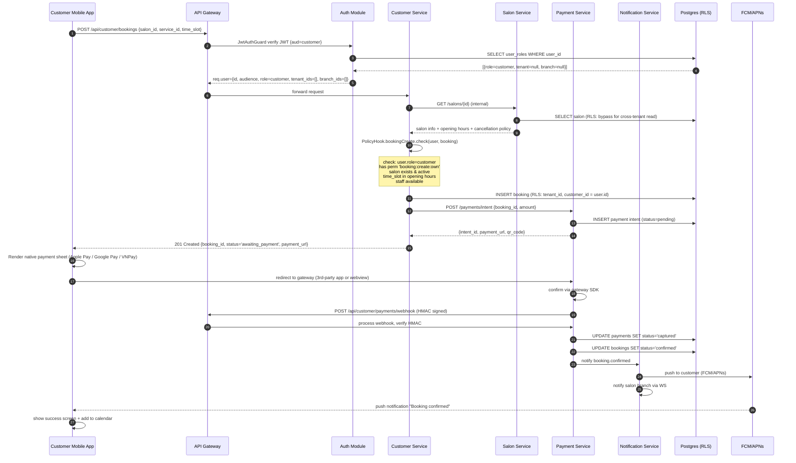
```mermaid
sequenceDiagram
    autonumber
    participant C as Customer Mobile App
    participant GW as API Gateway
    participant Auth as Auth Module
    participant Cust as Customer Service
    participant Salon as Salon Service
    participant Pay as Payment Service
    participant Notif as Notification Service
    participant DB as Postgres (RLS)
    participant Push as FCM/APNs

    C->>GW: POST /api/customer/bookings {salon_id, service_id, time_slot}
    GW->>Auth: JwtAuthGuard verify JWT {aud=customer}
    Auth->>DB: SELECT user_roles WHERE user_id
    DB-->>Auth: [{role=customer, tenant=null, branch=null}]
    Auth-->>GW: req.user={id, audience, role=customer, tenant_ids=[], branch_ids=[]}

    GW->>Cust: forward request
    Cust->>Salon: GET /salons/{id} (internal)
    Salon->>DB: SELECT salon (RLS: bypass for cross-tenant read)
    Salon-->>Cust: salon info + opening hours + cancellation policy

    Cust->>Cust: PolicyHook.bookingCreate.check(user, booking)
    Note over Cust: check: user.role=customer<br/>has perm 'booking:create:own'<br/>salon exists & active<br/>time_slot in opening hours<br/>staff available

    Cust->>DB: INSERT booking (RLS: tenant_id, customer_id = user.id)
    Cust->>Pay: POST /payments/intent {booking_id, amount}
    Pay->>DB: INSERT payment intent (status=pending)
    Pay-->>Cust: {intent_id, payment_url, qr_code}

    Cust-->>C: 201 Created {booking_id, status='awaiting_payment', payment_url}
    C->>C: Render native payment sheet (Apple Pay / Google Pay / VNPay)
    C->>Pay: redirect to gateway (3rd-party app or webview)
    Pay->>Pay: confirm via gateway SDK
    Pay->>GW: POST /api/customer/payments/webhook (HMAC signed)
    GW->>Pay: process webhook, verify HMAC
    Pay->>DB: UPDATE payments SET status='captured'
    Pay->>DB: UPDATE bookings SET status='confirmed'
    Pay->>Notif: notify booking.confirmed
    Notif->>Push: push to customer (FCM/APNs)
    Notif->>Notif: notify salon branch via WS

    Push-->>C: push notification "Booking confirmed"
    C->>C: show success screen + add to calendar
```

### 15.2 Customer cancel booking với refund tier

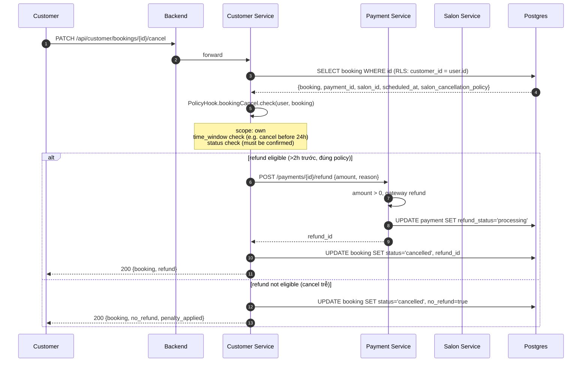
```mermaid
sequenceDiagram
    autonumber
    participant C as Customer
    participant API as Backend
    participant Cust as Customer Service
    participant Pay as Payment Service
    participant Salon as Salon Service
    participant DB as Postgres

    C->>API: PATCH /api/customer/bookings/{id}/cancel
    API->>Cust: forward
    Cust->>DB: SELECT booking WHERE id (RLS: customer_id = user.id)
    DB-->>Cust: {booking, payment_id, salon_id, scheduled_at, salon_cancellation_policy}

    Cust->>Cust: PolicyHook.bookingCancel.check(user, booking)
    Note over Cust: scope: own<br/>time_window check (e.g. cancel before 24h)<br/>status check (must be confirmed)

    alt refund eligible (>2h trước, đúng policy)
        Cust->>Pay: POST /payments/{id}/refund {amount, reason}
        Pay->>Pay: amount > 0, gateway refund
        Pay->>DB: UPDATE payment SET refund_status='processing'
        Pay-->>Cust: refund_id
        Cust->>DB: UPDATE booking SET status='cancelled', refund_id
        Cust-->>C: 200 {booking, refund}
    else refund not eligible (cancel trễ)
        Cust->>DB: UPDATE booking SET status='cancelled', no_refund=true
        Cust-->>C: 200 {booking, no_refund, penalty_applied}
    end
```

### 15.3 Receptionist refund trong branch scope

```mermaid
sequenceDiagram
    autonumber
    participant R as Receptionist Web
    participant API as Backend
    participant Sal as Salon Service
    participant Pay as Payment Service
    participant Audit as Audit Logger
    participant DB as Postgres

    R->>API: POST /api/salon/payments/{id}/partial-refund {amount, reason}
    API->>Sal: forward
    Sal->>Sal: AuthGuard.check(audience=salon, role in [receptionist, branch_manager, owner])
    Sal->>DB: SELECT user_roles WHERE user_id
    DB-->>Sal: [{role=receptionist, tenant=T1, branch=B2}]

    Sal->>Sal: PolicyHook.refund.check(user, payment)
    Note over Sal: perm='payment:refund:branch'<br/>refund_amount <= role.refund_limit<br/>payment.tenant_id == user.tenant_ids[0]<br/>payment.branch_id == user.branch_ids[0]

    alt amount <= Receptionist limit (200k)
        Sal->>Pay: process refund (refund tier = receptionist)
        Pay-->>Sal: success
        Sal->>Audit: log {actor:rec, action:refund, amount, payment_id, branch_id}
        Audit->>DB: INSERT audit_logs (no UPDATE/DELETE granted)
        Sal-->>R: 200 {refund}
    else amount > Receptionist limit
        Sal-->>R: 403 "Refund exceeds role limit; ask Branch Manager"
    end
```

### 15.4 Owner assign role cho user

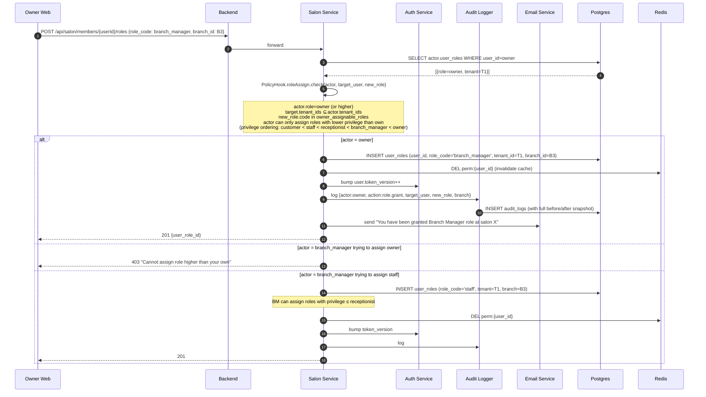
```mermaid
sequenceDiagram
    autonumber
    participant O as Owner Web
    participant API as Backend
    participant Sal as Salon Service
    participant Auth as Auth Service
    participant Audit as Audit Logger
    participant Email as Email Service
    participant DB as Postgres
    participant Cache as Redis

    O->>API: POST /api/salon/members/{userId}/roles {role_code: branch_manager, branch_id: B3}
    API->>Sal: forward
    Sal->>DB: SELECT actor.user_roles WHERE user_id=owner
    DB-->>Sal: [{role=owner, tenant=T1}]

    Sal->>Sal: PolicyHook.roleAssign.check(actor, target_user, new_role)
    Note over Sal: actor.role=owner (or higher)<br/>target.tenant_ids ⊆ actor.tenant_ids<br/>new_role.code in owner_assignable_roles<br/>actor can only assign roles with lower privilege than own<br/>(privilege ordering: customer < staff < receptionist < branch_manager < owner)

    alt actor = owner
        Sal->>DB: INSERT user_roles (user_id, role_code='branch_manager', tenant_id=T1, branch_id=B3)
        Sal->>Cache: DEL perm:{user_id} (invalidate cache)
        Sal->>Auth: bump user.token_version++
        Sal->>Audit: log {actor:owner, action:role.grant, target_user, new_role, branch}
        Audit->>DB: INSERT audit_logs (with full before/after snapshot)
        Sal->>Email: send "You have been granted Branch Manager role at salon X"
        Sal-->>O: 201 {user_role_id}
    else actor = branch_manager trying to assign owner
        Sal-->>O: 403 "Cannot assign role higher than your own"
    else actor = branch_manager trying to assign staff
        Sal->>DB: INSERT user_roles (role_code='staff', tenant=T1, branch=B3)
        Note over Sal: BM can assign roles with privilege ≤ receptionist
        Sal->>Cache: DEL perm:{user_id}
        Sal->>Auth: bump token_version
        Sal->>Audit: log
        Sal-->>O: 201
    end
```

### 15.5 Support CS xử lý ticket với scope-limited access

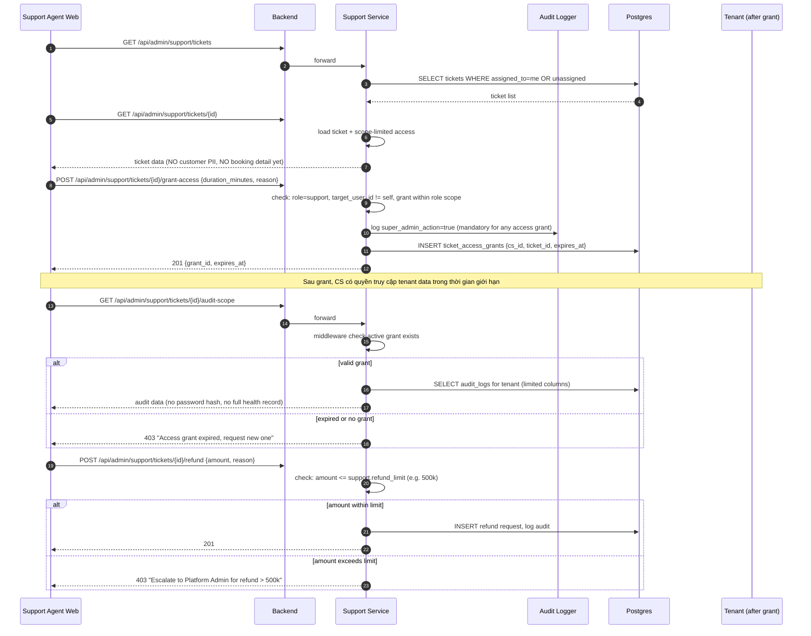
```mermaid
sequenceDiagram
    autonumber
    participant CS as Support Agent Web
    participant API as Backend
    participant Sup as Support Service
    participant Audit as Audit Logger
    participant DB as Postgres
    participant Tenant as Tenant (after grant)

    CS->>API: GET /api/admin/support/tickets
    API->>Sup: forward
    Sup->>DB: SELECT tickets WHERE assigned_to=me OR unassigned
    DB-->>Sup: ticket list

    CS->>API: GET /api/admin/support/tickets/{id}
    Sup->>Sup: load ticket + scope-limited access
    Sup-->>CS: ticket data (NO customer PII, NO booking detail yet)

    CS->>API: POST /api/admin/support/tickets/{id}/grant-access {duration_minutes, reason}
    Sup->>Sup: check: role=support, target_user_id != self, grant within role scope
    Sup->>Audit: log super_admin_action=true (mandatory for any access grant)
    Sup->>DB: INSERT ticket_access_grants {cs_id, ticket_id, expires_at}
    Sup-->>CS: 201 {grant_id, expires_at}

    Note over CS,Tenant: Sau grant, CS có quyền truy cập tenant data trong thời gian giới hạn

    CS->>API: GET /api/admin/support/tickets/{id}/audit-scope
    API->>Sup: forward
    Sup->>Sup: middleware check active grant exists
    alt valid grant
        Sup->>DB: SELECT audit_logs for tenant (limited columns)
        Sup-->>CS: audit data (no password hash, no full health record)
    else expired or no grant
        Sup-->>CS: 403 "Access grant expired, request new one"
    end

    CS->>API: POST /api/admin/support/tickets/{id}/refund {amount, reason}
    Sup->>Sup: check: amount <= support.refund_limit (e.g. 500k)
    alt amount within limit
        Sup->>DB: INSERT refund request, log audit
        Sup-->>CS: 201
    else amount exceeds limit
        Sup-->>CS: 403 "Escalate to Platform Admin for refund > 500k"
    end
```

### 15.6 Platform Admin impersonate user (debug)

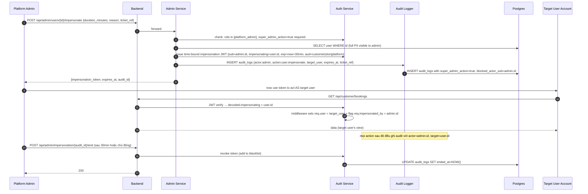
```mermaid
sequenceDiagram
    autonumber
    participant PA as Platform Admin
    participant API as Backend
    participant Adm as Admin Service
    participant Auth as Auth Service
    participant Audit as Audit Logger
    participant DB as Postgres
    participant Target as Target User Account

    PA->>API: POST /api/admin/users/{id}/impersonate {duration_minutes, reason, ticket_ref}
    API->>Adm: forward
    Adm->>Auth: check: role in [platform_admin], super_admin_action=true required
    Adm->>DB: SELECT user WHERE id (full PII visible to admin)
    Adm->>Auth: issue time-bound impersonation JWT {sub=admin.id, impersonating=user.id, exp=now+30min, aud=customer|slon|platform}
    Adm->>Audit: INSERT audit_logs {actor:admin, action:user.impersonate, target_user, expires_at, ticket_ref}
    Audit->>DB: INSERT audit_logs with super_admin_action=true, blocked_actor_sub=admin.id
    Adm-->>PA: {impersonation_token, expires_at, audit_id}

    PA->>Target: now use token to act AS target user
    Target->>API: GET /api/customer/bookings
    API->>Auth: JWT verify → decoded.impersonating = user.id
    Auth->>Auth: middleware sets req.user = target_user + flag req.impersonated_by = admin.id
    API-->>Target: data (target user's view)

    Note over Audit: mọi action sau đó đều ghi audit với actor=admin.id, target=user.id
    PA->>API: POST /api/admin/impersonation/{audit_id}/end (sau 30min hoặc chủ động)
    API->>Auth: revoke token (add to blacklist)
    Auth->>DB: UPDATE audit_logs SET ended_at=NOW()
    API-->>PA: 200
```

### 15.7 Multi-role user switch role

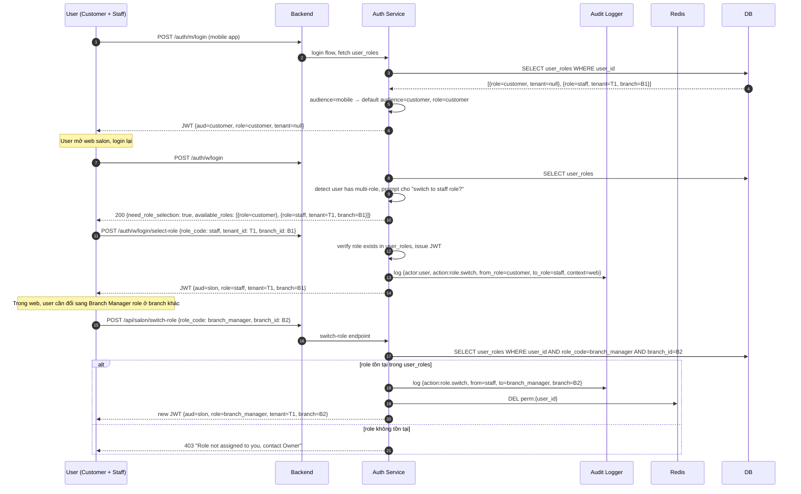
```mermaid
sequenceDiagram
    autonumber
    participant U as User (Customer + Staff)
    participant API as Backend
    participant Auth as Auth Service
    participant Audit as Audit Logger
    participant Cache as Redis

    U->>API: POST /auth/m/login (mobile app)
    API->>Auth: login flow, fetch user_roles
    Auth->>DB: SELECT user_roles WHERE user_id
    DB-->>Auth: [{role=customer, tenant=null}, {role=staff, tenant=T1, branch=B1}]
    Auth->>Auth: audience=mobile → default audience=customer, role=customer
    Auth-->>U: JWT {aud=customer, role=customer, tenant=null}

    Note over U: User mở web salon, login lại

    U->>API: POST /auth/w/login
    Auth->>DB: SELECT user_roles
    Auth->>Auth: detect user has multi-role, prompt cho "switch to staff role?"
    Auth-->>U: 200 {need_role_selection: true, available_roles: [{role=customer}, {role=staff, tenant=T1, branch=B1}]}

    U->>API: POST /auth/w/login/select-role {role_code: staff, tenant_id: T1, branch_id: B1}
    Auth->>Auth: verify role exists in user_roles, issue JWT
    Auth->>Audit: log {actor:user, action:role.switch, from_role=customer, to_role=staff, context=web}
    Auth-->>U: JWT {aud=slon, role=staff, tenant=T1, branch=B1}

    Note over U: Trong web, user cần đổi sang Branch Manager role ở branch khác

    U->>API: POST /api/salon/switch-role {role_code: branch_manager, branch_id: B2}
    API->>Auth: switch-role endpoint
    Auth->>DB: SELECT user_roles WHERE user_id AND role_code=branch_manager AND branch_id=B2
    alt role tồn tại trong user_roles
        Auth->>Audit: log {action:role.switch, from=staff, to=branch_manager, branch=B2}
        Auth->>Cache: DEL perm:{user_id}
        Auth-->>U: new JWT {aud=slon, role=branch_manager, tenant=T1, branch=B2}
    else role không tồn tại
        Auth-->>U: 403 "Role not assigned to you, contact Owner"
    end
```

### 15.8 WebSocket subscribe với audience mismatch (security check)

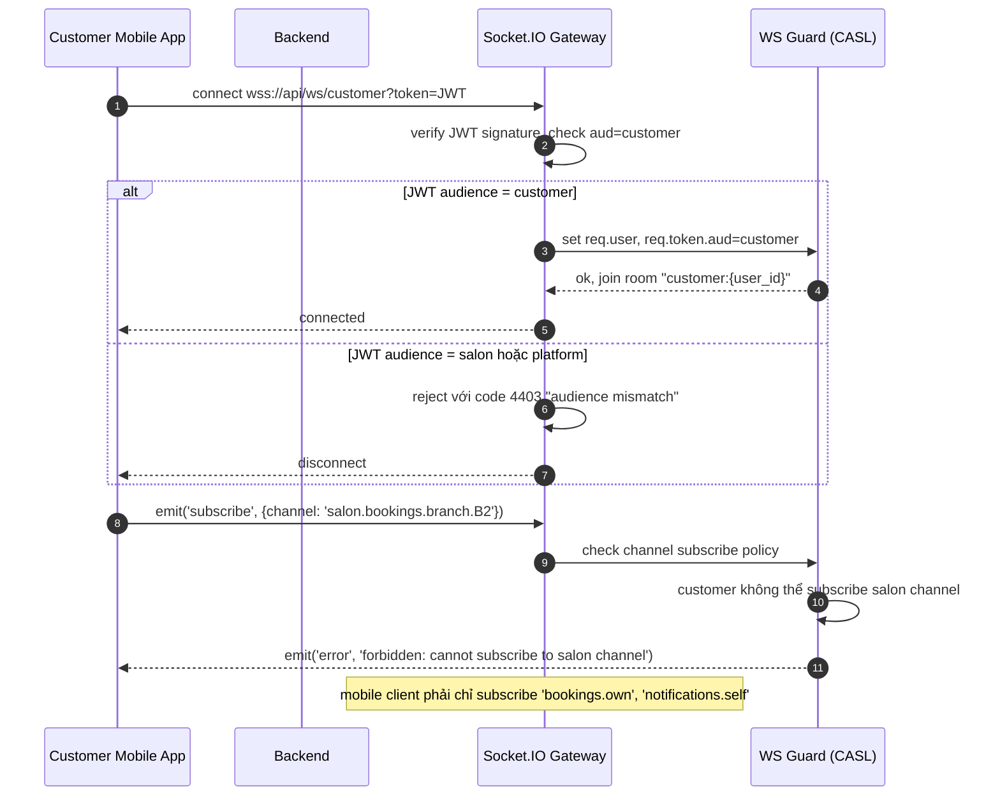
```mermaid
sequenceDiagram
    autonumber
    participant M as Customer Mobile App
    participant API as Backend
    participant WS as Socket.IO Gateway
    participant Guard as WS Guard (CASL)

    M->>WS: connect wss://api/ws/customer?token=JWT
    WS->>WS: verify JWT signature, check aud=customer
    alt JWT audience = customer
        WS->>Guard: set req.user, req.token.aud=customer
        Guard-->>WS: ok, join room "customer:{user_id}"
        WS-->>M: connected
    else JWT audience = salon hoặc platform
        WS->>WS: reject với code 4403 "audience mismatch"
        WS-->>M: disconnect
    end

    M->>WS: emit('subscribe', {channel: 'salon.bookings.branch.B2'})
    WS->>Guard: check channel subscribe policy
    Guard->>Guard: customer không thể subscribe salon channel
    Guard-->>M: emit('error', 'forbidden: cannot subscribe to salon channel')
    Note over WS: mobile client phải chỉ subscribe 'bookings.own', 'notifications.self'
```

### 15.9 Real-time booking event flow

```mermaid
sequenceDiagram
    autonumber
    participant C as Customer
    participant API as Backend
    participant Sal as Salon Service
    participant Cust as Customer Service
    participant WS as Socket.IO
    participant Push as Push Service
    participant R as Receptionist

    C->>API: POST /api/customer/bookings
    API->>Cust: create
    Cust->>DB: INSERT booking (tenant_id=T1, branch_id=B2)
    Cust->>WS: emit 'booking.created' to room 'branch.B2'
    WS->>R: push event (Receptionist đang mở web)
    Cust->>WS: emit 'booking.created' to room 'customer:{id}'
    WS-->>C: push event (Customer mobile đang online)
    Cust->>Push: queue notification "New booking received" for staff branch B2
    Push-->>R: FCM push to Receptionist device

    R->>API: PATCH /api/salon/bookings/{id}/status {status: confirmed}
    API->>Sal: update
    Sal->>DB: UPDATE booking
    Sal->>WS: emit 'booking.updated' to room 'booking.{id}' and 'customer.{id}'
    WS-->>C: push event
    Sal->>Push: notify customer "Your booking is confirmed"
```

### 15.10 Audit log immutable write

```mermaid
sequenceDiagram
    autonumber
    participant App as App (any module)
    participant Aud as Audit Service
    participant DB as Postgres
    participant Sentry as Monitoring

    App->>Aud: logAction({actor, action, resource_type, resource_id, before, after, request_id, ip})
    Aud->>Aud: validate payload (no PII in `before/after` for sensitive fields)
    Aud->>Aud: attach correlation_id, request_id
    Aud->>DB: BEGIN TRANSACTION
    Aud->>DB: SET LOCAL app.actor_id = {actor_id}
    Aud->>DB: INSERT INTO audit_logs (...)
    alt INSERT thất bại
        Aud->>Sentry: capture error, alert
        Aud-->>App: throw error (action phải fail nếu audit log fail)
    else INSERT thành công
        Aud->>DB: COMMIT
        Aud-->>App: ok
    end
    Note over DB: Post-init: REVOKE UPDATE, DELETE ON audit_logs FROM app_user;<br/>REVOKE TRUNCATE ON audit_logs FROM app_user
```

### 15.11 Double-sign refund flow (> 5M)

```mermaid
sequenceDiagram
    autonumber
    participant O as Owner (Salon)
    participant PF as Platform Finance
    participant API as Backend
    participant Sal as Salon Service
    participant Fin as Finance Service
    participant Pay as Payment Service
    participant Audit as Audit Logger

    O->>API: POST /api/salon/payments/{id}/refund {amount: 8M, reason, requires_platform_sign=true}
    API->>Sal: forward
    Sal->>Sal: check: role=owner, amount <= owner.refund_limit (10M)
    alt amount > 5M (cần platform co-sign)
        Sal->>DB: INSERT refund_requests (status=pending_platform_sign, owner_signed_at=NOW())
        Sal->>Audit: log {action:refund.request, owner_signed=true, amount, double_sign=true}
        Sal-->>O: 202 {refund_request_id, status=pending_platform_sign}
    end

    PF->>API: GET /api/admin/finance/refund-requests?status=pending_platform_sign
    PF->>API: POST /api/admin/finance/refund-requests/{id}/approve
    API->>Fin: forward
    Fin->>Fin: check: role=platform_finance, within finance.sign_limit
    Fin->>DB: UPDATE refund_requests SET platform_signed_at=NOW(), status=approved
    Fin->>Pay: process refund
    Pay->>DB: UPDATE payment SET refund_status='processing'
    Pay->>Audit: log {action:refund.execute, both_signed=true, amount}
    Fin-->>PF: 200 {refund_id}
    Fin->>O: notify "Your refund request was processed"
```

### 15.12 TOTP 2FA setup

```mermaid
sequenceDiagram
    autonumber
    participant U as User (Owner)
    participant API as Backend
    participant Auth as Auth Service
    participant DB as Postgres

    U->>API: POST /auth/w/2fa/setup (đã login)
    API->>Auth: forward
    Auth->>Auth: generate secret (otplib.authenticator.generateSecret())
    Auth->>Auth: generate QR code URI (otpauth://totp/...)
    Auth->>DB: INSERT user_totp_secrets (secret_encrypted, status='pending_verify')
    Auth-->>U: {qr_code_uri, manual_entry_key, backup_codes}

    U->>U: scan QR bằng Google Authenticator, nhập 6 số
    U->>API: POST /auth/w/2fa/verify {code: 123456}
    API->>Auth: forward
    Auth->>Auth: authenticator.verify({token: code, secret})
    alt code hợp lệ
        Auth->>DB: UPDATE user_totp_secrets SET status='active', verified_at=NOW()
        Auth->>DB: UPDATE users SET totp_enabled=true, token_version++
        Auth-->>U: 200 {backup_codes: ['AAAA-BBBB', ...]}
    else code sai
        Auth-->>U: 401 "Invalid code"
    end

    Note over U: Lần login sau với user có totp_enabled
    U->>API: POST /auth/w/login {email, password}
    API->>Auth: check credentials
    Auth-->>U: 200 {require_totp: true, partial_token: '...'}
    U->>API: POST /auth/w/login/totp {partial_token, code}
    API->>Auth: verify code
    Auth-->>U: 200 {jwt, refresh_token}
```

### 15.13 Right-to-be-forgotten (PDPA)

```mermaid
sequenceDiagram
    autonumber
    participant U as Customer
    participant API as Backend
    participant Cust as Customer Service
    participant DB as Postgres
    participant Audit as Audit Logger
    participant Cron as Cron job (nightly)

    U->>API: DELETE /api/customer/profile/me {reason}
    API->>Cust: forward
    Cust->>Cust: verify password (re-auth)
    Cust->>DB: BEGIN TRANSACTION
    Cust->>DB: UPDATE users SET email='deleted+{id_hash}@deleted.local', phone=NULL, full_name='Deleted User', avatar_url=NULL, status='deleted', deleted_at=NOW()
    Cust->>DB: DELETE FROM booking_health_records WHERE customer_id (hard delete sensitive)
    Cust->>DB: UPDATE bookings SET customer_notes=NULL, internal_notes=NULL WHERE customer_id
    Cust->>DB: UPDATE reviews SET comment='[removed by user]', images=[] WHERE customer_id
    Cust->>DB: INSERT INTO gdpr_deletion_log (user_id_hash, deleted_at, requested_at) -- chỉ giữ hash cho audit
    Cust->>Audit: log {action:user.delete, actor:user.id, request_id}
    Cust->>DB: COMMIT

    Cust-->>U: 200 {deletion_token}
    Note over U: User nhận email "Your account has been deleted. Recovery token: xxx (valid 30 days)"
    Note over U: Trong 30 ngày có thể restore bằng token

    Cron->>DB: job nightly
    Cron->>DB: DELETE FROM gdpr_deletion_log WHERE requested_at < NOW() - INTERVAL '30 days'
    Note over DB: Sau 30 ngày: user hoàn toàn biến mất, không thể restore
```

### 15.14 Push notification pipeline

```mermaid
sequenceDiagram
    autonumber
    participant App as App Module
    participant Notif as Notification Service
    participant DB as Postgres
    participant Queue as Bull Queue (Redis)
    participant Worker as Push Worker
    participant FCM as FCM (Android)
    participant APN as APNs (iOS)
    participant Dev as User Device

    App->>Notif: queue({user_id, type, title, body, data, audience})
    Notif->>DB: INSERT notifications (persistent inbox)
    Notif->>DB: SELECT user_devices WHERE user_id AND platform=audience
    alt devices found
        Notif->>Queue: enqueue push jobs per device
        Queue->>Worker: dequeue
        Worker->>DB: SELECT notification + user preferences
        alt user opted in for this type
            alt platform=ios
                Worker->>APN: send (HTTP/2 with JWT)
            else platform=android
                Worker->>FCM: send (legacy HTTP or HTTP v1)
            end
            APN-->>Dev: push delivered
            FCM-->>Dev: push delivered
            Worker->>DB: UPDATE notifications SET delivered_at=NOW()
        else user opted out
            Note over Worker: skip push
        end
    else no devices
        Note over Notif: only persist in inbox, no push
    end
```

### 15.15 Cross-tenant access attempt (block)

```mermaid
sequenceDiagram
    autonumber
    participant R as Receptionist (tenant T1, branch B2)
    participant API as Backend
    participant Sal as Salon Service
    participant DB as Postgres (RLS)

    R->>API: GET /api/salon/bookings/{booking_id_of_T2}
    API->>Sal: forward (req.user has tenant_ids=[T1])
    Sal->>DB: SELECT booking WHERE id
    Note over DB: RLS policy: USING (tenant_id = current_setting('app.current_tenant_id')::uuid)
    DB-->>Sal: 0 rows (RLS filter applied)
    Sal-->>R: 404 Not Found

    alt R bypasses API, queries DB directly
        Note over R,DB: Direct DB connection với role app_user<br/>RLS session variable 'app.current_tenant_id' chưa set
        DB-->>R: empty result
    end

    alt attacker với role superuser bypasses RLS
        DB->>DB: REVOKE BYPASSRLS FROM app_user (đã apply)
        DB-->>Attacker: denied
    end
```

### 15.16 RLS enforcement ở Postgres

```mermaid
sequenceDiagram
    autonumber
    participant App as App (req context)
    participant Pool as Postgres Pool
    participant DB as Postgres

    App->>Pool: BEGIN
    App->>Pool: SET LOCAL app.current_user_id = '{user_id}'
    App->>Pool: SET LOCAL app.current_tenant_id = '{tenant_id}'
    App->>Pool: SET LOCAL app.current_branch_id = '{branch_id}'
    App->>Pool: SET LOCAL app.audience = '{customer|slon|platform}'
    App->>Pool: SELECT * FROM bookings WHERE id = ...
    Pool->>DB: query
    DB->>DB: RLS policy USING (tenant_id = current_setting('app.current_tenant_id')::uuid)
    DB->>DB: return filtered rows
    DB-->>Pool: rows
    Pool-->>App: result
    App->>Pool: COMMIT (auto release session vars)
```

---

## Phần 16 — ERD Data Model

Phần này trình bày Entity Relationship Diagram toàn hệ thống (Mermaid `erDiagram`) cho tất cả bảng chính. Mermaid ERD không hỗ trợ đầy đủ multi-line cardinality, nên chia làm 4 nhóm cho dễ đọc: (A) Identity & RBAC, (B) Tenant & Salon core, (C) Booking & Payment, (D) Support & Operations.

### 16.1 Nhóm A — Identity & RBAC

```mermaid
erDiagram
    users ||--o{ user_emails : "has (1 primary, n secondary)"
    users ||--o{ user_phones : "has (1 primary, n secondary)"
    users ||--o{ user_roles : "has"
    users ||--o| user_totp_secrets : "has (optional)"
    users ||--o{ user_backup_codes : "has (10 codes)"
    users ||--o{ user_devices : "owns"
    users ||--o{ auth_sessions : "creates"
    users ||--o{ jwt_revocations : "subject of"
    users ||--o{ gdpr_consents : "grants"
    users ||--o| gdpr_deletion_log : "may have"
    users ||--o{ gdpr_data_exports : "may request"

    roles ||--o{ role_permissions : "grants"
    permissions ||--o{ role_permissions : "assigned to"

    user_roles }o--|| roles : "is"
    user_roles }o--o| tenants : "scoped to (nullable)"
    user_roles }o--o| branches : "scoped to (nullable)"

    role_permissions }o--|| roles : "for"
    role_permissions }o--|| permissions : "maps"

    users {
        uuid id PK
        uuid email PK
        string phone
        string full_name
        string avatar_url
        string password_hash
        int token_version
        boolean totp_enabled
        timestamp gdpr_consent_at
        timestamp gdpr_marketing_consent_at
        string status "active|locked|deleted|pending"
        timestamp locked_until
        timestamp created_at
        timestamp updated_at
        timestamp deleted_at
    }

    user_roles {
        uuid id PK
        uuid user_id FK
        uuid role_id FK
        uuid tenant_id FK "nullable"
        uuid branch_id FK "nullable"
        timestamp assigned_at
        uuid assigned_by
        timestamp expires_at "nullable for time-bound"
        string status "active|revoked|expired"
    }

    roles {
        uuid id PK
        string code PK "customer, staff, receptionist, ..."
        string name
        string description
        string audience "customer|salon|platform"
        int privilege_level "ordering for escalation check"
        boolean is_system "không thể xóa"
    }

    permissions {
        uuid id PK
        string code PK "booking:create:own"
        string resource "booking"
        string action "create|read|update|delete|approve|refund|..."
        string scope "own|assigned|branch|tenant|platform"
        string audience "customer|salon|platform"
        text description
    }

    role_permissions {
        uuid id PK
        uuid role_id FK
        uuid permission_id FK
        jsonb conditions "additional policy conditions"
    }

    user_devices {
        uuid id PK
        uuid user_id FK
        string device_id
        string platform "ios|android|web|tablet"
        text push_token
        boolean biometric_enabled
        boolean trusted
        timestamp last_seen_at
    }

    user_totp_secrets {
        uuid id PK
        uuid user_id FK
        text secret_encrypted
        string status "pending_verify|active|disabled"
        timestamp verified_at
    }

    user_backup_codes {
        uuid id PK
        uuid user_id FK
        string code_hash
        boolean used
        timestamp used_at
    }

    auth_sessions {
        uuid id PK
        uuid user_id FK
        string audience
        uuid device_id FK
        inet ip
        text user_agent
        timestamp login_at
        timestamp last_active_at
        timestamp logout_at
        string logout_reason
    }

    jwt_revocations {
        string jti PK
        uuid user_id FK
        string audience
        timestamp expires_at
        string reason "user_revoke|admin_force|token_version_bump"
    }

    gdpr_consents {
        uuid id PK
        uuid user_id FK
        string consent_type
        boolean granted
        timestamp granted_at
        string ip
        string user_agent
        int policy_version
    }

    gdpr_deletion_log {
        uuid id PK
        string user_id_hash "one-way hash, không thể reverse"
        timestamp requested_at
        timestamp deleted_at
        uuid request_id "correlate với support ticket nếu có"
    }

    gdpr_data_exports {
        uuid id PK
        uuid user_id FK
        string status "pending|ready|expired"
        timestamp requested_at
        timestamp expires_at
        text download_url "signed URL, TTL 24h"
    }
```

### 16.2 Nhóm B — Tenant & Salon core

```mermaid
erDiagram
    tenants ||--o{ branches : "owns"
    tenants ||--o{ tenant_subscriptions : "has"
    tenants ||--o{ tenant_settings : "has"

    tenants ||--o{ services : "offers"
    tenants ||--o{ staff_profiles : "employs"
    tenants ||--o{ promotions : "runs"

    branches ||--o{ schedules : "configures"
    branches ||--o{ opening_hours : "has"
    branches ||--o{ booking_assignments : "hosts"
    branches ||--o{ branch_resources : "has (rooms/chairs)"

    staff_profiles }o--|| users : "is"
    staff_profiles ||--o{ staff_availability : "has"
    staff_profiles ||--o{ staff_commissions : "earns"
    staff_profiles ||--o{ staff_time_off : "requests"
    staff_profiles ||--o{ staff_swap_requests : "initiates"

    services ||--o{ service_categories : "belongs to"
    services ||--o{ service_addons : "has"
    services ||--o{ booking_items : "booked as"

    tenants {
        uuid id PK
        string slug UK
        string name
        string legal_name
        string tax_code
        string logo_url
        string cover_url
        text description
        string status "active|suspended|pending_kyc|closed"
        timestamp kyc_verified_at
        uuid kyc_verified_by
        jsonb contact_info
        jsonb payout_info
        timestamp created_at
    }

    branches {
        uuid id PK
        uuid tenant_id FK
        string name
        string address
        string city
        string district
        string ward
        decimal lat
        decimal lng
        string phone
        string status "active|closed|temporarily_closed"
        uuid manager_user_id
        timestamp created_at
    }

    opening_hours {
        uuid id PK
        uuid branch_id FK
        int day_of_week "0-6"
        time open_time
        time close_time
        boolean is_closed
    }

    schedules {
        uuid id PK
        uuid branch_id FK
        uuid staff_id FK
        date effective_from
        date effective_to
        jsonb weekly_pattern
        string status "draft|published"
    }

    staff_profiles {
        uuid id PK
        uuid user_id FK
        uuid tenant_id FK
        uuid primary_branch_id FK
        string bio
        jsonb skills
        string employment_type "full_time|part_time|contractor"
        decimal base_commission_rate
        timestamp hired_at
        timestamp terminated_at
        string status "active|inactive|on_leave"
    }

    staff_availability {
        uuid id PK
        uuid staff_id FK
        uuid branch_id FK
        int day_of_week
        time start_time
        time end_time
        date effective_from
        date effective_to
    }

    staff_time_off {
        uuid id PK
        uuid staff_id FK
        date start_date
        date end_date
        string reason
        string status "pending|approved|rejected"
        uuid approved_by
    }

    staff_swap_requests {
        uuid id PK
        uuid from_staff_id FK
        uuid to_staff_id FK
        uuid booking_id FK
        string status "pending|approved|rejected"
        uuid approved_by
    }

    staff_commissions {
        uuid id PK
        uuid staff_id FK
        uuid booking_id FK
        decimal amount
        decimal rate
        timestamp settled_at
    }

    services {
        uuid id PK
        uuid tenant_id FK
        uuid category_id FK
        string name
        text description
        int duration_minutes
        decimal base_price
        decimal sale_price "nullable"
        int buffer_minutes
        boolean active
        int sort_order
    }

    service_categories {
        uuid id PK
        uuid tenant_id FK
        string name
        int sort_order
    }

    service_addons {
        uuid id PK
        uuid service_id FK
        string name
        decimal price
        int duration_minutes
    }

    promotions {
        uuid id PK
        uuid tenant_id FK "nullable if platform-wide"
        string name
        string type "percentage|fixed_amount|bogo"
        decimal value
        timestamp starts_at
        timestamp ends_at
        int usage_limit
        int usage_count
        jsonb conditions "e.g. min_spend, applicable_services"
        string audience "tenant|platform"
    }

    tenant_subscriptions {
        uuid id PK
        uuid tenant_id FK
        string plan "free|starter|pro|enterprise"
        timestamp starts_at
        timestamp ends_at
        string status
        jsonb features_enabled
    }

    tenant_settings {
        uuid id PK
        uuid tenant_id FK
        string key
        jsonb value
    }

    branch_resources {
        uuid id PK
        uuid branch_id FK
        string name "Chair 1, Room 2"
        string type
        boolean active
    }
```

### 16.3 Nhóm C — Booking & Payment

```mermaid
erDiagram
    bookings ||--o{ booking_items : "contains"
    bookings ||--o{ booking_status_history : "tracks"
    bookings ||--o{ booking_assignments : "assigned to"
    bookings ||--o{ booking_health_records : "may have"
    bookings ||--o| payments : "paid by"
    bookings }o--|| users : "booked by"
    bookings }o--|| tenants : "for"
    bookings }o--|| branches : "at"
    bookings }o--o| staff_profiles : "served by"

    payments ||--o{ refunds : "may have"
    payments }o--|| users : "paid by"
    payments }o--|| tenants : "for"

    refunds ||--o| refund_requests : "may require double-sign"
    refund_requests }o--|| users : "initiated by"
    refund_requests }o--o| users : "platform signed by"

    reviews }o--|| bookings : "for"
    reviews }o--|| users : "written by"
    reviews }o--|| tenants : "for"
    reviews }o--o| staff_profiles : "for"

    favorites {
        uuid id PK
        uuid user_id FK
        uuid tenant_id FK
        timestamp created_at
    }

    bookings {
        uuid id PK
        uuid customer_id FK
        uuid tenant_id FK
        uuid branch_id FK
        uuid staff_id FK "nullable, customer may not choose"
        timestamp scheduled_start
        timestamp scheduled_end
        string status "draft|awaiting_payment|confirmed|in_progress|completed|cancelled|no_show"
        string source "customer_mobile|salon_walk_in|admin_override"
        text customer_notes
        text internal_notes "salon-only"
        text cancellation_reason
        decimal total_amount
        decimal discount_amount
        decimal final_amount
        string currency "VND|USD"
        string cancel_policy_snapshot "snapshot tại thời điểm book"
        timestamp created_at
        timestamp updated_at
        timestamp cancelled_at
        uuid cancelled_by
    }

    booking_items {
        uuid id PK
        uuid booking_id FK
        uuid service_id FK
        decimal price
        int duration_minutes
        int sort_order
    }

    booking_status_history {
        uuid id PK
        uuid booking_id FK
        string from_status
        string to_status
        uuid changed_by
        timestamp changed_at
        text reason
    }

    booking_assignments {
        uuid id PK
        uuid booking_id FK
        uuid staff_id FK
        uuid branch_id FK
        timestamp assigned_at
        uuid assigned_by
        string role "primary|backup"
    }

    booking_health_records {
        uuid id PK
        uuid booking_id FK
        uuid customer_id FK
        text allergies
        text skin_conditions
        text medications
        text notes
        boolean consent_for_storage
        timestamp consent_at
        timestamp auto_delete_at "set 90 ngày sau service date"
    }

    payments {
        uuid id PK
        uuid booking_id FK
        uuid customer_id FK
        uuid tenant_id FK
        decimal amount
        decimal fee_amount
        decimal net_amount
        string currency
        string gateway "vnpay|momo|stripe|cash|admin_adjust"
        string gateway_txn_id
        string status "pending|captured|failed|refunded|partial_refunded"
        timestamp captured_at
        string idempotency_key UK
    }

    refunds {
        uuid id PK
        uuid payment_id FK
        decimal amount
        string reason
        string status "pending|processing|completed|failed"
        string gateway_refund_id
        timestamp completed_at
    }

    refund_requests {
        uuid id PK
        uuid payment_id FK
        decimal amount
        text reason
        uuid initiated_by
        timestamp owner_signed_at
        uuid owner_signed_by
        timestamp platform_signed_at
        uuid platform_signed_by
        string status "pending_owner|pending_platform|approved|rejected|executed"
    }

    reviews {
        uuid id PK
        uuid booking_id FK
        uuid customer_id FK
        uuid tenant_id FK
        uuid staff_id FK "nullable"
        int rating "1-5"
        text comment
        jsonb images
        text salon_reply
        timestamp salon_replied_at
        boolean hidden
        string hidden_reason
        timestamp created_at
        timestamp editable_until
    }

    favorites {
        uuid id PK
        uuid user_id FK
        uuid tenant_id FK
        timestamp created_at
    }
```

### 16.4 Nhóm D — Support, Audit, Notifications

```mermaid
erDiagram
    support_tickets ||--o{ ticket_messages : "has"
    support_tickets ||--o{ ticket_access_grants : "may have"
    support_tickets }o--o| users : "filed by"
    support_tickets }o--|| tenants : "about"

    ticket_messages }o--|| users : "authored by"

    ticket_access_grants }o--|| users : "granted by"
    ticket_access_grants }o--|| support_tickets : "for"

    audit_logs }o--o| users : "actor"
    audit_logs }o--o| users : "target"

    notifications }o--|| users : "for"
    notification_preferences }o--|| users : "of"

    notifications ||--o{ notification_deliveries : "attempted via"

    support_tickets {
        uuid id PK
        string ticket_number UK "TCK-2026-00001"
        uuid filed_by FK "nullable if guest"
        uuid tenant_id FK "nullable for platform issues"
        string category "booking|payment|account|salon|abuse|other"
        string severity "low|medium|high|critical"
        string status "open|in_progress|waiting_customer|resolved|closed"
        uuid assigned_to
        timestamp assigned_at
        timestamp resolved_at
        timestamp closed_at
        text summary
    }

    ticket_messages {
        uuid id PK
        uuid ticket_id FK
        uuid author_id FK
        text body
        jsonb attachments
        timestamp created_at
        boolean is_internal_note "visible only to staff"
    }

    ticket_access_grants {
        uuid id PK
        uuid ticket_id FK
        uuid granted_by FK
        uuid granted_to FK "CS agent"
        timestamp expires_at
        string scope "tenant_data|customer_data|full"
        text reason
    }

    audit_logs {
        uuid id PK
        uuid actor_id "nullable for system"
        uuid target_user_id "nullable"
        string action "booking.create|refund.execute|role.grant|user.delete|..."
        string resource_type
        uuid resource_id
        jsonb before "immutable snapshot, không có PII ở sensitive fields"
        jsonb after
        uuid tenant_id "nullable"
        uuid branch_id "nullable"
        string audience
        inet ip
        text user_agent
        string request_id "correlation"
        boolean super_admin_action
        timestamp created_at
    }

    notifications {
        uuid id PK
        uuid user_id FK
        string type "booking_confirmed|booking_reminder|payment_received|..."
        string title
        text body
        jsonb data
        string audience "customer|salon|platform"
        timestamp read_at
        timestamp created_at
    }

    notification_deliveries {
        uuid id PK
        uuid notification_id FK
        uuid device_id FK
        string channel "push|in_app|email|sms"
        string status "pending|delivered|failed|bounced"
        timestamp delivered_at
        text error
    }

    notification_preferences {
        uuid id PK
        uuid user_id FK
        string notification_type
        boolean push_enabled
        boolean email_enabled
        boolean sms_enabled
        boolean in_app_enabled
    }

    app_versions {
        string platform PK
        string min_version
        string latest_version
        boolean force_update
    }

    commission_ledger {
        uuid id PK
        uuid tenant_id FK
        uuid staff_id FK "nullable for salon-level"
        uuid booking_id FK
        decimal gross_amount
        decimal commission_amount
        decimal net_to_salon
        decimal net_to_staff
        string period "YYYY-MM"
        timestamp settled_at
    }

    marketing_banners {
        uuid id PK
        string title
        text body
        string image_url
        string placement "home|category|search"
        timestamp starts_at
        timestamp ends_at
        uuid created_by
        string status "draft|published|archived"
    }

    featured_salons {
        uuid id PK
        uuid tenant_id FK
        string placement "home_top|category_top"
        int sort_order
        timestamp starts_at
        timestamp ends_at
    }

    payouts {
        uuid id PK
        uuid tenant_id FK
        decimal amount
        string period "YYYY-MM"
        string status "pending|approved|processing|completed|failed"
        jsonb bank_info
        string approver_id
        timestamp approved_at
        timestamp executed_at
        text failure_reason
    }
```

### 16.5 Quan hệ cross-group

```mermaid
flowchart LR
    A[Identity & RBAC] -->|users.id ↔ user_roles| B[Tenant & Salon]
    A -->|users.id ↔ audit_logs.actor_id| D[Support & Ops]
    B -->|tenant.id ↔ bookings.tenant_id| C[Booking & Payment]
    A -->|users.id ↔ bookings.customer_id| C
    A -->|users.id ↔ staff_profiles.user_id| B
    B -->|tenant.id ↔ reviews.tenant_id| C
    C -->|booking.id ↔ payments.booking_id| C
    C -->|booking.id ↔ reviews.booking_id| C
    D -->|ticket.id ↔ ticket_messages| D
    D -->|tenant.id ↔ support_tickets.tenant_id| A
```

### 16.6 Index quan trọng

Các index cần tạo cho performance (một số đã được nhắc ở Phần 6, gom lại đây cho reference):

```sql
-- Users / identity
CREATE INDEX idx_users_email_lower ON users (LOWER(email));
CREATE INDEX idx_users_phone ON users (phone);
CREATE INDEX idx_users_status ON users (status) WHERE status != 'active';

-- RBAC
CREATE INDEX idx_user_roles_user_id ON user_roles (user_id) WHERE status = 'active';
CREATE INDEX idx_user_roles_tenant ON user_roles (tenant_id, role_id) WHERE status = 'active';
CREATE INDEX idx_user_roles_branch ON user_roles (branch_id, role_id) WHERE status = 'active';

-- Bookings (rất hot path)
CREATE INDEX idx_bookings_tenant_branch_time ON bookings (tenant_id, branch_id, scheduled_start);
CREATE INDEX idx_bookings_customer ON bookings (customer_id, scheduled_start DESC);
CREATE INDEX idx_bookings_staff_time ON bookings (staff_id, scheduled_start) WHERE status IN ('confirmed', 'in_progress');
CREATE INDEX idx_bookings_status ON bookings (tenant_id, status);

-- Payments
CREATE INDEX idx_payments_tenant_status ON payments (tenant_id, status);
CREATE INDEX idx_payments_customer ON payments (customer_id, created_at DESC);
CREATE UNIQUE INDEX idx_payments_idempotency ON payments (idempotency_key);

-- Reviews
CREATE INDEX idx_reviews_tenant ON reviews (tenant_id, created_at DESC);
CREATE INDEX idx_reviews_customer ON reviews (customer_id);

-- Audit
CREATE INDEX idx_audit_logs_actor_time ON audit_logs (actor_id, created_at DESC);
CREATE INDEX idx_audit_logs_tenant_time ON audit_logs (tenant_id, created_at DESC);
CREATE INDEX idx_audit_logs_resource ON audit_logs (resource_type, resource_id);
CREATE INDEX idx_audit_logs_super_admin ON audit_logs (created_at DESC) WHERE super_admin_action = true;

-- Notifications
CREATE INDEX idx_notifications_user_unread ON notifications (user_id, created_at DESC) WHERE read_at IS NULL;

-- Search
CREATE INDEX idx_salons_search ON tenants USING GIN (to_tsvector('simple', name || ' ' || description));
CREATE INDEX idx_audit_fulltext ON audit_logs USING GIN (to_tsvector('simple', action || ' ' || COALESCE(resource_type, '')));
```

---

## Phần 17 — Pseudo-code Implementation

Phần này cung cấp code TypeScript reference cho các thành phần cốt lõi. Code dùng làm blueprint, syntax NestJS + CASL chuẩn, có thể adapt theo style của codebase.

### 17.1 Type definitions

```typescript
// src/auth/types.ts

export type Audience = 'customer' | 'salon' | 'platform';

export type Scope = 'own' | 'assigned' | 'branch' | 'tenant' | 'platform';

export type Action =
  | 'create' | 'read' | 'update' | 'delete'
  | 'approve' | 'reject' | 'cancel' | 'reschedule'
  | 'lock' | 'unlock' | 'archive' | 'restore'
  | 'export' | 'grant' | 'revoke' | 'assign'
  | 'refund' | 'collect' | 'transfer'
  | 'impersonate' | 'audit' | 'promote' | 'demote';

export type Resource =
  | 'booking' | 'payment' | 'refund' | 'review'
  | 'service' | 'staff' | 'customer' | 'salon' | 'branch'
  | 'role' | 'permission' | 'user' | 'device'
  | 'support_ticket' | 'payout' | 'banner' | 'promotion'
  | 'audit_log' | 'report' | 'health_record' | 'consent';

export interface Permission {
  resource: Resource;
  action: Action;
  scope: Scope;
}

export interface PermissionCheck {
  resource: Resource;
  action: Action;
  target?: unknown; // entity being acted upon (used for own/assigned/branch check)
}

export interface UserRoleAssignment {
  user_id: string;
  role_code: string;
  audience: Audience;
  tenant_id: string | null;
  branch_id: string | null;
  expires_at: Date | null;
}

export interface AuthUser {
  id: string;
  email: string;
  status: 'active' | 'locked' | 'deleted' | 'pending';
  token_version: number;
  totp_enabled: boolean;
  gdpr_consent_at: Date | null;
  active_roles: UserRoleAssignment[];
}

export interface TokenPayload {
  sub: string;             // user_id
  aud: Audience;           // mandatory
  role_codes: string[];
  tenant_ids: string[];
  branch_ids: string[];
  token_version: number;
  jti: string;             // unique per token, for revocation
  iat: number;
  exp: number;
  // optional impersonation
  impersonated_by?: string;
  impersonation_exp?: number;
}
```

### 17.2 PermissionCache service

```typescript
// src/permissions/permission-cache.service.ts
import { Inject, Injectable } from '@nestjs/common';
import { Redis } from 'ioredis';
import { Permission } from '../auth/types';

@Injectable()
export class PermissionCacheService {
  private static TTL_SECONDS = 600; // 10 min

  constructor(@Inject('REDIS') private readonly redis: Redis) {}

  private key(userId: string): string {
    return `perm:${userId}`;
  }

  async get(userId: string): Promise<Permission[] | null> {
    const cached = await this.redis.get(this.key(userId));
    if (!cached) return null;
    try {
      return JSON.parse(cached) as Permission[];
    } catch {
      await this.invalidate(userId);
      return null;
    }
  }

  async set(userId: string, permissions: Permission[]): Promise<void> {
    await this.redis.set(
      this.key(userId),
      JSON.stringify(permissions),
      'EX',
      PermissionCacheService.TTL_SECONDS,
    );
  }

  async invalidate(userId: string): Promise<void> {
    await this.redis.del(this.key(userId));
  }

  async invalidateMany(userIds: string[]): Promise<void> {
    if (userIds.length === 0) return;
    const pipeline = this.redis.pipeline();
    for (const id of userIds) {
      pipeline.del(this.key(id));
    }
    await pipeline.exec();
  }
}
```

### 17.3 Permission resolver

```typescript
// src/permissions/permission.resolver.ts
import { Injectable } from '@nestjs/common';
import { InjectRepository } from '@nestjs/typeorm';
import { In, Repository } from 'typeorm';
import { Permission, UserRoleAssignment } from '../auth/types';
import { PermissionCacheService } from './permission-cache.service';

@Injectable()
export class PermissionResolver {
  constructor(
    @InjectRepository('UserRole') private readonly userRoleRepo: Repository<UserRoleAssignment>,
    private readonly cache: PermissionCacheService,
  ) {}

  async getEffectivePermissions(
    userId: string,
    assignments: UserRoleAssignment[],
  ): Promise<Permission[]> {
    const cached = await this.cache.get(userId);
    if (cached) return cached;

    const roleIds = assignments.map(a => a.role_id);
    if (roleIds.length === 0) {
      await this.cache.set(userId, []);
      return [];
    }

    const rows = await this.userRoleRepo.manager.query<{
      resource: string; action: string; scope: string;
    }[]>(`
      SELECT p.resource, p.action, p.scope
      FROM role_permissions rp
      JOIN permissions p ON p.id = rp.permission_id
      WHERE rp.role_id = ANY($1::uuid[])
    `, [roleIds]);

    const permissions: Permission[] = rows.map(r => ({
      resource: r.resource as any,
      action: r.action as any,
      scope: r.scope as any,
    }));

    await this.cache.set(userId, permissions);
    return permissions;
  }
}
```

### 17.4 CASL ability builder

```typescript
// src/permissions/ability.factory.ts
import { Injectable } from '@nestjs/common';
import {
  AbilityBuilder, createMongoAbility, MongoAbility, ForbiddenError,
} from '@casl/ability';
import { Action, AuthUser, Permission, Resource, UserRoleAssignment } from '../auth/types';

export type AppAbility = MongoAbility<[Action, Resource]>;

@Injectable()
export class AbilityFactory {
  createForUser(
    user: AuthUser,
    assignments: UserRoleAssignment[],
    permissions: Permission[],
  ): AppAbility {
    const { can, build } = new AbilityBuilder<AppAbility>(createMongoAbility);

    for (const perm of permissions) {
      // pick the broadest matching assignment for this user
      const matching = this.pickAssignment(assignments, perm);
      if (!matching) continue;

      switch (perm.scope) {
        case 'own':
          // applies only to entities user owns (booking.customer_id = user.id, etc.)
          can(perm.action, perm.resource, {
            // resolved per-resource-type via separate condition resolvers
            _scope: 'own',
            _user_id: user.id,
          });
          break;
        case 'assigned':
          can(perm.action, perm.resource, {
            _scope: 'assigned',
            _user_id: user.id,
            _branch_id: matching.branch_id,
            _tenant_id: matching.tenant_id,
          });
          break;
        case 'branch':
          can(perm.action, perm.resource, {
            _scope: 'branch',
            _branch_id: matching.branch_id,
            _tenant_id: matching.tenant_id,
          });
          break;
        case 'tenant':
          can(perm.action, perm.resource, {
            _scope: 'tenant',
            _tenant_id: matching.tenant_id,
          });
          break;
        case 'platform':
          can(perm.action, perm.resource, { _scope: 'platform' });
          break;
      }
    }

    return build();
  }

  private pickAssignment(
    assignments: UserRoleAssignment[],
    perm: Permission,
  ): UserRoleAssignment | null {
    // for platform-scoped perms → any assignment with platform role
    if (perm.scope === 'platform') {
      return assignments.find(a => a.audience === 'platform') ?? null;
    }
    // for tenant/branch → pick any matching assignment
    return assignments[0] ?? null;
  }

  forbidUnlessCan(ability: AppAbility, action: Action, resource: Resource, target?: any): void {
    ForbiddenError.from(ability).throwUnlessCan(action, resource, target);
  }
}
```

### 17.5 Condition resolver per resource

```typescript
// src/permissions/conditions/booking.condition.ts
import { UserRoleAssignment } from '../../auth/types';

export function bookingCondition(
  user: { id: string },
  assignment: UserRoleAssignment,
): Record<string, unknown> {
  // scope-agnostic; CASL will match based on _scope tag injected by ability builder
  return { _user_id: user.id };
}

export function resolveOwnershipCondition(
  scope: 'own' | 'assigned' | 'branch' | 'tenant' | 'platform',
  user: { id: string },
  assignment: UserRoleAssignment,
): Record<string, unknown> {
  switch (scope) {
    case 'own':
      return { customer_id: user.id };
    case 'assigned':
      return {
        tenant_id: assignment.tenant_id,
        branch_id: assignment.branch_id,
        // staff-specific: bookings where they are assigned
        // we rely on RLS + repo to pre-filter, but CASL adds redundant check
      };
    case 'branch':
      return {
        tenant_id: assignment.tenant_id,
        branch_id: assignment.branch_id,
      };
    case 'tenant':
      return { tenant_id: assignment.tenant_id };
    case 'platform':
      return {};
    default:
      throw new Error(`Unknown scope: ${scope}`);
  }
}
```

### 17.6 PolicyHook decorator

```typescript
// src/permissions/policy.hook.ts
import { ForbiddenException, Injectable } from '@nestjs/common';
import { Reflector } from '@nestjs/core';
import { AppAbility, AbilityFactory } from './ability.factory';
import { AuthUser, Action, Resource } from '../auth/types';

export const POLICY_KEY = 'policy_meta';

export interface PolicyMeta {
  resource: Resource;
  action: Action;
  // optional: pull target from request (e.g. body.id, params.id)
  targetFrom?: 'body' | 'params' | 'query';
  targetKey?: string;
}

@Injectable()
export class PolicyHook {
  constructor(
    private readonly reflector: Reflector,
    private readonly abilityFactory: AbilityFactory,
  ) {}

  check(req: any): void {
    const meta = this.reflector.get<PolicyMeta>(POLICY_KEY, req.handler);
    if (!meta) return;

    const user: AuthUser = req.user;
    const ability: AppAbility = req.ability;
    let target: any = undefined;
    if (meta.targetFrom && meta.targetKey) {
      target = req[meta.targetFrom]?.[meta.targetKey];
    }

    try {
      this.abilityFactory.forbidUnlessCan(ability, meta.action, meta.resource, target);
    } catch (err) {
      throw new ForbiddenException(
        `Action '${meta.action}' on '${meta.resource}' denied for user '${user.id}'`,
      );
    }
  }
}

// Decorator for controller methods
export const Policy = (meta: PolicyMeta) => (target: any, key?: any, descriptor?: any) => {
  if (descriptor) {
    Reflect.defineMetadata(POLICY_KEY, meta, descriptor.value);
    return descriptor;
  }
  Reflect.defineMetadata(POLICY_KEY, meta, target);
  return target;
};
```

### 17.7 AudienceGuard + RolesGuard chain

```typescript
// src/auth/guards/jwt-auth.guard.ts
import { CanActivate, ExecutionContext, Injectable, UnauthorizedException } from '@nestjs/common';
import { JwtService } from '@nestjs/jwt';
import { Redis } from 'ioredis';
import { Inject } from '@nestjs/common';
import { AuthUser, TokenPayload } from '../types';

@Injectable()
export class JwtAuthGuard implements CanActivate {
  constructor(
    private readonly jwt: JwtService,
    @Inject('REDIS') private readonly redis: Redis,
    @InjectRepository(User) private readonly userRepo: Repository<User>,
  ) {}

  async canActivate(ctx: ExecutionContext): Promise<boolean> {
    const req = ctx.switchToHttp().getRequest();
    const token = this.extractToken(req);

    let payload: TokenPayload;
    try {
      payload = await this.jwt.verifyAsync<TokenPayload>(token);
    } catch {
      throw new UnauthorizedException('Invalid token');
    }

    // 1. blacklist check
    const revoked = await this.redis.get(`jwt:revoked:${payload.jti}`);
    if (revoked) throw new UnauthorizedException('Token revoked');

    // 2. token_version check
    const user = await this.userRepo.findOne({ where: { id: payload.sub } });
    if (!user) throw new UnauthorizedException('User not found');
    if (user.token_version !== payload.token_version) {
      throw new UnauthorizedException('Token version mismatch');
    }

    // 3. status check
    if (user.status !== 'active') throw new UnauthorizedException('User not active');

    req.token = payload;
    req.user = user;
    return true;
  }

  private extractToken(req: any): string {
    const auth = req.headers.authorization;
    if (!auth?.startsWith('Bearer ')) {
      throw new UnauthorizedException('Missing bearer token');
    }
    return auth.slice(7);
  }
}
```

```typescript
// src/auth/guards/audience.guard.ts
import { CanActivate, ExecutionContext, ForbiddenException, Injectable } from '@nestjs/common';
import { Reflector } from '@nestjs/core';

export const AUDIENCE_KEY = 'required_audience';
export const Audience = (audience: 'customer' | 'salon' | 'platform') =>
  (target: any, key?: any, descriptor?: any) => {
    if (descriptor) {
      Reflect.defineMetadata(AUDIENCE_KEY, audience, descriptor.value);
      return descriptor;
    }
    Reflect.defineMetadata(AUDIENCE_KEY, audience, target);
    return target;
  };

@Injectable()
export class AudienceGuard implements CanActivate {
  constructor(private readonly reflector: Reflector) {}

  canActivate(ctx: ExecutionContext): boolean {
    const req = ctx.switchToHttp().getRequest();
    const required = this.reflector.getAllAndOverride<string>(AUDIENCE_KEY, [
      ctx.getHandler(),
      ctx.getClass(),
    ]);
    if (!required) return true;
    const aud = req.token?.aud;
    if (aud !== required) {
      throw new ForbiddenException(
        `Token audience '${aud}' does not match required '${required}'`,
      );
    }
    return true;
  }
}
```

```typescript
// src/auth/guards/roles.guard.ts
import { CanActivate, ExecutionContext, ForbiddenException, Injectable } from '@nestjs/common';
import { Reflector } from '@nestjs/core';
import { AuthUser } from '../types';

export const ROLES_KEY = 'required_roles';
export const Roles = (...roles: string[]) =>
  (target: any, key?: any, descriptor?: any) => {
    if (descriptor) {
      Reflect.defineMetadata(ROLES_KEY, roles, descriptor.value);
      return descriptor;
    }
    Reflect.defineMetadata(ROLES_KEY, roles, target);
    return target;
  };

@Injectable()
export class RolesGuard implements CanActivate {
  constructor(private readonly reflector: Reflector) {}

  canActivate(ctx: ExecutionContext): boolean {
    const req = ctx.switchToHttp().getRequest();
    const required = this.reflector.getAllAndOverride<string[]>(ROLES_KEY, [
      ctx.getHandler(),
      ctx.getClass(),
    ]);
    if (!required || required.length === 0) return true;

    const user = req.user as AuthUser;
    const userRoles = user.active_roles.map(r => r.role_code);
    const allowed = userRoles.some(r => required.includes(r));
    if (!allowed) {
      throw new ForbiddenException(
        `Required roles: [${required.join(', ')}]; user has: [${userRoles.join(', ')}]`,
      );
    }
    return true;
  }
}
```

### 17.8 AbilityInterceptor (build ability, run policy hook)

```typescript
// src/permissions/ability.interceptor.ts
import { CallHandler, ExecutionContext, Injectable, NestInterceptor } from '@nestjs/common';
import { Observable } from 'rxjs';
import { PermissionResolver } from './permission.resolver';
import { AbilityFactory } from './ability.factory';
import { PolicyHook } from './policy.hook';

@Injectable()
export class AbilityInterceptor implements NestInterceptor {
  constructor(
    private readonly resolver: PermissionResolver,
    private readonly abilityFactory: AbilityFactory,
    private readonly policyHook: PolicyHook,
  ) {}

  async intercept(ctx: ExecutionContext, next: CallHandler): Promise<Observable<any>> {
    const req = ctx.switchToHttp().getRequest();
    const user = req.user;
    const assignments = user.active_roles;

    const permissions = await this.resolver.getEffectivePermissions(user.id, assignments);
    const ability = this.abilityFactory.createForUser(user, assignments, permissions);
    req.ability = ability;
    req.userPermissions = permissions;

    // run policy hook (after JwtAuthGuard + AudienceGuard + RolesGuard)
    this.policyHook.check(req);

    return next.handle();
  }
}
```

### 17.9 Controller example

```typescript
// src/salon/salon-bookings.controller.ts
import { Body, Controller, Get, Param, Patch, Post, UseGuards, UseInterceptors } from '@nestjs/common';
import { JwtAuthGuard } from '../auth/guards/jwt-auth.guard';
import { AudienceGuard, Audience } from '../auth/guards/audience.guard';
import { RolesGuard, Roles } from '../auth/guards/roles.guard';
import { AbilityInterceptor } from '../permissions/ability.interceptor';
import { Policy } from '../permissions/policy.hook';
import { SalonBookingsService } from './salon-bookings.service';

@Controller('api/salon/bookings')
@UseGuards(JwtAuthGuard, AudienceGuard, RolesGuard)
@UseInterceptors(AbilityInterceptor)
@Audience('salon')
@Roles('staff', 'receptionist', 'branch_manager', 'owner')
export class SalonBookingsController {
  constructor(private readonly bookings: SalonBookingsService) {}

  @Get()
  @Policy({ resource: 'booking', action: 'read' })
  async list(@Query() query: ListBookingsDto) { /* ... */ }

  @Post()
  @Policy({ resource: 'booking', action: 'create' })
  async create(@Body() dto: CreateBookingDto) { /* ... */ }

  @Patch(':id/status')
  @Policy({ resource: 'booking', action: 'update', targetFrom: 'params', targetKey: 'id' })
  async updateStatus(@Param('id') id: string, @Body() dto: UpdateStatusDto) { /* ... */ }

  @Patch(':id/cancel')
  @Policy({ resource: 'booking', action: 'cancel', targetFrom: 'params', targetKey: 'id' })
  async cancel(@Param('id') id: string, @Body() dto: CancelDto) { /* ... */ }
}
```

### 17.10 Service layer với scope filter

```typescript
// src/salon/salon-bookings.service.ts
import { ForbiddenException, Injectable, NotFoundException } from '@nestjs/common';
import { InjectRepository } from '@nestjs/typeorm';
import { Repository, SelectQueryBuilder } from 'typeorm';
import { Booking, UserRoleAssignment, AuthUser } from '../auth/types';
import { AppAbility } from '../permissions/ability.factory';

@Injectable()
export class SalonBookingsService {
  constructor(
    @InjectRepository(Booking) private readonly repo: Repository<Booking>,
    @InjectRepository(UserRoleAssignment) private readonly userRoleRepo: Repository<UserRoleAssignment>,
  ) {}

  async listForUser(user: AuthUser, assignments: UserRoleAssignment[], ability: AppAbility, filter: any): Promise<Booking[]> {
    const qb = this.repo.createQueryBuilder('b');

    // scope filter based on user's assignments
    const branchAssignment = assignments.find(a => a.audience === 'salon' && a.branch_id);
    const tenantAssignment = assignments.find(a => a.audience === 'salon' && a.tenant_id);

    if (!branchAssignment && !tenantAssignment) {
      throw new ForbiddenException('No salon assignment');
    }

    const ownerRole = assignments.find(a => a.role_code === 'owner');
    const bmRole = assignments.find(a => a.role_code === 'branch_manager');
    const recRole = assignments.find(a => a.role_code === 'receptionist');
    const staffRole = assignments.find(a => a.role_code === 'staff');

    if (ownerRole) {
      // tenant scope: tất cả bookings trong tenant
      qb.andWhere('b.tenant_id = :tid', { tid: ownerRole.tenant_id });
    } else if (bmRole) {
      qb.andWhere('b.tenant_id = :tid AND b.branch_id = :bid', {
        tid: bmRole.tenant_id, bid: bmRole.branch_id,
      });
    } else if (recRole) {
      qb.andWhere('b.tenant_id = :tid AND b.branch_id = :bid', {
        tid: recRole.tenant_id, bid: recRole.branch_id,
      });
    } else if (staffRole) {
      // staff chỉ thấy bookings assigned cho mình
      qb.andWhere('b.tenant_id = :tid AND b.branch_id = :bid AND b.staff_id = :sid', {
        tid: staffRole.tenant_id,
        bid: staffRole.branch_id,
        sid: staffRole.user_id,
      });
    }

    // additional filters from query
    if (filter.status) qb.andWhere('b.status = :status', { status: filter.status });
    if (filter.dateFrom) qb.andWhere('b.scheduled_start >= :df', { df: filter.dateFrom });
    if (filter.dateTo) qb.andWhere('b.scheduled_start < :dt', { dt: filter.dateTo });

    return qb.getMany();
  }

  async updateStatus(user: AuthUser, assignment: UserRoleAssignment, bookingId: string, status: string): Promise<Booking> {
    const booking = await this.repo.findOne({ where: { id: bookingId } });
    if (!booking) throw new NotFoundException();

    // explicit cross-check on top of CASL: đảm bảo booking thuộc scope của user
    if (booking.tenant_id !== assignment.tenant_id) {
      throw new ForbiddenException('Booking not in your tenant');
    }
    if (assignment.role_code !== 'owner' && booking.branch_id !== assignment.branch_id) {
      throw new ForbiddenException('Booking not in your branch');
    }
    if (assignment.role_code === 'staff' && booking.staff_id !== user.id) {
      throw new ForbiddenException('Booking not assigned to you');
    }

    booking.status = status as any;
    return this.repo.save(booking);
  }
}
```

### 17.11 Authorization middleware cho Postgres RLS

```typescript
// src/database/tenant-aware-pool.ts
import { Inject, Injectable, Scope } from '@nestjs/common';
import { Pool, PoolClient } from 'pg';

export interface RequestContext {
  user_id: string;
  audience: 'customer' | 'salon' | 'platform';
  tenant_id: string | null;
  branch_id: string | null;
}

@Injectable({ scope: Scope.REQUEST })
export class TenantAwarePool {
  private client: PoolClient | null = null;

  constructor(@Inject('PG_POOL') private readonly pool: Pool) {}

  async acquire(ctx: RequestContext): Promise<PoolClient> {
    this.client = await this.pool.connect();
    try {
      await this.client.query('BEGIN');
      await this.client.query(`SELECT set_config('app.current_user_id', $1, true)`, [ctx.user_id]);
      await this.client.query(`SELECT set_config('app.current_audience', $1, true)`, [ctx.audience]);
      await this.client.query(`SELECT set_config('app.current_tenant_id', $1, true)`, [ctx.tenant_id ?? '']);
      await this.client.query(`SELECT set_config('app.current_branch_id', $1, true)`, [ctx.branch_id ?? '']);
      return this.client;
    } catch (err) {
      this.client.release();
      this.client = null;
      throw err;
    }
  }

  async release(): Promise<void> {
    if (!this.client) return;
    try {
      await this.client.query('COMMIT');
    } catch {
      await this.client.query('ROLLBACK');
    } finally {
      this.client.release();
      this.client = null;
    }
  }

  getClient(): PoolClient {
    if (!this.client) throw new Error('No client acquired');
    return this.client;
  }
}
```

### 17.12 Audit logging middleware

```typescript
// src/audit/audit.service.ts
import { Inject, Injectable } from '@nestjs/common';
import { Pool } from 'pg';

export interface AuditEntry {
  actor_id: string | null;
  target_user_id?: string | null;
  action: string;
  resource_type: string;
  resource_id?: string;
  before?: Record<string, unknown>;
  after?: Record<string, unknown>;
  tenant_id?: string | null;
  branch_id?: string | null;
  audience: 'customer' | 'salon' | 'platform';
  ip?: string;
  user_agent?: string;
  request_id?: string;
  super_admin_action?: boolean;
}

@Injectable()
export class AuditService {
  constructor(@Inject('PG_POOL') private readonly pool: Pool) {}

  async log(entry: AuditEntry): Promise<void> {
    // Sensitive field masking: never log password_hash, health details, etc.
    const safe = this.maskSensitive(entry);

    try {
      await this.pool.query(
        `INSERT INTO audit_logs (
          actor_id, target_user_id, action, resource_type, resource_id,
          before, after, tenant_id, branch_id, audience,
          ip, user_agent, request_id, super_admin_action
        ) VALUES ($1,$2,$3,$4,$5,$6,$7,$8,$9,$10,$11,$12,$13,$14)`,
        [
          safe.actor_id,
          safe.target_user_id ?? null,
          safe.action,
          safe.resource_type,
          safe.resource_id ?? null,
          safe.before ? JSON.stringify(safe.before) : null,
          safe.after ? JSON.stringify(safe.after) : null,
          safe.tenant_id ?? null,
          safe.branch_id ?? null,
          safe.audience,
          safe.ip ?? null,
          safe.user_agent ?? null,
          safe.request_id ?? null,
          safe.super_admin_action ?? false,
        ],
      );
    } catch (err) {
      // Audit failure must fail the original operation; rethrow
      throw err;
    }
  }

  private maskSensitive(entry: AuditEntry): AuditEntry {
    const SENSITIVE = ['password', 'password_hash', 'totp_secret', 'biometric_key', 'health'];
    const mask = (obj: any) => {
      if (!obj || typeof obj !== 'object') return obj;
      const out: any = Array.isArray(obj) ? [] : {};
      for (const [k, v] of Object.entries(obj)) {
        if (SENSITIVE.some(s => k.toLowerCase().includes(s))) {
          out[k] = '[REDACTED]';
        } else if (typeof v === 'object') {
          out[k] = mask(v);
        } else {
          out[k] = v;
        }
      }
      return out;
    };
    return {
      ...entry,
      before: entry.before ? mask(entry.before) : undefined,
      after: entry.after ? mask(entry.after) : undefined,
    };
  }
}
```

### 17.13 Token blacklist service

```typescript
// src/auth/token-blacklist.service.ts
import { Inject, Injectable } from '@nestjs/common';
import { Redis } from 'ioredis';

@Injectable()
export class TokenBlacklistService {
  constructor(@Inject('REDIS') private readonly redis: Redis) {}

  async revoke(jti: string, expiresAt: number, reason: string): Promise<void> {
    const ttl = Math.max(1, expiresAt - Math.floor(Date.now() / 1000));
    await this.redis.set(
      `jwt:revoked:${jti}`,
      JSON.stringify({ revokedAt: new Date().toISOString(), reason }),
      'EX',
      ttl,
    );
  }

  async isRevoked(jti: string): Promise<boolean> {
    const v = await this.redis.get(`jwt:revoked:${jti}`);
    return v !== null;
  }

  async revokeAllForUser(userId: string, reason: string): Promise<void> {
    // bump token_version is the canonical way; blacklist is for surgical revokes
    // this is here for completeness if you want to invalidate active sessions
    const sessions = await this.redis.keys(`session:${userId}:*`);
    if (sessions.length === 0) return;
    const pipeline = this.redis.pipeline();
    for (const key of sessions) {
      pipeline.del(key);
    }
    await pipeline.exec();
  }
}
```

### 17.14 Refund authority guard

```typescript
// src/salon/guards/refund-authority.guard.ts
import { CanActivate, ExecutionContext, ForbiddenException, Injectable } from '@nestjs/common';
import { Reflector } from '@nestjs/core';
import { AuthUser, UserRoleAssignment } from '../auth/types';

export const REFUND_KEY = 'refund_authority';
export const RefundAuthority = () =>
  (target: any, key?: any, descriptor?: any) => {
    if (descriptor) {
      Reflect.defineMetadata(REFUND_KEY, true, descriptor.value);
      return descriptor;
    }
    Reflect.defineMetadata(REFUND_KEY, true, target);
    return target;
  };

const REFUND_LIMITS: Record<string, number> = {
  receptionist: 200_000,
  branch_manager: 1_000_000,
  owner: 10_000_000,
  // platform_finance: no limit (handled separately with double-sign for > 5M)
  support: 500_000,
  platform_finance: 50_000_000,
};

@Injectable()
export class RefundAuthorityGuard implements CanActivate {
  constructor(private readonly reflector: Reflector) {}

  canActivate(ctx: ExecutionContext): boolean {
    const required = this.reflector.getAllAndOverride<boolean>(REFUND_KEY, [
      ctx.getHandler(),
      ctx.getClass(),
    ]);
    if (!required) return true;

    const req = ctx.switchToHttp().getRequest();
    const user: AuthUser = req.user;
    const amount: number = req.body?.amount ?? 0;

    const highestRole = this.highestRefundAuthority(user.active_roles);
    const limit = REFUND_LIMITS[highestRole] ?? 0;

    if (amount > limit) {
      throw new ForbiddenException(
        `Refund amount ${amount} exceeds role '${highestRole}' limit ${limit}`,
      );
    }
    return true;
  }

  private highestRefundAuthority(assignments: UserRoleAssignment[]): string | null {
    // pick the role with highest limit among user's assignments
    let best: string | null = null;
    let bestLimit = -1;
    for (const a of assignments) {
      const limit = REFUND_LIMITS[a.role_code] ?? -1;
      if (limit > bestLimit) {
        bestLimit = limit;
        best = a.role_code;
      }
    }
    return best;
  }
}
```

### 17.15 Cross-role assignment guard

```typescript
// src/salon/guards/cross-role-assignment.guard.ts
import { BadRequestException, CanActivate, ExecutionContext, ForbiddenException, Injectable } from '@nestjs/common';

const PRIVILEGE_ORDER: Record<string, number> = {
  customer: 0,
  staff: 10,
  receptionist: 20,
  branch_manager: 30,
  owner: 40,
  support: 50,
  compliance: 60,
  marketing: 55,
  finance: 65,
  platform_admin: 100,
};

@Injectable()
export class CrossRoleAssignmentGuard implements CanActivate {
  canActivate(ctx: ExecutionContext): boolean {
    const req = ctx.switchToHttp().getRequest();
    const actor = req.user;
    const target = req.body;

    const targetRole = target.role_code;
    if (!targetRole) throw new BadRequestException('role_code required');

    const actorMaxLevel = Math.max(
      ...actor.active_roles.map(a => PRIVILEGE_ORDER[a.role_code] ?? -1),
    );
    const targetLevel = PRIVILEGE_ORDER[targetRole];

    if (targetLevel === undefined) {
      throw new BadRequestException(`Unknown role '${targetRole}'`);
    }

    // actor can only assign roles with privilege <= their own - 10
    // (must be strictly lower, no same-level)
    if (targetLevel >= actorMaxLevel) {
      throw new ForbiddenException(
        `Cannot assign role '${targetRole}' (level ${targetLevel}) at or above your level (${actorMaxLevel})`,
      );
    }

    // platform_admin (100) có thể assign mọi role
    // owner (40) chỉ assign được role <= 30 (branch_manager)
    // branch_manager (30) chỉ assign được role <= 20 (receptionist)
    // receptionist (20) không được assign role
    // staff (10) không được assign role

    // tenant scope check: actor chỉ assign role trong tenant của mình
    const targetTenantId = target.tenant_id ?? actor.active_roles[0]?.tenant_id;
    const actorTenantIds = actor.active_roles.map(a => a.tenant_id).filter(Boolean);
    if (targetTenantId && !actorTenantIds.includes(targetTenantId)) {
      throw new ForbiddenException('Cannot assign role outside your tenant');
    }

    req.assignmentValidation = {
      target_role: targetRole,
      target_level: targetLevel,
      actor_max_level: actorMaxLevel,
    };
    return true;
  }
}
```

### 17.16 Field masking interceptor

```typescript
// src/permissions/field-mask.interceptor.ts
import { CallHandler, ExecutionContext, Injectable, NestInterceptor } from '@nestjs/common';
import { Observable, map } from 'rxjs';
import { Reflector } from '@nestjs/core';

export const MASK_KEY = 'field_mask_rules';
export const MaskFields = (...fields: string[]) =>
  (target: any, key?: any, descriptor?: any) => {
    if (descriptor) {
      Reflect.defineMetadata(MASK_KEY, fields, descriptor.value);
      return descriptor;
    }
    Reflect.defineMetadata(MASK_KEY, fields, target);
    return target;
  };

const ROLE_HIDDEN_FIELDS: Record<string, string[]> = {
  staff: ['commission_rate', 'salary', 'tip_amount', 'internal_notes', 'salon_profit_margin'],
  receptionist: ['commission_rate', 'salary', 'tip_amount'],
  branch_manager: ['salary'],
  customer: ['commission_rate', 'salary', 'internal_notes', 'health_info', 'tip_amount'],
  support: ['password_hash', 'health_info', 'commission_rate', 'salary'],
};

@Injectable()
export class FieldMaskInterceptor implements NestInterceptor {
  constructor(private readonly reflector: Reflector) {}

  intercept(ctx: ExecutionContext, next: CallHandler): Observable<any> {
    const req = ctx.switchToHttp().getRequest();
    const user = req.user;

    return next.handle().pipe(
      map((data) => this.maskForUser(data, user)),
    );
  }

  private maskForUser(data: any, user: any): any {
    if (!data || !user) return data;
    const userRoles = user.active_roles?.map((r: any) => r.role_code) ?? [];

    // gather fields to hide based on user's roles (union, take restrictive)
    const hiddenSet = new Set<string>();
    for (const role of userRoles) {
      for (const f of ROLE_HIDDEN_FIELDS[role] ?? []) {
        hiddenSet.add(f);
      }
    }
    if (hiddenSet.size === 0) return data;

    const mask = (obj: any): any => {
      if (Array.isArray(obj)) return obj.map(mask);
      if (obj && typeof obj === 'object') {
        const out: any = {};
        for (const [k, v] of Object.entries(obj)) {
          if (hiddenSet.has(k)) {
            out[k] = '[HIDDEN]';
          } else if (v && typeof v === 'object') {
            out[k] = mask(v);
          } else {
            out[k] = v;
          }
        }
        return out;
      }
      return obj;
    };

    return mask(data);
  }
}
```

### 17.17 Switch role endpoint

```typescript
// src/auth/switch-role.controller.ts
import { Body, Controller, ForbiddenException, Post, UseGuards } from '@nestjs/common';
import { JwtAuthGuard } from './guards/jwt-auth.guard';
import { AudienceGuard, Audience } from './guards/audience.guard';
import { AuthService } from './auth.service';
import { AuditService } from '../audit/audit.service';
import { PermissionCacheService } from '../permissions/permission-cache.service';

class SwitchRoleDto {
  role_code: string;
  tenant_id?: string;
  branch_id?: string;
}

@Controller('api/salon/switch-role')
@UseGuards(JwtAuthGuard, AudienceGuard)
@Audience('salon')
export class SwitchRoleController {
  constructor(
    private readonly auth: AuthService,
    private readonly audit: AuditService,
    private readonly cache: PermissionCacheService,
  ) {}

  @Post()
  async switch(@Body() dto: SwitchRoleDto, @Req() req: any) {
    const user = req.user;
    const fromRoles = user.active_roles.map((r: any) => r.role_code).join(',');

    // 1. verify user actually has this role assignment
    const targetAssignment = user.active_roles.find(
      (r: any) =>
        r.role_code === dto.role_code &&
        r.tenant_id === (dto.tenant_id ?? null) &&
        r.branch_id === (dto.branch_id ?? null) &&
        r.status === 'active',
    );
    if (!targetAssignment) {
      throw new ForbiddenException(
        `Role '${dto.role_code}' is not assigned to you in this scope`,
      );
    }

    // 2. issue new token with role filter
    const newToken = await this.auth.issueToken({
      sub: user.id,
      audience: 'salon',
      role_codes: [targetAssignment.role_code],
      tenant_ids: targetAssignment.tenant_id ? [targetAssignment.tenant_id] : [],
      branch_ids: targetAssignment.branch_id ? [targetAssignment.branch_id] : [],
    });

    // 3. invalidate permission cache
    await this.cache.invalidate(user.id);

    // 4. audit
    await this.audit.log({
      actor_id: user.id,
      action: 'role.switch',
      resource_type: 'user',
      resource_id: user.id,
      before: { active_roles: user.active_roles },
      after: { active_role: targetAssignment },
      tenant_id: targetAssignment.tenant_id,
      branch_id: targetAssignment.branch_id,
      audience: 'salon',
      ip: req.ip,
      user_agent: req.headers['user-agent'],
      request_id: req.id,
    });

    return {
      access_token: newToken.access_token,
      expires_in: newToken.expires_in,
      refresh_token: newToken.refresh_token,
      active_role: targetAssignment,
    };
  }
}
```

### 17.18 Cron: data retention

```typescript
// src/jobs/retention.cron.ts
import { Inject, Injectable, Logger } from '@nestjs/common';
import { Cron, CronExpression } from '@nestjs/schedule';
import { Pool } from 'pg';

@Injectable()
export class RetentionCron {
  private readonly logger = new Logger(RetentionCron.name);

  constructor(@Inject('PG_POOL') private readonly pool: Pool) {}

  // Chạy mỗi đêm lúc 3h sáng
  @Cron(CronExpression.EVERY_DAY_AT_3AM)
  async runRetention() {
    await this.deleteExpiredHealthRecords();
    await this.anonymizeInactiveUsers();
    await this.purgeOldGdprDeletionLogs();
    await this.purgeOldNotifications();
  }

  async deleteExpiredHealthRecords() {
    const result = await this.pool.query(`
      DELETE FROM booking_health_records
      WHERE auto_delete_at < NOW()
        AND consent_for_storage = false
    `);
    this.logger.log(`Deleted ${result.rowCount} expired health records`);
  }

  async anonymizeInactiveUsers() {
    // Sau 2 năm không hoạt động: anonymize
    const result = await this.pool.query(`
      UPDATE users
      SET email = CONCAT('inactive+', id::text, '@anonymized.local'),
          phone = NULL,
          full_name = 'Inactive User',
          avatar_url = NULL,
          password_hash = NULL,
          status = 'deleted'
      WHERE last_active_at < NOW() - INTERVAL '2 years'
        AND status != 'deleted'
        AND id NOT IN (
          SELECT user_id FROM user_roles
          WHERE role_code IN ('owner', 'platform_admin')
        )
    `);
    this.logger.log(`Anonymized ${result.rowCount} inactive users`);
  }

  async purgeOldGdprDeletionLogs() {
    await this.pool.query(`
      DELETE FROM gdpr_deletion_log
      WHERE deleted_at < NOW() - INTERVAL '3 years'
    `);
  }

  async purgeOldNotifications() {
    // Giữ notification 90 ngày
    await this.pool.query(`
      DELETE FROM notifications
      WHERE created_at < NOW() - INTERVAL '90 days'
        AND read_at IS NOT NULL
    `);
  }
}
```

### 17.19 Privilege escalation matrix check

```typescript
// src/permissions/escalation.ts
// Static checks để ngăn privilege escalation qua API

export const FORBIDDEN_ASSIGNMENTS: Array<{
  actor: string;
  target: string;
  reason: string;
}> = [
  { actor: 'staff', target: 'staff', reason: 'Staff cannot grant roles' },
  { actor: 'staff', target: 'receptionist', reason: 'Staff cannot grant roles' },
  { actor: 'staff', target: 'branch_manager', reason: 'Staff cannot grant roles' },
  { actor: 'staff', target: 'owner', reason: 'Staff cannot grant roles' },
  { actor: 'receptionist', target: 'staff', reason: 'Receptionist cannot grant roles' },
  { actor: 'receptionist', target: 'receptionist', reason: 'Receptionist cannot grant roles' },
  { actor: 'receptionist', target: 'branch_manager', reason: 'Receptionist cannot grant roles' },
  { actor: 'receptionist', target: 'owner', reason: 'Receptionist cannot grant roles' },
  { actor: 'branch_manager', target: 'branch_manager', reason: 'BM cannot grant same level' },
  { actor: 'branch_manager', target: 'owner', reason: 'BM cannot grant owner' },
  { actor: 'owner', target: 'owner', reason: 'Owner cannot grant another owner; only platform_admin can' },
  { actor: 'owner', target: 'platform_admin', reason: 'Owner cannot grant platform roles' },
  { actor: 'owner', target: 'platform_finance', reason: 'Owner cannot grant platform roles' },
  { actor: 'branch_manager', target: 'staff', reason: 'BM CAN grant staff - allowed' /* documented */ },
  // platform_admin can grant any
];

export function canActorAssignRole(
  actorRoles: string[],
  targetRole: string,
  actorTenantId: string | null,
  targetTenantId: string | null,
): { allowed: boolean; reason?: string } {
  // platform_admin can assign any role in any tenant
  if (actorRoles.includes('platform_admin')) {
    return { allowed: true };
  }

  // Owner can assign roles in their tenant only
  if (actorRoles.includes('owner')) {
    if (targetRole === 'owner') {
      return { allowed: false, reason: 'Owner cannot grant owner role' };
    }
    if (targetRole.startsWith('platform_')) {
      return { allowed: false, reason: 'Cannot grant platform role' };
    }
    if (targetTenantId !== actorTenantId) {
      return { allowed: false, reason: 'Cannot grant role in another tenant' };
    }
    return { allowed: true };
  }

  // Branch Manager can assign roles in their branch, role ≤ receptionist
  if (actorRoles.includes('branch_manager')) {
    const bmAllowed = ['staff', 'receptionist'];
    if (!bmAllowed.includes(targetRole)) {
      return { allowed: false, reason: `BM can only grant: ${bmAllowed.join(', ')}` };
    }
    if (targetTenantId !== actorTenantId) {
      return { allowed: false, reason: 'Cannot grant role in another tenant' };
    }
    return { allowed: true };
  }

  // Receptionist & Staff cannot grant any roles
  return {
    allowed: false,
    reason: 'Your role does not have permission to assign roles',
  };
}
```

### 17.20 Implementation notes

- **Cache invalidation**: Mọi action thay đổi role/permission (admin grant, role revoke, plan upgrade) phải gọi `cache.invalidate(userId)` + bump `token_version`. Dùng outbox pattern hoặc event bus để đảm bảo cả 2 đều chạy.
- **Defense in depth**: CASL guard ở controller + RLS ở DB + manual cross-check ở service. Một lớp lỗi vẫn còn lớp kia bảo vệ.
- **Token storage**: Mobile lưu Keychain/Keystore, web lưu httpOnly + Secure cookie. Không bao giờ localStorage cho web.
- **Test fixtures**: Tạo factory `UserFactory.withRoles(roles)`, `BookingFactory.for(branch, staff, customer)` để test matrix dễ viết.
- **Migration path**: Áp dụng từng phase, không big-bang. Phase 0–1 là foundation; Phase 2–3 mới enable policy check.

---


## Tổng kết

Bản phân tích này là **blueprint clean-room** cho hệ thống RBAC + Scope của beauty booking marketplace. Khi triển khai vào codebase NestJS hiện tại, các điểm neo chính để bắt đầu:

1. **Mở rộng Prisma schema** theo Phần 6 (bổ sung `users`, `tenants`, `branches`, `staff_profiles`, `roles`, `permissions`, `role_permissions`, `user_roles`, `bookings`, `booking_health_records`, `payments`, `reviews`, `promotions`, `audit_logs`, `jwt_revocations`, `support_tickets`, `commission_ledger`).
2. **Implement phân quyền theo 2 lớp** (Phần 7.2): Coarse ở Guards, fine-grained ở Service qua CASL hoặc custom policy module.
3. **Seed permission catalog** (Phần 12) vào DB.
4. **Viết permission matrix test** (Phần 9) — đây là test gate release quan trọng nhất.
5. **Tách `bookings` ↔ `booking_health_records`** để đáp ứng PDPA VN.
6. **Bật audit log** cho mọi write operation (hủy, sửa giá, refund, đổi role).
7. **Khi scale**: chuyển sang OpenFGA/Cerbos, bật RLS, tách entitlement.

Cấu trúc 3 lớp actor + RBAC + Scope + 2-tier check + audit log + PDPA + tenant isolation + test matrix đảm bảo:

- **Bảo mật**: IDOR không thể xảy ra (ownership check bắt buộc), token compromise không sống được lâu, refund > ngưỡng cần multi-sign.
- **Linh hoạt**: Thêm role mới (kế toán, content, regional manager...) chỉ cần gán permission có sẵn, không sửa code.
- **Tuân thủ**: PDPA VN 2025 (tách data nhạy cảm, consent rõ ràng, quyền quên); audit log cho mọi action nhạy cảm.
- **Khả năng mở rộng**: Từ 1 chi nhánh → multi-branch → marketplace → multi-quốc gia chỉ cần thêm scope levels + policy engine.
