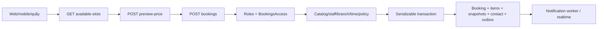

# Luồng đặt lịch thực tế

Đường dẫn source dưới đây tính từ root repository; tiền tố backend là `beauty-booking-api-main/` và web là `beauty-booking-web-main/beauty-booking-web-main/`.

## Kênh, actor và điểm vào

| Kênh | UI/API | Actor thực tế | Điểm ghi |
| --- | --- | --- | --- |
| Web tự đặt | `src/App.jsx:320-325`: `/book` → `/book/staff` → `/book/time` → `/book/info` → `/book/confirm` | CUSTOMER đã đăng nhập | `src/pages/Customer/BookingConfirm.jsx` → `POST /bookings` (`bookings.controller.ts:237-307`) |
| Mobile tự đặt | `mobile/src/screens/BookingScreen.tsx`, `mobile/src/api/bookings.ts:24-75` | CUSTOMER | `POST /bookings`, `source=ONLINE_APP` |
| Quầy/điện thoại | `POST /bookings` | OWNER/RECEPTIONIST đúng scope | `bookings.controller.ts:245-304`; WALK_IN/PHONE/STAFF_CREATED |
| “Guest” route | `POST /bookings/guest` | Vẫn yêu cầu CUSTOMER principal | `bookings.controller.ts:199-235`; không phải anonymous checkout |
| Chuỗi định kỳ | `POST /recurring` → `RecurringService.create` | CUSTOMER | `recurring.service.ts:39-147` gọi `BookingsService.create` từng kỳ |

Web chọn branch/offering/combo/variant, rồi staff hoặc “bất kỳ”, ngày/slot, thông tin và xác nhận. `BookingConfirm.jsx` giữ idempotency key trên một attempt; contact được nhập ở bước info nhưng payload confirm chủ yếu dùng customer profile server-side: cần kiểm tra kỳ vọng UX trước khi gọi đây là lỗi dữ liệu. Mobile gọi thẳng create từ màn hình đặt lịch; `BookingsContext` cập nhật danh sách sau success. Nguồn được chuẩn hóa tại `src/bookings/booking-channel-policy.ts`; API không tin source tùy ý của khách.

`getAvailableSlots` (`bookings.service.ts:1917-2157`) là ảnh chụp tại thời điểm đọc, không giữ chỗ. Final create (`817-1579`) đọc catalog/branch/staff, rồi trong Serializable transaction kiểm lại branch/channel, khóa service/business-service/variant rows `FOR SHARE` (`1183-1227`), chọn provider, lấy advisory locks staff và customer theo thứ tự (`1303-1333`), kiểm overlap và tạo booking/items. Initial status `CONFIRMED` cho WALK_IN hoặc auto-confirm; trường hợp khác `PENDING` có `pendingExpiresAt` (`1385-1405`). Snapshot item tên/giá/thời lượng lưu khi create (`~1450`); phụ thuộc voucher/combo được reserve/release. Outbox ghi trong transaction (`1531`), notification/realtime xử lý sau commit. Những tiền kiểm ngoài transaction không thể coi là reservation.

## Inventory mutation và writer gián tiếp

| Nhóm | Entry point → writer | Ghi chú |
| --- | --- | --- |
| Trạng thái | `PATCH /bookings/:id/status`, `PUT /bookings/:id` → `BookingsService.updateStatus` (`421-~800`) | CAS theo status, cascade item khi hủy |
| Giờ/nhân viên | `PATCH move/resize/assign` → `moveBooking` (`2159`), `resizeBooking` (`2337`), `assignStaff` (`2488`) | Revalidation trong transaction sau booking row lock |
| Item | `POST /bookings/:id/items`, `PATCH .../items/:itemId` → `BookingItemsService.add/update` (`15-222`) | Add khóa booking; update khóa item và CAS revision |
| Yêu cầu khách | `POST /bookings/:id/change-requests`; approve/reject → `ChangeRequestsService` (`56-~560`) | Approve khóa booking trước request, kiểm lại status/cutoff/staff/overlap |
| Hết hạn | `PendingBookingsCron` → `expirePendingBookings` (`1590-1627`); `ChangeRequestExpiryWorker` | CAS theo status/deadline |
| Impact | `ImpactService.resolveItem/transferBranch` (`50-200`, `238+`) | Mutation booking tách khỏi finalize impact item |
| Recurring | `RecurringService.create/cancel`; `RecurringPlanRecoveryWorker` | Mỗi occurrence là một booking; worker xử lý CREATING treo |
| Lifecycle phụ thuộc | `ServicesService.archiveCatalog` (`755-783`), `StaffService.deactivate` (`508-589`), `BranchStateService.transition` (`65-~160`), `StaffService.upsertHoliday/createSpecialDay` (`599-627`), `BranchesService.saveOnboarding` (`916-930`) | Có thể thay khả năng thực hiện lịch tương lai |
| Branch review workflow | `BranchesService.submit/review` (`1142-1312`) → `BranchStateService.transition` rồi ghi review request/event/documents | Hai transaction nối tiếp; xem BE-18 |

Read paths: list/my appointments/salon queue/scheduler/detail tại `bookings.controller.ts:418-895`. Review chỉ nhận booking hoàn thành và đúng customer (`reviews.service.ts:~290-350`). Payment/refund chỉ đánh giá ảnh hưởng trực tiếp, xem [gap deferred](CRITICAL-BOOKING-GAPS.md#deferred_payment).
