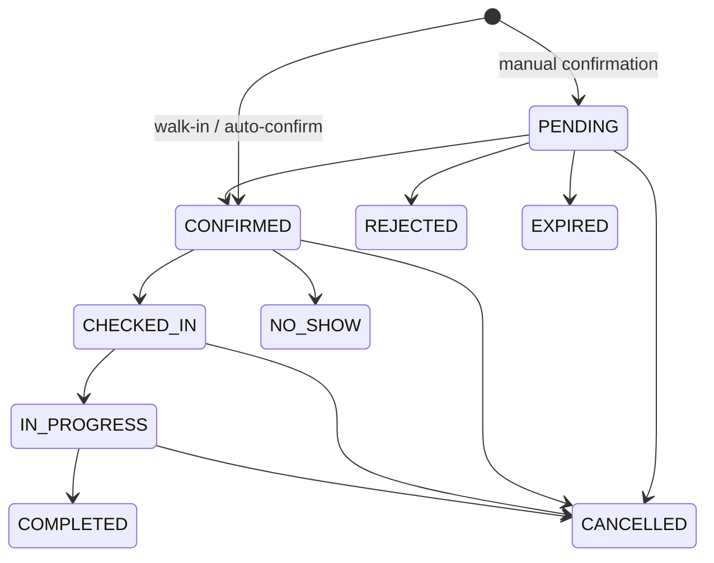

# Booking và item state machine

Source của đồ thị là `beauty-booking-api-main/src/bookings/bookings.validation.ts:15-86`, không phải sơ đồ cũ đã xóa. Entry point chính ở `bookings.controller.ts:902-~1320`; writer gián tiếp cần xem bên dưới.

`COMPLETED`, `CANCELLED`, `NO_SHOW`, `REJECTED`, `EXPIRED` terminal theo `ALLOWED_STATUS_TRANSITIONS`; `PENDING/CONFIRMED/CHECKED_IN/IN_PROGRESS` chặn slot (`bookings.validation.ts:27-29`). Actor table (`31-50`): customer chỉ cancel PENDING/CONFIRMED; receptionist confirm/reject/check-in/no-show/cancel; staff thực hiện start/complete theo quyền; owner rộng hơn. `assertActorStatusTransition` kiểm role, nhưng quyền trên booking cụ thể còn do `BookingsAccessService.assertWrite` (`bookings-access.service.ts:126-181`) quyết định. Platform bị chặn trong write service dù transition helper có nhánh admin (`137-144`).

Item bắt đầu `SCHEDULED`; `START` yêu cầu booking CHECKED_IN/IN_PROGRESS và đưa item sang IN_PROGRESS, có thể đồng thời đưa parent sang IN_PROGRESS (`booking-items.service.ts:155-159`). `COMPLETE` yêu cầu item IN_PROGRESS rồi sang COMPLETED (`160-162`); `SKIP` từ SCHEDULED/IN_PROGRESS sang SKIPPED, `REMOVE` đưa SCHEDULED sang CANCELLED (`129-146`). `REASSIGN/RESIZE/REPRICE` giữ trạng thái item và tăng `revision`, với giới hạn staff, khoảng giờ, giá (`147-220`). `add` chỉ khi parent PENDING/CONFIRMED/CHECKED_IN/IN_PROGRESS (`27-35`). Parent cancel/reject/expire/no-show gọi `cancelUnfinishedBookingItems` trong transaction (`bookings.service.ts:653-655`, `1607-1622`).

Invariant cha/con: parent COMPLETED cần mọi item `COMPLETED|SKIPPED|CANCELLED` và thanh toán đủ (`bookings.service.ts:476-509`). **BE-05**: kiểm child trước transaction, CAS parent chỉ so status; add item có thể chèn giữa lần đọc và commit complete. Các writer gián tiếp: `ChangeRequestsService.approve` hủy parent và cascade (`change-requests.service.ts:404-505`); pending expiry (`bookings.service.ts:1604-1625`); recurring compensation (`1663+`); impact cancellation/move/reassign (`impact.service.ts:81-107`). Cần test parent-child với tất cả writer, nhất là add/complete.

Không coi mọi transition bảng trên là public API hợp lệ: thời gian, quyền và chính sách hủy/no-show kiểm thêm tại `bookings.service.ts:511-627`; ví dụ direct cancellation và salon-approved cancellation có quy tắc khác nhau. Chưa chạy test nên đây là mô hình từ source, không xác nhận production DB.
